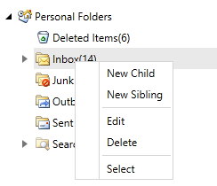

# Overview

## 






Thank you for choosing __RadContextMenu__!        

Have you ever encountered the need of building a very complicated custom menu system, while still keeping it simple for the end user? It’s easy to save space and provide additional commands or features with the __RadContextMenu__.        

__RadContextMenu__ provides the power to boost the existing navigation of your application. Similar to RadMenu, __RadContextMenu__ allows you to combine the ability to display hierarchical views and the advanced styling mechanism, thus letting you build even the most complicated menu systems.   

## Key Features      

* __Multi-level Menu Items__: The control supports displaying hierarchical data. You can build multiple levels of menu items as needed to achieve the navigation you’d like. [Read More]()

* __Hierarchical Data Binding__: The control allows you to bind and visualize sets of hierarchical data. You can also populate it by consuming data from XML files, WCF services, RIA services etc. [Read More]()

* __Opening on a Specific Event__: You are able to specify the event that should trigger the __RadContextMenu__ opening. You can also specify a key, that should be pressed in combination with the event. [Read More]()

* __Styling and Appearance__: __RadContextMenu__ can be fully customized. There are also various pre-defined themes that can be used to style the control. [Read More]()


* __Boundary Detection__: __RadContextMenu__ detects the Silverlight plug-in boundaries and opens its child item-groups in the opposite direction when the screen boundaries are to be crossed. When there is not enough space in both directions, the control will adjust its items’ position in order to make them visible whenever this is possible. [Read More]()


* __UI Automation Support__: Check the [UI Automation Support]() common article.

* __Enhanced Routed Events Framework__: The events system of the control will help your code become even more elegant and concise.       

>tip Get started with the control with its [Getting Started]() help article that shows how to use it in a basic scenario.

> Check out our examples at [demos.telerik.com](https://demos.telerik.com/silverlight/#ContextMenu/FirstLook)[demos.telerik.com](https://demos.telerik.com/wpf/).

## See Also

* [Visual Structure]()
* [Key Properties]() 
* [Events]()
