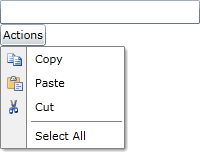

# Placement

The __RadContextMenu__ exposes a set of properties, which allow you to specify the location, on which it will appear. They are as follows:

* [Placement](#placement)

* [PlacementRectangle](#placementrectangle)

* [PlacementTarget](#placementtarget)

* [DropDownPlacement](#dropdownplacement)

## Placement

The placement property allows you to specify the position of the __RadContextMenu__ relatively to the target element or the value of the __PlacementRect__. It has the following values.

* __Absolute__ - positions the __RadContextMenu__ absolutely.

* __Bottom__ - displays the __RadContextMenu__ below the target control or the rect.

* __Center__ - displays the __RadContextMenu__ in the center of the target control or the rect.

* __Left__ - displays the __RadContextMenu__ on the left of the target control or the rect.

* __Right__ - displays the __RadContextMenu__ on the right of the target control or the rect.

* __Top__ - displays the __RadContextMenu__ above the target control or the rect.

Here is an example:

#### __XAML__

{{region xaml-radcontextmenu-features-placement_0}}
	<TextBox x:Name="InputBox"
	         Width="200"
	         VerticalAlignment="Top">
	    <telerik:RadContextMenu.ContextMenu>
	        <telerik:RadContextMenu x:Name="radContextMenu"
	                                Placement="Bottom">
	            ...
	        </telerik:RadContextMenu>
	    </telerik:RadContextMenu.ContextMenu>
	</TextBox>
{{endregion}}

## PlacementRectangle

The __PlacementRectangle__ is of type __Rect__ and specifies the position of the __RadContextMenu__. It can be combined with the __Placement__ property.

>tipProperties of type __Rect__ cannot be declared in-line because this is not supported. Set the property as attribute by passing the x, y, width and height parameters. The type converter will handle them from there.          

#### __XAML__

{{region xaml-radcontextmenu-features-placement_1}}
	<TextBox x:Name="InputBox1"
	 Width="200"
	 VerticalAlignment="Top">
	    <telerik:RadContextMenu.ContextMenu>
	        <telerik:RadContextMenu x:Name="radContextMenu1"
	                                Placement="Bottom"
	                                PlacementRectangle="0,0,100,100">
	            ...
	        </telerik:RadContextMenu>
	    </telerik:RadContextMenu.ContextMenu>
	</TextBox>
{{endregion}}

## PlacementTarget

The __PlacementTarget__ property is used when the __RadContextMenu__ should be displayed on a position related to a different UI element (not the one attached to).

>If you are using the same __RadContextMenu__ for multiple elements and you want to open it from the code behind, it is mandatory to set the __PlacementTarget__.          

#### __C#__

{{region cs-radcontextmenu-features-placement-01}}
	public Default_Cs()
	{
	    InitializeComponent();
	    this.radContextMenu.PlacementTarget = this.InputBox;
	    this.radContextMenu.IsOpen = true;
	}
{{endregion}}

Placement	|	Placement Target	|	Target Area	|	Context Menu Target Point	|	Context Menu Alignment Point
---	|	---	|	---	|	---	|	---
Absolute	|	Not applicable. PlacementTarget is ignored.	|	The screen, or PlacementRectangle if it is set. The PlacementRectangle is relative to the screen.	|	The top-left corner of the target area.	|	The top-left corner of the RadContextMenu.
AbsolutePoint	|	Not applicable. PlacementTarget is ignored.	|	The screen, or PlacementRectangle if it is set. The PlacementRectangle is relative to the screen.	|	The top-left corner of the target area.	|	The top-left corner of the RadContextMenu.
Bottom	|	PlacementTarget or parent.	|	The target object, or PlacementRectangle if it is set. The PlacementRectangle is relative to the target object.	|	The bottom-left corner of the target area.	|	The top-left corner of the RadContextMenu.
Center	|	PlacementTarget or parent.	|	The target object, or PlacementRectangle if it is set. The PlacementRectangle is relative to the target object.	|	The center of the target area.	|	The center of the RadContextMenu.
Left	|	PlacementTarget or parent.	|	The target object, or PlacementRectangle if it is set. The PlacementRectangle is relative to the target object.	|	The top-left corner of the target area.	|	The top-right corner of the RadContextMenu.
Mouse	|	Not applicable. PlacementTarget is ignored.	|	The bounds of the mouse pointer. PlacementRectangle is ignored.	|	The bottom-left corner of the target area.	|	The top-left corner of the RadContextMenu.
MousePoint	|	Not applicable. PlacementTarget is ignored.	|	The bounds of the mouse pointer. PlacementRectangle is ignored.	|	The top-left corner of the target area.	|	The top-left corner of the RadContextMenu.
Relative	|	PlacementTarget or parent.	|	The target object, or PlacementRectangle if it is set. The PlacementRectangle is relative to the target object.	|	The top-left corner of the target area.	|	The top-left corner of the RadContextMenu.
RelativePoint	|	PlacementTarget or parent.	|	The target object, or PlacementRectangle if it is set. The PlacementRectangle is relative to the target object.	|	The top-left corner of the target area.	|	The top-left corner of the RadContextMenu.
Right	|	PlacementTarget or parent.	|	The target object, or PlacementRectangle if it is set. The PlacementRectangle is relative to the target object.	|	The top-right corner of the target area.	|	The top-left corner of the RadContextMenu.
Top	|	PlacementTarget or parent.	|	The target object, or PlacementRectangle if it is set. The PlacementRectangle is relative to the target object.	|	The top-left corner of the target area.	|	The bottom-left corner of the RadContextMenu.

## DropDownPlacement

If there are any sub-menus in the __RadContextMenu__ their dropdown position can be specified through the __DropDownPlacement__ property of the __RadMenuItem__. It has the following values:        

* __Auto__ - positions the dropdown of the sub-menu automatically.

* __Bottom__ - displays the nested __RadMenuItems__ below the parent RadMenuItem.          

* __Left__ - displays the nested __RadMenuItems__ on the left of the parent RadMenuItem.

* __Right__ - displays the nested __RadMenuItems__ on the right of the parent RadMenuItem.

* __Top__ - displays the nested __RadMenuItems__ above the parent RadMenuItem.

Here is an example:

#### __XAML__

{{region xaml-radcontextmenu-features-placement_2}}
	<TextBox x:Name="InputBox2"
	         Width="200"
	         VerticalAlignment="Top">
	    <telerik:RadContextMenu.ContextMenu>
	        <telerik:RadContextMenu x:Name="radContextMenu2">
	            ...
	            <telerik:RadMenuItem Header="Sub Menu" DropDownPlacement="Right">
	                <telerik:RadMenuItem Header="Item 1" />
	                <telerik:RadMenuItem Header="Item 2" />
	            </telerik:RadMenuItem>
	            ...
	        </telerik:RadContextMenu>
	    </telerik:RadContextMenu.ContextMenu>
	</TextBox>
{{endregion}}

## See Also

 * [Opening on a Specific Event]()

 * [Key Modifiers]()

 * [Opening and Closing Delays]()
