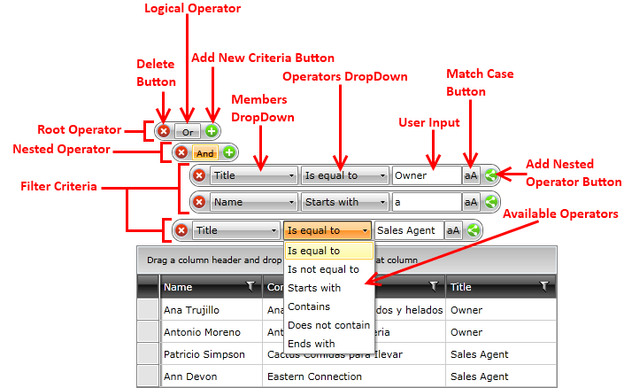

# Visual Structure

__RadDataFilter__ allows you to create complex filter criteria within unlimited number of filter conditions combined by logical operators. You can easily add nested filter criteria by clicking on the button for adding nested operators.

This section defines the terms and concepts used in the scope of the __RadDataFilter__ that you have to get familiar with prior to continue reading this help. They can also be helpful when contacting with the support service in order to better describe your issue. Below you can see snapshots and explanations of the main states and visual elements of the standard __RadDataFilter__ control.

* __Root Operator__ - represents the root filter operator. Any other operator gets nested under it.

* __Nested Operator__ - represents an operator that is nested under the Root Operator or another operator.

* __Filter Criteria__ - represents the UI for creating a filtering condition, that gets translated into a FilterDescritpor.

* __Delete Button__ - removes the respective element from the tree. 

* __Add New Criteria Button__ - adds a new filter criteria under the respective operator.

* __Add Nested Operator Button__- adds a new operator under the parent of the respective criteria. The criteria becomes a child of the created operator.

* __Logical Operator__- represents the logical condition of the operator. It can be either AND or OR.

* __Members DropDown__ - represents a list with all of the available members, which can serve as a filter criteria.

* __Operators DropDown__ - represents a list with all of the available operators for the filter criteria.

* __Available Operators__ - these are the available operators for a single filter criteria.

* __User Input__ - represents an input box, where the users can enter their filter input. The [built-in filter editors]() will help the users to achieve this fast and easily.

* __Match Case Button__ - represents a button that toggles the Match Case functionality.

>Please check the [End-User Capabilities]() topic for more information on how to create filter conditions via the UI. 

## See Also

 * [Getting Started]()

 * [Template Structure]()

 * [End User Manual]()
