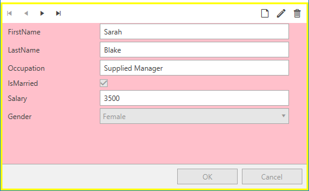

# Styling RadDataForm

This article will demonstrate how to create a style targeting the RadDataForm control.

## Targeting the RadDataForm Element

In order to style a __RadDataForm__, you can create an implicit style targeting __RadDataForm__. Alternatively, you can create an explicit style by giving it an "x:Key" and set it to the __Style__ property of the control. 

#### __[XAML] Example 1: Creating an implicit style targeting RadDataForm__
{{region xaml-raddatafor-styles-and-templates-styling-raddataform_0}}
	<Window.Resources>
        <!-- If you are using the NoXaml binaries, you should base the style on the default one like so:-->
        <!--
    </Window.Resources>
    <Grid>              
        <telerik:RadDataForm AutoGenerateFields="True" />
    </Grid>
{{endregion}}

#### __Figure 1: RadDataForm with custom style in the Office2016 theme__

>tip In order to learn how to further modify the control by extracting its ControlTemplate, read the [Editing Control Templates]() article.

## See Also

 * [Styling CollectionNavigator]()