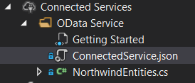

# Creating the Client Application

Once you have created the _Server Application_, you may start developing the _Client_ one. 



To display the data from the __WCF Data Service__, create a new WPF application with a data source that is based on the service. Later in this walk-through, you will add data-bound controls to the application.

1. Create a new WPF application. 

1. [Generate the client code](https://docs.microsoft.com/en-us/odata/client/code-generation-tool) for a service of your choice. For this tutorial we are going to use the [http://services.odata.org/Northwind/Northwind.svc](http://services.odata.org/Northwind/Northwind.svc) service. Name the generated file "NorthwindEntities".

1. Add a new class inside the project and replace its declaration with the one demonstrated in __Example 1__.

#### __[C#] Example 1: Defining the context__

{{region raddataservicedatasource-getting-started-creating-the-client-application_0}}

	public class MyNorthwindContext : NorthwindEntities
	{
		public MyNorthwindContext() : base(new Uri("http://services.odata.org/Northwind/Northwind.svc", UriKind.Absolute)){}
	}
{{endregion}}

#### __[VB.NET] Example 1: Defining the context__

{{region raddataservicedatasource-getting-started-creating-the-client-application_1}}

	Public Class MyNorthwindContext
	 Inherits NorthwindEntities
	 Public Sub New()
	  MyBase.New(New Uri("http://services.odata.org/Northwind/Northwind.svc", UriKind.Absolute))
	 End Sub
	End Class
{{endregion}}





To display the data from the __WCF Data Service__, create a new __Silverlight__ application with a data source that is based on the service. Later in this walk-through, you will add data-bound controls to the application.

1. In ___Solution Explorer___, right-click the solution node, click ___Add___, and select ___New Project___.

1. In the ___New Project___ dialog, expand ___Visual C#___ or ___Visual Basic___, and then select __Silverlight__.

1. Select the ___Silverlight Application___ project template.

1. In the __Name__ box, type ___NorthwindExplorer___ and click ___OK___. The ___New Silverlight Application Wizard___ opens.

1. __Uncheck__ the __Web site__ check-box and click ___OK___. __Visual Studio__ adds the ___NorthwindExplorer___ project to the solution.
 

1. On the __Data__ menu, click ___Show Data Sources___. The __Data Sources__ window opens.

1. In the __Data Sources__ window, click ___Add New Data Source___. The ___Data Source Configuration Wizard___ opens.

1. In the ___Choose a Data Source Type___ page of the wizard, select __Service__ and then click __Next__.

1. In the __Address__ box, type [http://services.odata.org/Northwind/Northwind.svc](http://services.odata.org/Northwind/Northwind.svc) and then click ___Go___.
            

1. __Visual Studio__ searches the specified address for available services, and adds ___NorthwindEntities___ to the list of available services in the __Services__ box.

1. In the __Namespace__ box, type ___NorthwindService___.

1. In the __Services__ box, click ___NorthwindEntities___ and then click ___OK___. __Visual Studio__ downloads the service information and then returns to the ___Data Source Configuration Wizard___.

1. In the ___Add Service Reference___ page, click __Finish__.  __Visual Studio__ adds nodes that represent the data returned by the service to the __Data Sources__ window.

1. On the __Project__ menu, click ___Add Class___.

1. Change the name to ___MyNorthwindContext___, and click __Add__.

1. Replace the class declaration with the following code:

#### __C#__

{{region raddataservicedatasource-getting-started-creating-the-client-application_2}}

	public class MyNorthwindContext : NorthwindEntities
	{
	 public MyNorthwindContext() : base(new Uri("http://services.odata.org/Northwind/Northwind.svc", UriKind.Absolute)){}
	}
{{endregion}}

#### __VB.NET__

{{region raddataservicedatasource-getting-started-creating-the-client-application_3}}

	Public Class MyNorthwindContext
	 Inherits NorthwindEntities
	 Public Sub New()
	  MyBase.New(New Uri("http://services.odata.org/Northwind/Northwind.svc", UriKind.Absolute))
	 End Sub
	End Class
{{endregion}}

When we added the ___Service Reference___, __Visual Studio__ generated a hidden file that contains all client-side proxy classes. You can find this file if you tell the __Solution Explorer__ to ___“Show All Files”___ and then drill-down in the __Service References__ node all the way to the file called __Reference__. When you use the ___Add Service Reference___ dialog to add a data service to an application, an entity container class is created that inherits from the __DataServiceContext__ class. This class includes properties that return typed __DataServiceQuery__ instances. In this case this class is called __NorthwindEntities__ and we have further derived from it in order to specify the __Uri__ where it should get its data from. This was done so we can easily declare __RadDataServiceDataSource.DataServiceContext__ in XAML later on.



## See Also
* [Creating the Server Application]()
* [Creating the Data-bound Controls]()