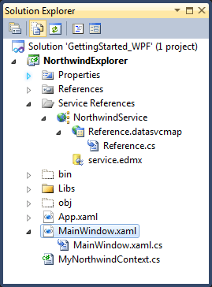

# The DataServiceContext

__RadDataServiceDataSource__ requires a __DataServiceContext__ and a __DataServiceQuery&lt;T&gt;__ in order to connect to a remote server. 

## The DataServiceContext

A class that derives from the __DataServiceContext__ class will be automatically generated for you when you add the __Service Reference__ to your project. It can be located in the generated code-behind file of your __Service Reference__. You might need to select the ___Show All Files___ option in __Solution Explorer__ in order to see the code-behind file. 







A typical auto-generated __DataServiceContext__ class will look like this:

#### __C#__

{{region raddataservicedatasource-loading-the-DataServiceContext_0}}

	public partial class NorthwindEntities : global::System.Data.Services.Client.DataServiceContext
{{endregion}}

#### __VB.NET__

{{region raddataservicedatasource-loading-the-DataServiceContext_1}}

	Partial Public Class NorthwindEntities Inherits Global.System.Data.Services.Client.DataServiceContext
{{endregion}}

## Setting DataServiceContext in code-behind

In order to create an instance of the DataServiceContext class, you need to specify the WCF Data Service Uri in its constructor. The simply assign to the respective property on RadDataServiceDataSource:

#### __C#__

{{region raddataservicedatasource-loading-the-DataServiceContext_2}}

	Uri serviceUri = new Uri("http://services.odata.org/Northwind/Northwind.svc", UriKind.Absolute);
	NorthwindEntities northwindContext = new NorthwindEntities(serviceUri);
	this.radDataServiceDataSource.DataServiceContext = northwindContext;
{{endregion}}

#### __VB.NET__

{{region raddataservicedatasource-loading-the-DataServiceContext_3}}

	Dim serviceUri As New Uri("http://services.odata.org/Northwind/Northwind.svc", UriKind.Absolute)
	Dim northwindContext As New NorthwindEntities(serviceUri)
	Me.radDataServiceDataSource.DataServiceContext = northwindContextSetting DataServiceContext in XAML
{{endregion}}

## Setting DataServiceContext in XAML

Since the __DataServiceContext__ class does not have a parameterless constructor, it cannot be directly instantiated in XAML. This can be worked around by creating another class with a parameterless constructor that derives from it and then hard-coding the __Uri__ in the call to the base constructor:

#### __C#__

{{region raddataservicedatasource-loading-the-DataServiceContext_4}}

	public class MyNorthwindContext : NorthwindEntities
	{
	    public MyNorthwindContext() : base(new Uri("http://services.odata.org/Northwind/Northwind.svc", UriKind.Absolute)){}
	}
{{endregion}}

#### __VB.NET__

{{region raddataservicedatasource-loading-the-DataServiceContext_5}}

	Public Class MyNorthwindContext
	 Inherits NorthwindEntities
	 Public Sub New()
	  MyBase.New(New Uri("http://services.odata.org/Northwind/Northwind.svc", UriKind.Absolute))
	 End Sub
	End Class
{{endregion}}

Once you have a context class with a parameterless constructor, you can easily instantiate it in XAML:

#### __XAML__

{{region raddataservicedatasource-loading-the-DataServiceContext_6}}

	<telerik:RadDataServiceDataSource Name="customersDataSource" QueryName="Customers" AutoLoad="True">
	  <telerik:RadDataServiceDataSource.DataServiceContext>
	     <local:MyNorthwindContext/>
	  </telerik:RadDataServiceDataSource.DataServiceContext>
	</telerik:RadDataServiceDataSource>
{{endregion}}

>caution Once you assign the __DataServiceContext__ to the control, do not set any of its properties or call any of its methods. __RadDataServiceDataSource__ needs to be the only entity that operates with the context. __WCF Data Services___ are stateless, but the __DataServiceContext__ is not. Tampering with the __DataServiceContext__ of a __RadDataServiceDataSource__ may lead to unexpected results. In case you need to perform unrelated tasks, you can always create another context and work with it, instead of modifying the one that is currently in use by __RadDataServiceDataSource__.

>The only ___DataServiceContext.MergeOption___ that is supported is ___MergeOption.OverwriteChanges___. Setting the ___DataServiceContext.MergeOption___ to anything else will result in an error.