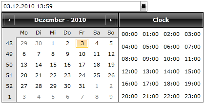
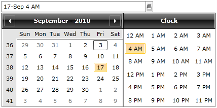

# Formatting

The __RadDateTimePicker__ gives you a few possibilities to change the way your data is formatted. This topic will go through the following sections:

* [Changing the display format](#changing-the-display-format)

* [Changing the culture](#changing-the-culture)

* [Defining a custom format](#defining-a-custom-format)

## Changing the display format

__RadDateTimePicker__ has the ability to format its value in two different formats specified by the __DisplayFormat__ property.

Here is a brief description of each value in the __DisplayFormat__ enumerator property:

* __Short__ - this is the default value which will show you only the date and time formatted according to the current culture.

* __Long__ - this is the mode which shows a detailed information about the current date and time.

For example:

#### __XAML__

{{region xaml-raddatetimepicker-features-formatting_0}}
	<telerik:RadDateTimePicker DisplayFormat="Long"/>
{{endregion}}

## Changing the culture

You can change the __RadDateTimePicker__ control's culture via the __Culture__ property. You can set its value in XAML or code behind. If you choose to set it in XAML you will have to provide the correct culture code. Otherwise in code behind you will have to create a __CultureInfo__ object and assign it to the __RadDateTimePicker's Culture__ property. 

Here is an example:

#### __XAML__

{{region xaml-raddatetimepicker-features-formatting_1}}
	<telerik:RadDateTimePicker x:Name="radDateTimePicker" Culture="de"/>
{{endregion}}

#### __C#__

{{region cs-raddatetimepicker-features-formatting_2}}
	this.radDateTimePicker.Culture = new System.Globalization.CultureInfo( "de" );
{{endregion}}

#### __VB.NET__

{{region vb-raddatetimepicker-features-formatting_3}}
	Me.radDateTimePicker.Culture = New System.Globalization.CultureInfo("de")
{{endregion}}

Here is the result:

## Defining a custom format

You can easily customize the date format in the __RadDateTimePicker__ through its __Culture__ property. You do this by defining a custom __DateFormatInfo__ object and later assigning it to the __CultureInfo's DateTimeFormat__ property.

Here is an example of defining a custom format for the __RadDateTimePicker's__ items:

#### __C#__

{{region cs-raddatetimepicker-features-formatting_4}}
	this.radDateTimePicker.Culture = new System.Globalization.CultureInfo("en-US");
	this.radDateTimePicker.Culture.DateTimeFormat.ShortDatePattern = "dd-MMM";
	this.radDateTimePicker.Culture.DateTimeFormat.ShortTimePattern = "h tt";
{{endregion}}

#### __VB.NET__

{{region vb-raddatetimepicker-features-formatting_5}}
	Me.radDateTimePicker.Culture = New System.Globalization.CultureInfo("en-US")
	Me.radDateTimePicker.Culture.DateTimeFormat.ShortDatePattern = "dd-MMM"
	Me.radDateTimePicker.Culture.DateTimeFormat.ShortTimePattern = "h tt"
{{endregion}}

>In this example the "tt" in the __ShortTimePattern__ represents the AM and PM values and also you have omitted the year from the __ShortDatePattern's__ definition.

<!-- -->

>For more information about the custom date and time format specifiers and the result string produced by each format specifier, check out the [Custom Date and Time Format Strings topic](http://msdn.microsoft.com/en-us/library/8kb3ddd4.aspx).

Here is the result:

## See Also

 * [Overview]()

 * [Events]()

 * [Selection]()
