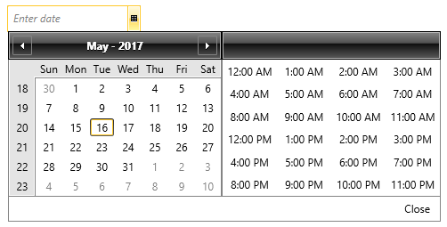

# Getting Started

This tutorial will walk you through the creation of a sample application that contains RadDateTimePicker.

* [Assembly References](#assembly-references)
* [Adding RadDateTimePicker to the Project](#adding-raddatetimepicker-to-the-project)
* [Working with Selected Values](#working-with-selected-values)
* [Manually Updating the Bound Property](#manually-updating-the-bound-property)
* [Setting a Theme](#setting-a-theme)

>Before reading this tutorial you should get familiar with the [Visual Structure]() of the __RadDateTimePicker__ control.
                 
## Assembly References

In order to use __RadDateTimePicker__ control in your projects you have to add references to the following assemblies:

* __Telerik.Windows.Controls__
* __Telerik.Windows.Controls.Input__

## Adding RadDateTimePicker to the Project

You can add RadDateTimePicker to your application manually by writing the XAML code in __Example 1__. You can also add the control by dragging it from the Visual Studio Toolbox and dropping it over the XAML view.

#### __[XAML] Example 1: Adding RadDateTimePicker in XAML__

{{region xaml-raddatetimepicke-getting-started_1}}
	<telerik:RadDateTimePicker />
{{endregion}}

>In order to create the __RadDateTimePicker__ control you have to include the following namespace declaration:
	_xmlns:telerik="http://schemas.telerik.com/2008/xaml/presentation"_

You can also create the __RadDateTimePicker__ in code-behind:

#### __[C#] Example 2: Adding RadDateTimePicker in code-behind__

{{region cs-raddatetimepicke-getting-started_2}}
	RadDateTimePicker radDateTimePicker = new RadDateTimePicker();
{{endregion}}

#### __[VB.NET] Example 2: Adding RadDateTimePicker in code-behind__

{{region vb-raddatetimepicke-getting-started_3}}
	Dim radDateTimePicker As New RadDateTimePicker()
{{endregion}}

If you run the application now you will see the default __RadDateTimePicker__ control with the default watermark content. Clicking on the control's drop down button will display a date and time representations from which you can select a single value.

#### __Figure 1: The RadDateTimePicker created by the code in Example 1__

## Working with Selected Values

You can get the selected value using the following properties:

* __SelectedValue__: A __DateTime__ representation of the selected date and time or **null** if no value has been selected.

* __SelectedDate__: The __Date__ part of the currently selected value. 

* __SelectedTime__: The __TimeOfDay__ part of the currently selected value.

#### __[C#] Example 3: Getting the selected values__
{{region cs-raddatetimepicke-getting-started_4}}
	DateTime? userSelectedValue = radDateTimePicker.SelectedValue;
	DateTime? userSelectedDate = radDateTimePicker.SelectedDate;
	TimeSpan? userSelectedTime = radDateTimePicker.SelectedTime;
{{endregion}}

#### __[VB.NET] Example 3: Getting the selected values__

{{region vb-raddatetimepicke-getting-started_5}}
	Dim userSelectedValue As System.Nullable(Of DateTime) = radDateTimePicker.SelectedValue
	Dim userSelectedDate As System.Nullable(Of DateTime) = radDateTimePicker.SelectedDate
	Dim userSelectedTime As System.Nullable(Of TimeSpan) = radDateTimePicker.SelectedTime
{{endregion}}

Normally you would want to bind the __SelectedValue__ property to your data as demonstrated in **Example 4**.

#### __[XAML] Example 4: Binding SelectedValue__

{{region xaml-raddatetimepicke-getting-started_6}}
	<telerik:RadDateTimePicker SelectedValue="{Binding Established}" />
{{endregion}}

## Manually Updating the Bound Property

In case the bound property value needs to be manually updated at some state, the __DateTimeText__ property of the control can simply be set to be equal to the __CurrentDateTimeText__ one. The __CurrentDateTimeText__ property is updated each time the user types in the textbox, whereas the __DateTimeText__ is updated once the textbox has lost focus, for example.  

#### __[C#] Example 5: Manually updating the bound property__

{{region cs-raddatetimepicke-getting-started_7}}
	this.DateTimePicker.DateTimeText = this.DateTimePicker.CurrentDateTimeText;
{{endregion}}

#### __[VB.NET] Example 5: Manually updating the bound property__
{{region vb-raddatetimepicke-getting-started_7}}
	Me.DateTimePicker.DateTimeText = Me.DateTimePicker.CurrentDateTimeText
{{endregion}}

## Setting a Theme

The controls from our suite support different themes. You can see how to apply a theme different than the default one in the [Setting a Theme]() help article.

>important Changing the theme using implicit styles will affect all controls that have styles defined in the merged resource dictionaries. This is applicable only for the controls in the scope in which the resources are merged. 

To change the theme, you can follow the steps below:
* Choose between the themes and add reference to the corresponding theme assembly (ex: **Telerik.Windows.Themes.Windows8.dll**). You can see the different themes applied in the **Theming** examples from our [WPF Controls Examples](https://demos.telerik.com/wpf/)[Silverlight Controls Examples](https://demos.telerik.com/silverlight/) application.

* Merge the ResourceDictionaries with the namespace required for the controls that you are using from the theme assembly. For __RadDateTimePicker__, you will need to merge the following resources:

	* __Telerik.Windows.Controls__
	* __Telerik.Windows.Controls.Input__

__Example 8__ demonstrates how to merge the ResourceDictionaries so that they are applied globally for the entire application.

#### __[XAML] Example 5: Merge the ResourceDictionaries__  
{{region xaml-raddatetimepicke-getting-started_7}}
		<Application.Resources>
			<ResourceDictionary>
				<ResourceDictionary.MergedDictionaries>
	                <ResourceDictionary Source="/Telerik.Windows.Themes.Windows8;component/Themes/System.Windows.xaml"/>
	                <ResourceDictionary Source="/Telerik.Windows.Themes.Windows8;component/Themes/Telerik.Windows.Controls.xaml"/>
	                <ResourceDictionary Source="/Telerik.Windows.Themes.Windows8;component/Themes/Telerik.Windows.Controls.Input.xaml"/>
				</ResourceDictionary.MergedDictionaries>
			</ResourceDictionary>
		</Application.Resources>
{{endregion}}

__Figure 2__ shows __RadDateTimePicker__ with the **Windows8** theme applied.
	
#### __Figure 2: RadDateTimePicker with the Windows8 theme__

## See Also

* [Use the control as a date picker or time picker independently]()

* [Customizing the Preview Tooltip]()

* [The Watermark]()

* [Enhance the parsing mechanism]()

* [Populating the clock with custom clock items]()
