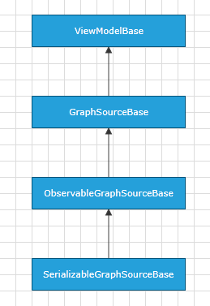

# SerializableGraphSourceBase

Telerik Diagramming Framework provides a list of __ViewModels__ defined in the __Telerik.Windows.Controls.Diagrams.Extensions.dll__.	  

This article describes the __SerializableGraphSourceBase<TNode, TLink>__ class defined in the Diagramming Extensions.	  

## Overview

The __SerializableGraphSourceBase<TNode, TLink>__ class is an __abstract__ class which is designed to provide a base __ViewModel__ implementation that supports item serialization. It derives from __ObservableGraphSourceBase<TNode, TLink>__ and it implements the [ISerializableGraphSource](http://www.telerik.com/help/silverlight/t_telerik_windows_diagrams_core_iserializablegraphsource.html)[ISerializableGraphSource](http://www.telerik.com/help/wpf/t_telerik_windows_diagrams_core_iserializablegraphsource.html) interface.		

SerializableGraphSourceBase<TNode, TLink> Inheritance Model

>tip If you need to define a data-bound __RadDiagram__ that has to support cut, copy and paste, you need to make sure that your custom __GraphSource__ implementation derives from the __SerializableGraphSourceBase<TNode, TLink>__ class. The clipboard operations internally use the serialization strings of the diagramming items and therefore you need to create a __GraphSource ViewModel__ that can serialize its business items. Also, please note that as __SerializableGraphSourceBase<TNode, TLink>__ derives from  __ObservableGraphSourceBase<TNode, TLink>__, it supports __TwoWay__ binding to the __RadDiagram GraphSource__, as well as drag and drop operations.        

## Inherited Properties

The __SerializableGraphSourceBase<TNode, TLink>__ class exposes all properties it inherits from the __GraphSourceBase__ class:		

Inherited Properties

|Name|Description|
|----|-----------|
|InternalItems|Gets the internal ObservableCollection of business nodes.|
|InternalLinks|Gets the internal ObservableCollection of business links.|
|Items|Gets an IEnumerable collection of business nodes.|
|Links|Gets an IEnumerable collection of business links.|

## Methods

The __SerializableGraphSourceBase<TNode, TLink>__ class exposes the following __virtual__ methods:
		
Virtual Methods

|Name|Description|
|----|-----------|
|GetNodeUniqueId(TNode)|This is an abstract method that gets a node's unique id. This id should be always unique and should not rely on the object's reference. Please note that you have to override this method to define a custom unique ID for a specified node.|
|DeserializeLink(IConnection, SerializationInfo)|By default this method creates a new instance of the TLink type. However when overridden, this method should create a new instance of an TLink associated with the specified IConnection and restore any saved information from the specified SerializationInfo.|
|DeserializeNode(IShape,SerializationInfo)|By default this method creates a new instance of the TNode type. However when overridden, this method should create a new instance of an TLink associated with the specified IShape and restore any saved information from the specified SerializationInfo.|
|SerializeNode(TNode, SerializationInfo)|By default this method uses the GetNodeUniqueId() to serialize the unique ID of the node in the SerializationInfo. However when overridden, it should save important information about the node in the specified SerializationInfo.|
|SerializeLink(TLink, SerializationInfo)|By default this method uses the GetNodeUniqueId() to serialize the unique ID of the source and target nodes of the specified link in the SerializationInfo. However when overridden, it should also save important information about the link in the specified SerializationInfo.|
|ClearCache|Clears the deserialization cache that contains the items generated during the deserialization of the saved data. The cache should be cleared either before or after the deserialization of the GraphSource.|

## See Also
 * [ItemViewModelBase]()
 * [NodeViewModelBase]()
 * [LinkViewModelBase]()
 * [ContainerNodeViewModelBase]()
 * [HierarchicalNodeViewModel]()
 * [GraphSourceBase]()
 * [ObservableGraphSourceBase]()
