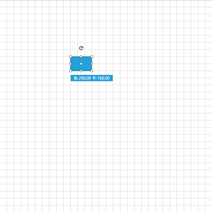
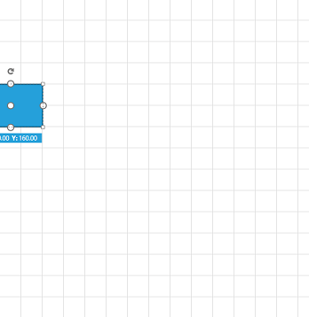
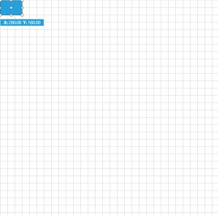
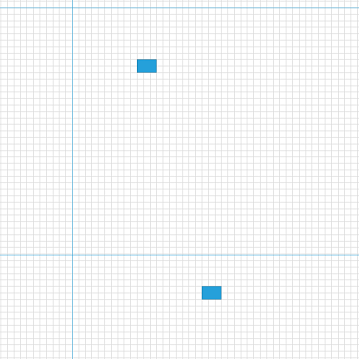

# Bring Into View and Auto Fit Support

The RadDiagram framework allows you to bring a specific item(s) or position into its viewport through couple of methods – __BringIntoView()__ and __AutoFit()__.

## BringIntoView

The BringIntoView method can be used to bring a section of the diagram’s surface into the viewport. The method has few overloads which bring different components into view. 

* The method can bring a specific Rect into the view. In other words the diagram can fit the viewport into coordinates and the size of the Rect element.
* The method can bring a specific IDiagramItem (RadDiagramShape, RadDiagramConnection, etc.) and then center it into the viewport.
* The method can bring a particular position into the top left coordinates of the viewport

## AutoFit

The AutoFit method tries to adjust the viewport so that all items which are plotted on the diagram are visible. The method expose an additional overload which takes a Thickness objects as an argument that represents the margin used as a white space border around the diagram items.

>tip RadDiagram also provides AutoFitAsync() method which executes the same action as the AutoFit() but asynchronously.

## How to use the BringIntoView and AutoFit methods

This section demonstrates the use of the BringIntoView and AutoFit methods. For the sake of the examples the following RadDiagram XAML declaration will be used:

#### __XAML__
{{region raddiagram-features-bring-into-view-auto-fit-0}}
	<telerik:RadDiagram x:Name="diagram" Width="600" Height="600">
		<telerik:RadDiagramShape x:Name="diagramShape" Position="200 160" />
		<telerik:RadDiagramShape Position="400 860" />
	</telerik:RadDiagram>
{{endregion}}

Here is the visual result rendered by the RadDiagram’s definition above:

* __BringIntoView__ - The method exposes several overloads:
	* __BringIntoView(Rect newViewPort, [bool useAnimation = true])__ – this overload accepts a Rect object that defines the new viewport of the diagram and fits it inside the Rect. The second argument is optional and it determines if the bring into view should be performed with an animation. 
	
		#### __C#__
		{{region raddiagram-features-bring-into-view-auto-fit-1}}
			this.diagram.BringIntoView(new Rect(220, 180, 300, 100));
		{{endregion}}

		

	* __BringIntoView(object item, [double zoomLevel = 1], [bool useAnimation =  true])__ – this overload accepts an object that contains the shape which should be brought into the view. The last two arguments define the zoom level which should be applied and if an animation should be performed. The shape will be positioned at the center of the viewport.
	
		#### __C#__
		{{region raddiagram-features-bring-into-view-auto-fit-2}}
			this.diagram.BringIntoView(this.diagramShape);
		{{endregion}}

		
	
	* __BringIntoView(Point position, [double zoomLevel = 1], [bool useAnimation =  true])__ – this overload gets a Point object which determines the top left position of the viewport. The last two arguments define the zoom level which should be applied and if an animation should be performed.
		
		#### __C#__
		{{region raddiagram-features-bring-into-view-auto-fit-3}}
			this.diagram.BringIntoView(new Point(200, 160));
		{{endregion}}
		
		

* __AutoFit__ - the method provides two overloads: 
	
	* __AutoFit()__ – this overload will fit the items without using any margin as a white space border.
		#### __C#__
		{{region raddiagram-features-bring-into-view-auto-fit-4}}
			this.diagram.AutoFit();
		{{endregion}}
		
		
		
	* __AutoFit(Thickness margin, [bool useAnimation = true])__  - this overload accepts a Thickness object as an argument that determines the margin used as a white space border around the diagram items. 
		
		#### __C#__
		{{region raddiagram-features-bring-into-view-auto-fit-5}}
			this.diagram.AutoFit(new Thickness(100));
		{{endregion}}
		
		

## See Also
 * [Getting Started]()
 * [Pan and Zoom]()
 * [Global Settings]()
 