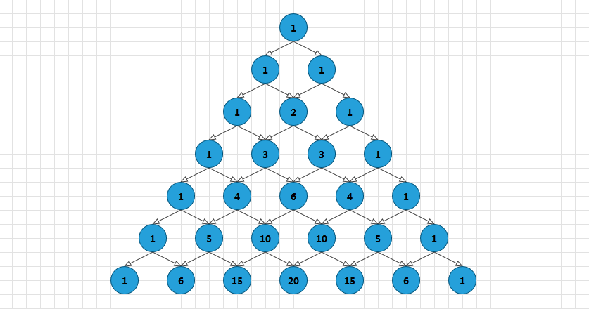
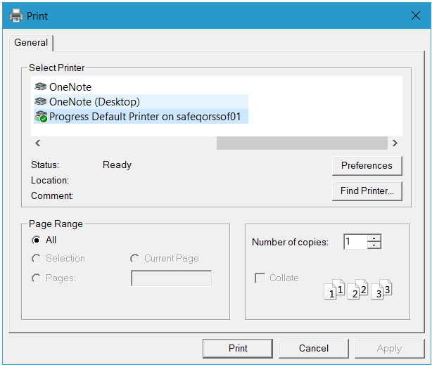
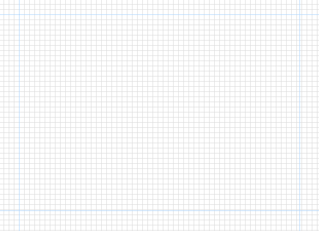
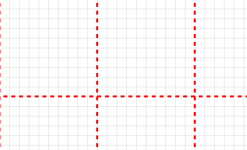
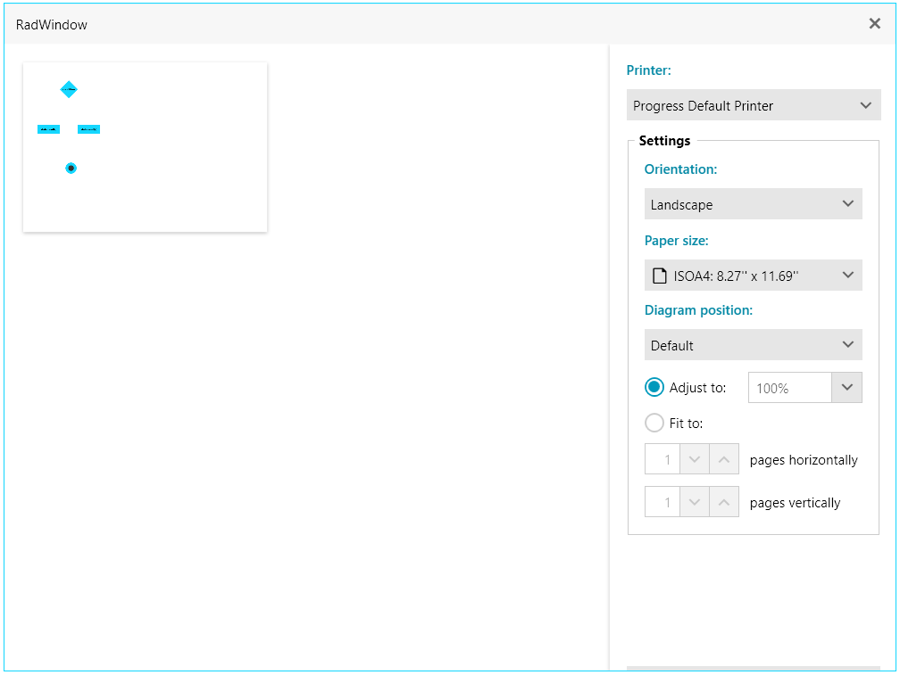

# Printing

This tutorial describes the Diagramming framework printing functionality.

The __RadDiagram__ exposes a method and command that allow you to print its content.	  

## RadDiagram Print Support

###  RadDiagram.Print() method		  

The __RadDiagram.Print()__ method allows you to print the content of the Diagramming canvas. The __Print()__ method has one optional argument of type __RadDiagramPrintSettings__, which exposes the following members:			

* __Title__ - this property is of type __string__ and it determines the name of the printing job in the print queue of a printer				

* __PageMargin__ - this property is of type __Thickness__ and it provides control over the size of the document's page margins when printed.
	
	>You can take advantage of the __RadDiagramPrintPreview__ to see the __RadDiagram__ print document's page margins before printing.
	
	
#### __C#__
{{region raddiagram-features-printing-2}}
    xDiagram.Print(new RadDiagramPrintSettings("My Diagramming Solution",new Thickness(22,15,22,15)));		  
{{endregion}}
	
#### __VB.NET__
{{region raddiagram-features-printing-3}}
    xDiagram.Print(New RadDiagramPrintSettings("My Diagramming Solution", New Thickness(22, 15, 22, 15)))		  
{{endregion}}

If you don't define any __RadDiagramPrintSettings__ when invoking the __Print()__ method, by default the Diagramming framework will name your printing job *"RadDiagram Print Document"* and it will set the __PageMargin__ to *15*.	

The __RadDiagramPrintSettings__'s constructor have an optional parameter that defines the resolution (__DPI__) used during printing. The default DPI is 96. If you need better quality of the print result you can pass bigger value in the settings' constructor.

#### __C#__
{{region raddiagram-features-printing-00}}
	xDiagram.Print(new RadDiagramPrintSettings("My Diagramming Solution",new Thickness(22,15,22,15), 300));
{{endregion}}

#### __VB.NET__
{{region raddiagram-features-printing-01}}
	xDiagram.Print(New RadDiagramPrintSettings("My Diagramming Solution", New Thickness(22, 15, 22, 15), 300))
{{endregion}}

### Print() Method Example

For the purpose of this tutorial we will try to print the sample Diagramming solution demonstrated in the [DataBinding]() section of this documentation:

>Please note that the examples in this tutorial are showcasing Telerik Windows8 theme. In the [Setting a Theme](http://www.telerik.com/help/silverlight/common-styling-apperance-setting-theme.html#Setting_Application-Wide_Built-In_Theme_in_the_Code-Behind)[Setting a Theme](http://www.telerik.com/help/wpf/common-styling-apperance-setting-theme-wpf.html#Setting_Application-Wide_Built-In_Theme_in_the_Code-Behind) article you can find more information on how to set an application-wide theme.			  

Now let's add a Print __RadButton__ in our layout and handle its __Click__ event to invoke the __RadDiagram.Print()__ method:
			
#### __XAML__
{{region raddiagram-features-printing-4}}
    <Grid x:Name="LayoutRoot">
        <Grid.Resources>
          ...
        </Grid.Resources>
        <Grid.RowDefinitions>
            <RowDefinition Height="50" />
            <RowDefinition Height="*" />
        </Grid.RowDefinitions>
        <telerik:RadButton Content="Print" Click="Print" HorizontalAlignment="Center" VerticalAlignment="Center"/>
        <telerik:RadDiagram x:Name="diagram" Grid.Row="1"
                            ConnectionStyle="{StaticResource pascalEdgeStyle}"
                            ShapeStyle="{StaticResource pascalNodeStyle}" />
    </Grid>
{{endregion}}

#### __C#__
{{region raddiagram-features-printing-5}}
    private void Print(object sender, RoutedEventArgs e)
    {
        this.diagram.Print();
    }
{{endregion}}

#### __VB.NET__
{{region raddiagram-features-printing-6}}
    Private Sub Print(sender As Object, e As RoutedEventArgs)
        Me.diagram.Print()
    End Sub
{{endregion}}

Now if you run your solution and hit the *Print* button:

A PrintDialog will be opened, allowing you to set up the printing operation:

### Print Command

Telerik Diagramming Framework provides a __Print__ command as well. It is part of the __DiagramExtensionCommands__ class implementation defined in the __Telerik.Windows.Controls.Diagrams.Extensions__ namespace and  you can apply it on your buttons and use it to invoke the print dialog:			

#### __XAML__
{{region raddiagram-features-printing-7}}
    <telerik:RadButton xmlns:extensions="clr-namespace:Telerik.Windows.Controls.Diagrams.Extensions;assembly=Telerik.Windows.Controls.Diagrams.Extensions"
					Content="Print" 
					Command="extensions:DiagramExtensionCommands.Print" 
					CommandTarget="{Binding ElementName=diagram}" 
					HorizontalAlignment="Center" 
					VerticalAlignment="Center"/>			  
{{endregion}}

>You need to keep in mind that the __Print__ command can only be executed on a __RadDiagram__, populated with __DiagramItems__.			

## Pages Preview Canvas

With the Q1 2013 release, __RadDiagram__ supports pages preview canvas. The pages background is enabled by default but you can control its visibility and appearance through the following set of attached properties:		

* __BackgroundPageGrid.IsGridVisible__ - this is a __Boolean__ property that controls the visibility of the page preview canvas. Its default value is __True__.			

* __BackgroundPageGrid.PageSize__ - this property is of type __Size__ and it determines the size that describes a single page in the __RadDiagram__ surface. The default value of the property is a size of 1092x763 units - the size of an A4 page format.			

* __BackgroundPageGrid.LineStroke__ - this property is of type __Brush__ and it specifies how the pages outline is painted.			

* __BackgroundPageGrid.LineStrokeDashArray__ - this property gets or sets a collection of __Double__ values that indicate the pattern of dashes and gaps that is used to outline the pages.			

* __BackgroundPageGrid.LineStrokeThickness__ - this property is of type __double__ and it gets or sets the thickness of the lines that visualize the pages.			

>tip The __BackgroundPageGrid__ attached properties are defined in the __Telerik.Windows.Controls.Diagrams.Primitives__ namespace. This is why in order to use them you need to add a using statement for that namespace in code-behind or define an alias in XAML: `xmlns:primitives="clr-namespace:Telerik.Windows.Controls.Diagrams.Primitives;assembly=Telerik.Windows.Controls.Diagrams"`

The default look and size of the page preview canvas is demonstrated in the next snapshot:		

The PagesPreview canvas in a zoomed RadDiagram

And in order to modify it, you can change some or all of the previously described properties: 

#### __XAML__
{{region raddiagram-features-printing-8}}
    <telerik:RadDiagram primitives:BackgroundPageGrid.LineStroke="Red"
                        primitives:BackgroundPageGrid.LineStrokeDashArray="2 2"
                        primitives:BackgroundPageGrid.LineStrokeThickness="4"
                        primitives:BackgroundPageGrid.PageSize="200 200"/>		  
{{endregion}}

Customized PagesPreview canvas

>tip The __RadDiagram__ exposes an __IsBackgroundSurfaceVisible__ property that determines the visibility of the background surface and the pages preview canvas at the same time. It is important to have this in mind when considering whether to set the __IsBackgroundSurfaceVisible__ to __False__.


## RadDiagramPrintPreview

With the official release of the __RadDiagrams__, Telerik an Extensions assembly to the diagrams assembly. The purpose of this assembly is to provide predefined Diagramming tools and controls to facilitate your efforts when creating Diagramming solution. One of the controls provided by the __Telerik.Windows.Controls.Diagrams.Extensions__ assembly is the __RadDiagramPrintPreview__ control.

> You can find more information about the __Extensions__ provided by __Telerik RadDiagrams__ [here](). Also, please keep in mind that in order to take advantage of the controls provided in the assembly, you have to reference the following dlls in your project as well:
>	- Telerik.Windows.Controls.Navigation
>	- Telerik.Windows.Controls.Input

The __RadDiagramPrintPreview__ is a stand-alone control which you can use to preview your __RadDiagram__ print document before printing it. You can also use it to choose the printer and the settings of the pages. Usually the control is used in a __Window__ dialog and this is why the next example illustrates how to wrap the control in a __RadWindow__ dialog.

#### __XAML__
{{region raddiagram-features-printing-9}}
	<Grid x:Name="LayoutRoot" 
		  xmlns:extensions="clr-namespace:Telerik.Windows.Controls.Diagrams.Extensions;assembly=Telerik.Windows.Controls.Diagrams.Extensions">
		<Grid.Resources>
		   ...
		</Grid.Resources>
		<Grid.RowDefinitions>
			<RowDefinition Height="50" />
			<RowDefinition Height="*" />
		</Grid.RowDefinitions>
		<StackPanel Orientation="Horizontal">
			<telerik:RadButton Content="PrintPreview" HorizontalAlignment="Center" VerticalAlignment="Center" Click="OpenPrintPreview"/>
			<telerik:RadButton Content="Print" Command="extensions:DiagramExtensionCommands.Print" CommandTarget="{Binding ElementName=diagram}" HorizontalAlignment="Center" VerticalAlignment="Center" />
		</StackPanel>

		<telerik:RadDiagram x:Name="diagram" Grid.Row="1"
							ConnectionStyle="{StaticResource pascalEdgeStyle}"
							ShapeStyle="{StaticResource pascalNodeStyle}" />
	</Grid>
{{endregion}}

#### __C#__
{{region raddiagram-features-printing-10}}
	private void OpenPrintPreview(object sender, RoutedEventArgs e)
	{
		var printPreviewWindow = new Telerik.Windows.Controls.RadWindow();
		var printPreview = new RadDiagramPrintPreview { Diagram = this.diagram};
		printPreviewWindow.Content = printPreview;
		printPreviewWindow.ResizeMode = ResizeMode.NoResize;
		printPreviewWindow.Width = 800;
		printPreviewWindow.Height = 600;
		printPreviewWindow.ShowDialog();
	}	
{{endregion}}
	
#### __VB.NET__
{{region raddiagram-features-printing-11}}
	Private Sub OpenPrintPreview(sender As Object, e As RoutedEventArgs)
		Dim printPreviewWindow = New Telerik.Windows.Controls.RadWindow()
		Dim printPreview = New RadDiagramPrintPreview() With { .Diagram = Me.diagram }
		printPreviewWindow.Content = printPreview
		printPreviewWindow.ResizeMode = ResizeMode.NoResize
		printPreviewWindow.Width = 800
		printPreviewWindow.Height = 600
		printPreviewWindow.ShowDialog()
	End Sub
{{endregion}}
	
If you run this sample and hit the *PrintPreview* button, the following PrintPreview dialog will open:

__RadDiagramPrintPreview Properties__

The __RadDiagramPrintPreview__ control exposes the following properties:
* __Diagram__ - this property is of type __RadDiagram__ and it determines the Diagramming object that should be printed

* __ItemStyle__ - this property allows you to create a custom style for the __RadDiagramPrintPreviewItem__ which basically represents a page of the diagram print document.	
	You can edit its default settings in Blend, if you select the RadDiagramPrintPreview object in the *Objects and Timeline* pane and then choose from the Object menu *Edit AdditionalStyles->Edit ItemStyle->Eit a Copy.... * The default structure of the __RadDiagramPrintPreviewItem ControlTemplate__ is as follows:  
	
	

__RadDiagramPrintPreview Methods and Events__

The RadDiagramPrintPreview control exposes the following events:
* __PreviewPrint__ - occurs when a print operation is about to begin
* __Printed__ - occurs when the print operation is over

The control also exposes a __Print(string title)__ method which has one required attribute - the name of the printing job.

