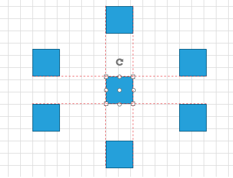
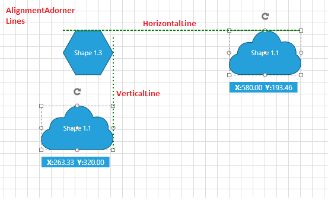

# Align and Snap 

__RadDiagram__ gives you the ability to __Align__ the selected RadDiagramItems or __Snap__ them with DiagramCommands.            

>Please note that the examples in this tutorial are showcasing Telerik Windows8 theme. In the [Setting a Theme](http://www.telerik.com/help/silverlight/common-styling-apperance-setting-theme.html#Setting_Application-Wide_Built-In_Theme_in_the_Code-Behind)[Setting a Theme](http://www.telerik.com/help/wpf/common-styling-apperance-setting-theme-wpf.html#Setting_Application-Wide_Built-In_Theme_in_the_Code-Behind) article you can find more information on how to set an application-wide theme.                

## Align

The __Align__ DiagramCommand makes the Selected Items align to Top, Bottom, Left, Right, Middle or Center.                

Note that the __IsSnapToGridEnabled__ property of the RadDiagram must be set to True (default). Below you can see an example code of how to use the Align Command:                

#### __XAML__

{{region raddiagrams-features-snap-0}}
	<Grid>
		<Grid.RowDefinitions>
			<RowDefinition Height="Auto" />
			<RowDefinition Height="*" />
		</Grid.RowDefinitions>
		
		<StackPanel>
			<telerik:RadButton Width="125" Command="telerik:DiagramCommands.Snap" CommandTarget="{Binding ElementName=diagram}" Content="Snap" />
			<telerik:RadButton Width="125" Command="telerik:DiagramCommands.Align" CommandTarget="{Binding ElementName=diagram}" Content="Align" />
		</StackPanel>
		
		<telerik:RadDiagram Grid.Row="1" x:Name="diagram">
			<telerik:RadDiagramShape Width="45" Height="45" Geometry="{telerik:CommonShape ShapeType=RectangleShape}" Position="123 50" />
			<telerik:RadDiagramShape Width="45" Height="45" Geometry="{telerik:CommonShape ShapeType=RectangleShape}" Position="183 100" />
			<telerik:RadDiagramShape Width="45" Height="45" Geometry="{telerik:CommonShape ShapeType=RectangleShape}" Position="243 150" />
		</telerik:RadDiagram>
	</Grid>
{{endregion}}

You can give argument to the Align Command with the __CommandParameter__ property. You can set Top, Bottom, Left, Right, Middle or Center Alignment like so:

#### __XAML__

{{region raddiagrams-features-snap-1}}
	<StackPanel>
		<telerik:RadButton Width="125" Command="telerik:DiagramCommands.Align" CommandParameter="Right" CommandTarget="{Binding ElementName=diagram}" Content="Align" />
	</StackPanel>
{{endregion}}

>Please keep in mind that you cannot use __HorizontalAlignment__ and __VerticalAlignment__ of the RadDiagramItem because the Diagram is created over a Canvas. In other word, use only the Position property.                    

## Snap To Grid

The __RadDiagram__ snapping features allow you to move the diagram items exactly to a point coordinates. This is very useful when you need to create more accurate layouts. Essentially __Snapping__ means changing the __RadDiagramItems Position__ by multiplying the __X__ and __Y__ coordinates by a particular value - __RadDiagram SnapX__ and __SnapY__ accordingly.                

In the __RadDiagram__ the snapping is enabled by default and in order to disable it, you can set the __IsSnapToGridEnabled__ property to __False__. Also, please note that the default value of the __RadDiagram SnapX__ and __SnapY__ properties is 20, but you can change it to any integer greater than or equal to 1.                

Once the snapping is enabled, when a __DiagramItem__ is dragged its X and Y coordinates increase or decrease with the __SnapX__ and __SnapY__ value. Below you can see the selected item being snapped with the [Snap Command]().                

#### __XAML__

{{region raddiagrams-features-snap-2}}
	<Grid>
		<Grid.RowDefinitions>
			<RowDefinition Height="Auto" />
			<RowDefinition Height="*" />
		</Grid.RowDefinitions>
		
		<StackPanel>
			<telerik:RadButton Width="125" Command="telerik:DiagramCommands.Snap" CommandTarget="{Binding ElementName=diagram}" Content="Snap" />
			<telerik:RadButton Width="125" Command="telerik:DiagramCommands.Align" CommandTarget="{Binding ElementName=diagram}" Content="Align" />	
		</StackPanel>
		
		<telerik:RadDiagram Grid.Row="1" GridCellWidth="20" GridCellHeight="20" x:Name="diagram">
			<telerik:RadDiagramShape Width="45" Height="45" Geometry="{telerik:CommonShape ShapeType=RectangleShape}" Position="125 55" />
		</telerik:RadDiagram>
	</Grid>
{{endregion}}

## Snap To Items

You are also able to snap items to other items while dragging. You can enable this feature by setting the __RadDiagram IsSnapToItemsEnabled__ property to __True__. This feature is also enabled by default and you will have to explicitly set the property to __False__ to disable it.                

>Please keep in mind that when both snapping features are enabled (which is the default state of the __RadDiagram__), the __SnapToItems__ feature has a higher priority.           

The __SnapToItems__ feature is visualized through a set of thin indication lines helping you snap the dragged item/s to other static items:

## SnappingEngine

The __SnapToItems__ feature of the __Diagramming Framework__ uses a __SnappingEngine__ to determine how an item should be snapped to a set of static items. The class exposes two virtual methods which you can override in your application to customize the default snap to items behavior. Both methods are executed for all possible pairs of items formed of one dragged item from the collection of currently dragged items and one static item from all static items on the diagramming surface (viewport). Also both methods return a value of type __MatchingInfo__ - this object describes a list of matching points and a __double__ value. The __MatchingPoints__ collection is populated with the points where the compared items match. These points are then used to draw the snapping lines. The __double__ value, named __Delta__, is used to determine the snapping.                

>Please have in mind that the __MachingInfo__ with minimum __Delta__ value is used to snap the items. All other __MatchingInfo__ results returned by the __SnappingEngine__ methods are rejected.

* __GetHorizontalMatchingOverride__ - this method matches the __Top__ and __Bottom__ values of the bounds of two __DiagramShapes__ - one static and one dragged, to find the matching points between them. The method also determines how the dragged shape can be snapped to the static shape and what horizontal snapping lines should be displayed.           

* __GetVerticalMatchingOverride__ - this method matches the __Left__ and __Right__ values of the bounds of two items - one static and one dragged item, to find the matching points between them. The method also determines how the dragged item can be snapped to the static item and what vertical snapping lines should be displayed.

## Appearance

The alignment lines are part of the __AlignmentAdorner__ and therefore their appearance can be controlled through the following set of properties:                

* __AlignmentAdorner.HorizontalLineStroke__ - this property is of type __Brush__ and it specifies how the horizontal alignment lines are painted.                        

* __AlignmentAdorner.HorizontalLineStrokeDashArray__ - this property gets or sets a collection of __Double__ values that indicate the pattern of dashes and gaps that is used to outline the horizontal alignment lines.                        

* __AlignmentAdorner.HorizontalLineStrokeThickness__ - this property is of type __double__ and it gets or sets the thickness of the horizontal alignment lines.                        

* __AlignmentAdorner.VerticalLineStroke__ - this property is of type __Brush__ and it specifies how the vertical alignment lines are painted.                        

* __AlignmentAdorner.VerticalLineStrokeDashArray__ - this property is of type __Brush__ and it specifies how the vertical alignment lines are painted.                        

* __AlignmentAdorner.VerticalLineStrokeThickness__ - this property gets or sets a collection of __Double__ values that indicate the pattern of dashes and gaps that is used to outline the vertical alignment lines.                        

>The __AlignmentAdorner__ definition is placed in the __Telerik.Windows.Controls.Diagrams.Primitives__ namespace. This is why in order to control its settings, you need to add an alias to that namespace:
>`xmlns:primitives="clr-namespace:Telerik.Windows.Controls.Diagrams.Primitives;assembly=Telerik.Windows.Controls.Diagrams"`
>`...`
>`<telerik:RadDiagram primitives:AlignmentAdorner.VerticalLineStroke="Green"/>`

#### __XAML__

{{region raddiagrams-features-snap-4}}
	<telerik:RadDiagram x:Name="xDiagram"
						primitives:AlignmentAdorner.HorizontalLineStroke="Green"
						primitives:AlignmentAdorner.HorizontalLineStrokeDashArray="2 1"
						primitives:AlignmentAdorner.HorizontalLineStrokeThickness="2"
						primitives:AlignmentAdorner.VerticalLineStroke="Green"
						primitives:AlignmentAdorner.VerticalLineStrokeDashArray="1 2"
						primitives:AlignmentAdorner.VerticalLineStrokeThickness="2" />
{{endregion}}

## See Also
 * [Getting Started]()
 * [Populating with Data]()
 * [Shapes]()
 * [Connections]()
 * [Pan and Zoom]()
 * [Undo and Redo]()
 * [Commands]()
 * [Keyboard Support]()