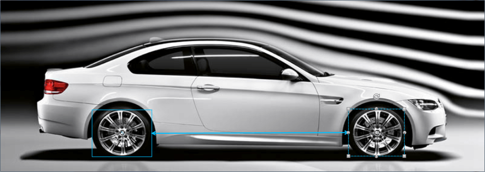

# Maintain the Items' Positions When the Diagram is Resized

The purpose of this article is to show how a user can maintain the RadDiagramItems' Position, Width and Height when the Diagram is being resized.            

## Maintaining the Items' Positions When Resizing the RadDiagram

Consider the following scenario. We are working with RadDiagram used over an Image. When we resize the Window/UserControl which contains the RadDiagram and the Image, we want to preserve the relative positions of the Shapes we use.Here is the XAML of a RadDiagram used with Image:

We can use the __RadDiagram.SizeChanged__ event, iterate over the __Shapes__ collection and update the shapes' Position, Width and Height like so:

Below you can see this in action. The Window or UserControl is resized and the Shapes' Position and size are updated:

#### __C#__
{{region raddiagram-howto-maintain-shapes-positions-when-resizing-the-diagram-0}}
    private void RadDiagram_SizeChanged(object sender, SizeChangedEventArgs e) 
    { 
        if(e.PreviousSize != null && e.PreviousSize.Width != 0 && e.PreviousSize.Height != 0) 
        { 
            double deltaX = (e.NewSize.Width / e.PreviousSize.Width); 
            double deltaY = (e.NewSize.Height / e.PreviousSize.Height); 

            this.radDiagram.Shapes.ToList().ForEach(x => 
                { 
                    x.Position = new Point(x.Position.X * deltaX, x.Position.Y * deltaY); 
                    x.Width = x.Width * deltaX; 
                    x.Height = x.Height * deltaY; 
                }); 
        } 
    }   
{{endregion}}
    
#### __VB.NET__
{{region raddiagram-howto-maintain-shapes-positions-when-resizing-the-diagram-1}}
    Private Sub RadDiagram_SizeChanged(sender As Object, e As SizeChangedEventArgs)
        If e.PreviousSize IsNot Nothing AndAlso e.PreviousSize.Width <> 0 AndAlso e.PreviousSize.Height <> 0 Then
            Dim deltaX As Double = (e.NewSize.Width / e.PreviousSize.Width)
            Dim deltaY As Double = (e.NewSize.Height / e.PreviousSize.Height)

            Me.radDiagram.Shapes.ToList().ForEach(Function(x) 
				x.Position = New Point(x.Position.X * deltaX, x.Position.Y * deltaY)
				x.Width = x.Width * deltaX
				x.Height = x.Height * deltaY

			End Function)
        End If
    End Sub
{{endregion}}

## See Also
 * [Resizing]()