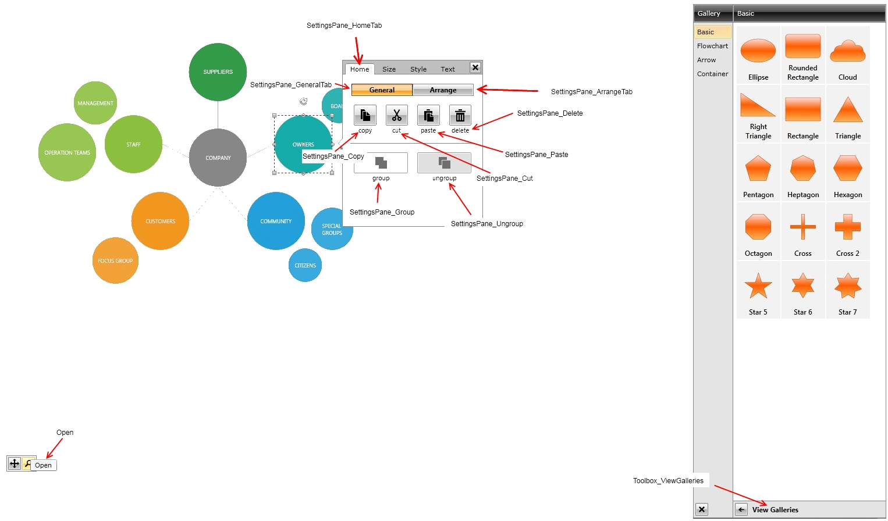
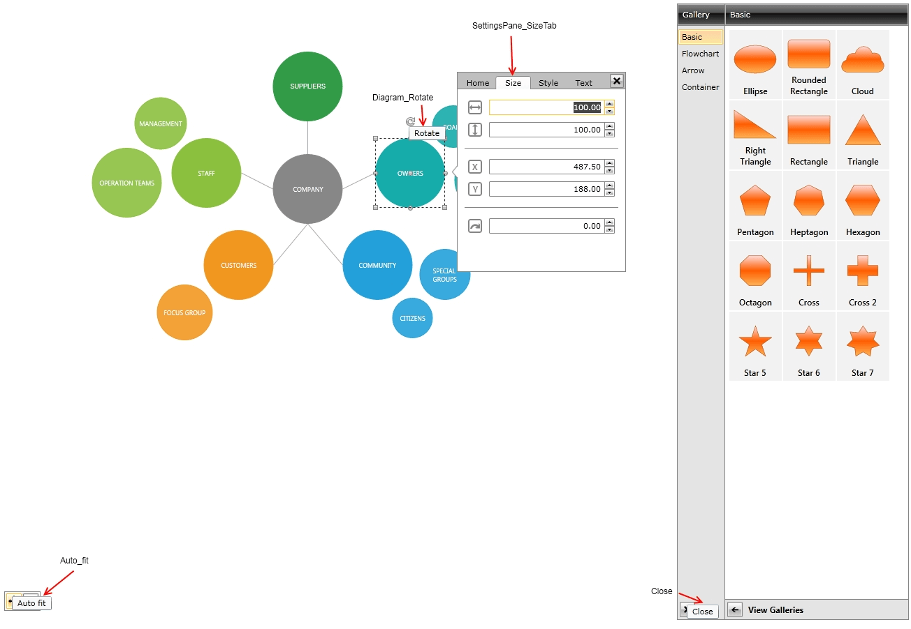
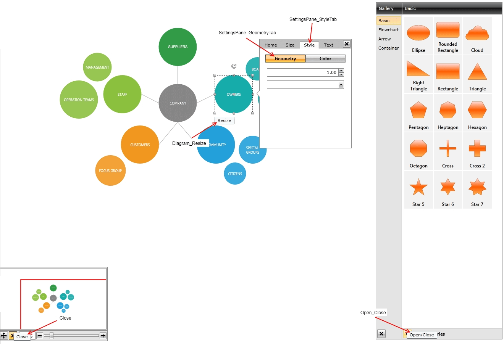
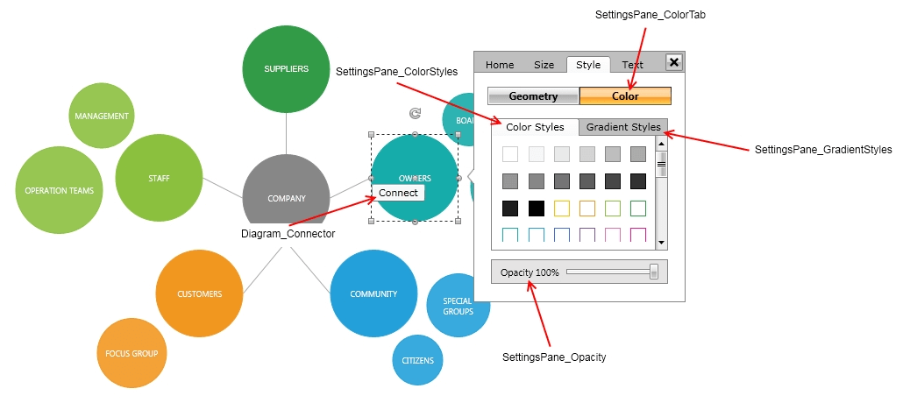

# Localization

This tutorial describes the localization support implemented in the RadDiagram elements

## Localization Using ResourceManager

You can base your localization on the standard resource files provided by the .NET framework. For that purpose you will have to create a separate .ResX file for each one of the languages that your application will support.		

Imagine that you want to translate your diagramming implementation into English and German. For that purpose you will have to add two new resource files to your project:		

* __DiagramResources.resx__ -  this resource file will store the English(default) resources for the grid control. Set the AccessModifier property to Public.			

* __DiagramResources.de.resx__ - this resource file will store the German resources for the grid control. Set the AccessModifier property to No code generation.

Now, having the needed files, it's time to illustrate the idea and localize only the text for the group panel. For that purpose you need to create a single resource string in each one of the three resource files and translate it to the appropriate language. 

>Note that the name of the resource string should be the same as the resource key for the string that you are localizing. The resource key for the diagram rotation thumb tooltip is Diagram_Rotate. 

<!-- -->
>For a full list of ResourceKeys, check out the LocalizationStrings section of this article. 

The snapshot below shows the content of the DiagramResources.de.resx file. The resource name of the other file should be the same. The Value column will contain the translation for the appropriate language.

The last step is to instantiate the __LocalizationManager__ class and set its __ResourceManager__ to the resources that have been just created (you can do this in the default constructor of the __Application__ class).		

#### __C#__
{{region raddiagram-localization-0}}
    LocalizationManager.Manager = new LocalizationManager()
    {
        ResourceManager = DiagramResources.ResourceManager
    };
{{endregion}}

#### __VB.NET__
{{region raddiagram-localization-1}}
    LocalizationManager.Manager = New LocalizationManager()
    LocalizationManager.Manager.ResourceManager = DiagramResources.ResourceManager  
{{endregion}}

>If you rely on culture settings to load the right resources automatically, you have to write some code inside your application's project file. For example, if you have to support English and German languages, you can store the localized strings in __Resources.resx__ and __Resources.de.resx__ files. For the __Resources.resx__ file you can set __ResXFileCodeGenerator__ to __Internal__ or __Public__ and for the others - to __No code generation__. Then, open the project file in a text-mode and insert the code below into the <PropertyGroup> section. In this way you notify the framework about the supported cultures.

#### __XAML__
{{region raddiagram-localization-2}}
	<SupportedCultures>en;de</SupportedCultures>			
{{endregion}}

## Localization Using Custom Localization Manager

The other way to localize your __RadDiagram__ is to create a class that derives from the __LocalizationManager__ object and to override its method __GetStringOverride()__. The logic is pretty simple, you just have to create a switch statement and return the correct translation for each resource key, as it is shown below: 
		
#### __C#__
{{region raddiagram-localization-3}}
    public class CustomLocalizationManager : LocalizationManager
    {
        public override string GetStringOverride(string key)
        {
            switch (key)
            {
                case "Diagram_Rotate":
                    return "Rotate";
                case "Auto_fit":
                    return "Auto Fit";
                //SettingsPane parts localization strings
                case "SettingsPane_SizeTab":
                    return "Size";
                case "SettingsPane_HomeTab":
                    return "Home";
                case "SettingsPane_Copy":
                    return "Copy";
                case "SettingsPane_Cut":
                    return "Cut";
                case "SettingsPane_Paste":
                    return "Paste";
                case "SettingsPane_Delete":
                    return "Delete";
            }
            return base.GetStringOverride(key);
        }
    }
{{endregion}}

#### __VB.NET__
{{region raddiagram-localization-4}}	
	Public Class CustomLocalizationManager
		Inherits LocalizationManager
		Public Overrides Function GetStringOverride(key As String) As String
			Select Case key
				Case "Diagram_Rotate"
					Return "Rotate"
				Case "Auto_fit"
					Return "Auto Fit"
				'SettingsPane parts localization strings
				Case "SettingsPane_SizeTab"
					Return "Size"
				Case "SettingsPane_HomeTab"
					Return "Home"
				Case "SettingsPane_Copy"
					Return "Copy"
				Case "SettingsPane_Cut"
					Return "Cut"
				Case "SettingsPane_Paste"
					Return "Paste"
				Case "SettingsPane_Delete"
					Return "Delete"
			End Select
			Return MyBase.GetStringOverride(key)
		End Function
	End Class	
{{endregion}}

Of course, if you don't want to hard-code your translation inside your source code, you can always use resource files:
		
#### __C#__
{{region raddiagram-localization-5}}	
    public override string GetStringOverride(string key)
    {
        switch (key)
        {
            //----------------------
            case "Diagram_Rotate":
                return DiagramResources.Diagram_Rotate;
            //----------------------
        }
        return base.GetStringOverride(key);
    }	    
{{endregion}}
	
#### __VB.NET__
{{region raddiagram-localization-6}}	
	Public Overrides Function GetStringOverride(key As String) As String
		Select Case key
			'----------------------'
			Case "Diagram_Rotate"
				Return DiagramResources.Diagram_Rotate
			'----------------------'
		End Select
		Return MyBase.GetStringOverride(key)
	End Function		
{{endregion}}

## Diagram Localization Strings

In the following snapshots you can find a list of all Diagram localization strings:

