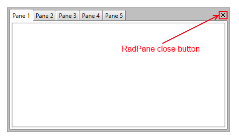
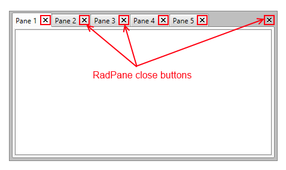
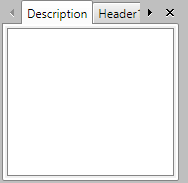
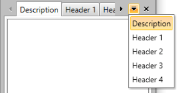

# Document Host

The `DocumentHost` is meant to be the default container for the editable documents in your application. By default it occupies the whole central area of the `RadDocking` control and each newly added pane is docked as a new tab page inside of it.

Here is the XAML declaration of the above structure.

#### __[XAML]__

{{region xaml-raddocking-features-document-host_0}}
	<telerik:RadDocking x:Name="radDocking">
	    <telerik:RadDocking.DocumentHost>
	        <telerik:RadSplitContainer>
	            <telerik:RadPaneGroup x:Name="radPaneGroup" >
	                <telerik:RadPane x:Name="radPane1" Header="Document 1">
	                    <TextBlock TextWrapping="Wrap" Text=""></TextBlock>
	                </telerik:RadPane>
	                <telerik:RadPane x:Name="radPane2" Header="Document 2">
	                    <TextBlock TextWrapping="Wrap" Text=""></TextBlock>
	                </telerik:RadPane>
	                <telerik:RadPane x:Name="radPane3" Header="Document 3">
	                    <TextBlock TextWrapping="Wrap" Text=""></TextBlock>
	                </telerik:RadPane>
	            </telerik:RadPaneGroup>
	        </telerik:RadSplitContainer>
	    </telerik:RadDocking.DocumentHost>
	</telerik:RadDocking>
{{endregion}}

>tipSince the DocumentHost is meant to host the editable documents in your application, it is good idea to use [RadDocumentPanes]() instead of [RadPanes]().

>Placing `RadPaneGroup` directly in the DocumentHost is not a supported scenario in the Docking control. The RadPaneGroup needs to be placed in a `RadSplitContainer`.

## Modifying DocumentHost

The `DocumentHost` is part of the template of the Docking control. To learn how to modify it, take a look at the [Templating the RadDocking]() topic.

## Setting the CloseButtonPosition

You could easily set the close button position of the Panes that are placed in the DocumentHost by setting the `CloseButtonPosition` property of the Docking control to one of the three built-in predefined settings (InGroup, InPane and InPaneAndGroup).

The next code snippet shows how to set the CloseButtonPosition to InPane:
  
#### __[XAML]__

{{region xaml-raddocking-features-document-host_1}}
	<telerik:RadDocking CloseButtonPosition="InPane">
	    <telerik:RadDocking.DocumentHost>
	        <telerik:RadSplitContainer>
	            <telerik:RadPaneGroup x:Name="radPaneGroup1" >
	                <telerik:RadPane x:Name="radPane11" Header="Document 1">
	                    <TextBlock TextWrapping="Wrap" Text=""></TextBlock>
	                </telerik:RadPane>
	                <telerik:RadPane x:Name="radPane21" Header="Document 2">
	                    <TextBlock TextWrapping="Wrap" Text=""></TextBlock>
	                </telerik:RadPane>
	                <telerik:RadPane x:Name="radPane31" Header="Document 3">
	                    <TextBlock TextWrapping="Wrap" Text=""></TextBlock>
	                </telerik:RadPane>
	            </telerik:RadPaneGroup>
	        </telerik:RadSplitContainer>
	    </telerik:RadDocking.DocumentHost>
	</telerik:RadDocking>
{{endregion}}

The next descriptions describe the built-in predefined CloseButtonPosition settings and their visual representation when they are set:

1. `InGroup`&mdash;This is the default value of the CloseButtonPosition property which causes the close button of the currently active Pane in the PaneGroup to be visible in the top right corner of the PaneGroup

	

2. `InPane`&mdash;Places separate close button for each Pane in their tab

	

3. `InPaneAndGroup`&mdash;Places separate close button for each Pane in their tab and a close button for the currently active Pane in the PaneGroup in the top right corner of the group.

	
	
## Showing Arrows and DropDown Button

When the number of Panes inside the `DocumentHost` increases and there is not enough space available inside the tabstrip they begun to shrink. In order to see the whole Headers of the Panes you can use the `ScrollViewer.HorizontalScrollBarVisibility` attached property of the `PaneGroup` inside the DocumentHost. Arrows will be visualized on both sides of the tabstrip:

#### __[XAML]__

{{region xaml-raddocking-features-document-host_2}}
	<telerik:RadPaneGroup ScrollViewer.HorizontalScrollBarVisibility="Auto"/>
{{endregion}}

__Figure 1:__ DocumentHost with a visible `HorizontalScrollBar`:

By design the `HorizontalScrollBarVisibility` property is disabled and can be visualized either by setting it to `Visible` or `Auto` (the arrow buttons will become visible when the space is not enough).

In addition to this you could also display the drop down menu button that contains a list of all Panes inside the DocumentHost. For that purpose the `DropDownDisplayMode` property could be used:

#### __[XAML]__

{{region xaml-raddocking-features-document-host_3}}
	<telerik:RadPaneGroup ScrollViewer.HorizontalScrollBarVisibility="Auto" DropDownDisplayMode="Visible"/>
{{endregion}}

The `DropDownDisplayMode` property could be set to any of the following values:
* `Collapsed`&mdash;The drop down will never be shown.
* `Visible`&mdash;The drop down will always be visible.
* `WhenNeeded`&mdash;The drop down will be shown only when there is not enough space the Tabs to be arranged. 

Figure 2 demonstrate the appearance of the DocumentHost when both properties are set.

__Figure 2:__ DocumentHost with visible `HorizontalScrollBar` and drop down menu button:

## Controlling Content Margin

To control the extra space around the content of the panes inside a certain pane group, which is defined inside a `DocumentHost`, utilize the `Padding` property of the desired `RadPaneGroup` element.

#### __[XAML]__

{{region xaml-raddocking-features-document-host_4}}
	<telerik:RadDocking.DocumentHost>
	    <telerik:RadSplitContainer>
	        <telerik:RadPaneGroup Padding="10">
	            <telerik:RadPane>
	                <ScrollViewer/>
	            </telerik:RadPane>
	        </telerik:RadPaneGroup>
	    </telerik:RadSplitContainer>
	</telerik:RadDocking.DocumentHost>
{{endregion}}

Furthermore, if you need to apply this to all of the `RadPaneGroup` instances, create a new `Style` with a `Setter` for the `Padding` property.

#### __[XAML]__

{{region xaml-raddocking-features-document-host_5}}
	<!-- If you're using the NoXaml binaries, you need to base the custom style on the default one for the control, like so:
	
{{endregion}}

> For the Fluent, Green, Material, Office2016 and Office2016Touch themes, the `RadPaneGroup` element's padding should be updated through a style trigger.

#### __[XAML]__

{{region xaml-raddocking-features-document-host_6}}
	<!-- If you're using the NoXaml binaries, you need to base the custom style on the default one for the control, like so:
	
{{endregion}}

## See Also

 * [Pane Groups]()

 * [Split Container]()

 * [Tool Window]()

 * [Compass]()

 * [RadDocumentPane]()
