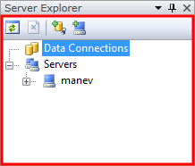
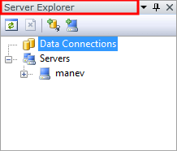
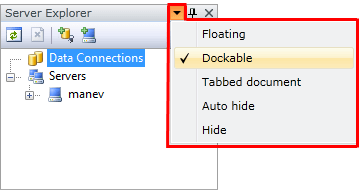
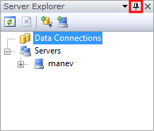
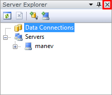
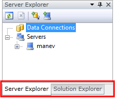

# Visual Structure

The major control elements of a the standard __RadPane__ are:

* __Content Area__: This is the area inside of a __RadPane__ where your content will be hosted. To set it or get it just use the __RadPane__'s property __Content__.

	

* __Header__: This is the header control of a RadPane. In most cases it displays textual information. To learn how to customize the header, take a look at the [Styling the Pane Header]() and [How to Add Buttons to the Pane Header]() articles.

	

* __Menu__: This menu is created automatically for you and contains the __RadPane__'s most common commands. It allows you to make it floating, docked, part of a tabbed document or just hide it. The menu commands are programmatically accessible via the __RadPane__'s property __MenuCommands__. To learn how to customize this menu, take a look at the [How to Customize or Remove the RadPane's Menu]() and [RadDocking Localization]() articles.

	

* __Pin/Unpin Button__: This button allows you to pin and unpin the RadPane in case it is docked inside of the __RadSplitContainer__. It is visible by default but if you want to hide it, and prevent the user from changing the pin state of your pane, just set the pane's __CanUserPin__ property to __False__ and the button will be hidden.

	

* __Close button__: This button allows you to close the __RadPane__. It is visible by default but if you want to hide it, and prevent the user from closing your pane, just set the __RadPane__'s property __CanUserClose__ to __False__ and the button will be hidden. You can also have a look at the [How to Disable the Close Button]() topic.

	

* __Tab__: The tab is visible only when a __RadPane__ is docked inside of a container that hosts more than one pane. In that case each RadPane is placed as a separate tab item. To learn more, take a look at the [Pane Groups]() article.

	
          
## See Also

 * [How to Add Buttons to the Pane Header]()
 * [How to Customize or Remove the RadPane's Menu]()
 * [Styling the RadPane]()
 * [Styling the Pane Header]()