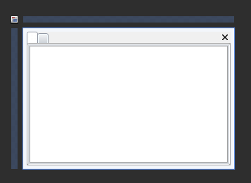
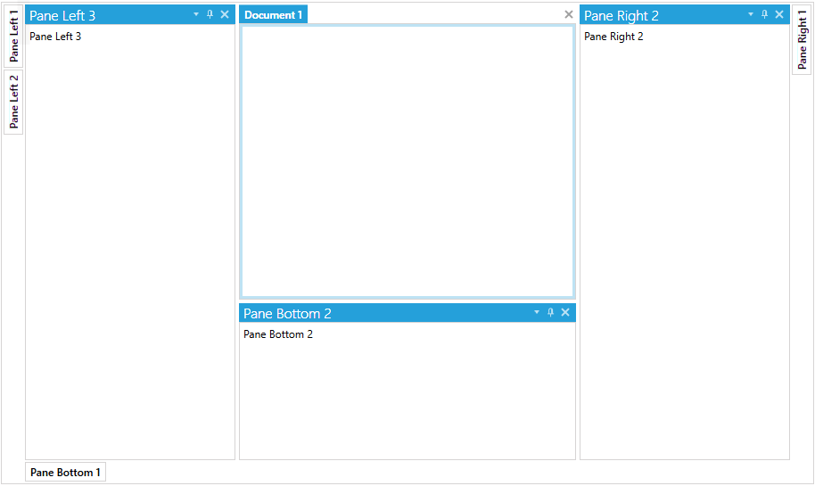

# Getting Started

This tutorial will walk you through the creation of a sample application that contains the __RadDocking__ control. 

* [Assembly References](#assembly-references)
* [Adding RadDocking to the Project](#adding-raddocking-to-the-project)
* [Adding DocumentHost, RadSplitContainer, RadPaneGroup and RadPanes](#adding-documenthost-radsplitcontainer-radpanegroup-and-radpanes)
* [Header, Content, CanFloat of RadPane](#header-content-canfloat-of-radpane)
* [Pinned Panes](#pinned-panes)
* [Setting a Theme](#setting-a-theme)

## Assembly References

In order to use the __RadDocking__ control in your projects, you have to add references to the following assemblies:			

* __Telerik.Windows.Controls__
* __Telerik.Windows.Controls.Navigation__
* __Telerik.Windows.Controls.Docking__
* __Telerik.Windows.Data__

## Adding RadDocking to the Project

Before proceeding with adding a __RadDocking__ control to your project, make sure the required assembly references are added to the project. 

You can add a __RadDocking__ control manually by writing the XAML code in __Example 1__. You can also add the control by dragging it from the Visual Studio Toolbox and dropping it over the XAML view.

#### __[XAML] Example 1: Adding RadDocking in XAML__

{{region xaml-raddocking-getting-started2_0}}
	<telerik:RadDocking/>
{{endregion}}

In order to use a __RadDocking__ control in XAML, you have to add the following namespace declaration:

#### __[XAML] Example 2: Declaring Telerik Namespace__
{{region xaml-raddocking-getting-started2-8}}
	xmlns:telerik="http://schemas.telerik.com/2008/xaml/presentation"
{{endregion}}

If you run the application, you will see an empty docking with no SplitContainers, PaneGroups and Panes, as shown in __Figure 1__. 

#### __Figure1: The empty RadDocking generated by the code in Example 1__

## Adding DocumentHost, RadSplitContainer, RadPaneGroup and RadPanes

Using __RadSplitContainers__, __RadPaneGroups__ and __RadPanes__ you could easily create Explorer and Outlook-like layouts. Without them, __RadDocking__ will look like an empty container.

### Adding DocumentHost

The [Document Host]() is meant to be the default container for the editable documents in your application. By default, it occupies the whole central area of __RadDocking__ and each newly added pane is docked as a new tab page inside it. In order to add __DocumentHost__ inside __RadDocking__, you need to set the __RadDocking.DocumentHost__ property as shown in __Example 3__.

#### __[XAML] Example 3: Adding DocumentHost in XAML__

{{region xaml-raddocking-getting-started2_1}}
	<telerik:RadDocking>
	    <telerik:RadDocking.DocumentHost>
	        <telerik:RadSplitContainer>
	            ...
	        </telerik:RadSplitContainer>
	    </telerik:RadDocking.DocumentHost>
	</telerik:RadDocking>
{{endregion}}

>tipThe DocumentHost control is not a required element. As an experiment, remove it from the XAML above and run your application to see how the application changes.

### Adding RadSplitContainer

[RadSplitContainer]() allows you to use movable bars to divide the displayed area into resizable parts. With  __RadDocking__'s __SplitContainers__ you can build complex layouts. Some practical examples of such layouts are Explorer-like and Outlook-like interfaces.

__Example 4__ demonstrates how to add __RadSplitContainer__ inside the __DocumentHost__.

#### __[XAML] Example 4: Adding RadSplitContainer in XAML__

{{region xaml-raddocking-getting-started2_2}}
	<telerik:RadDocking>
	    <telerik:RadDocking.DocumentHost>
	        <telerik:RadSplitContainer>
	        </telerik:RadSplitContainer>
	    </telerik:RadDocking.DocumentHost>
	</telerik:RadDocking>
{{endregion}}

### Adding RadPaneGroup

Before adding panes to your __RadDocking__ declaration, you need to add a [RadPaneGroup]() first. __RadPane__ cannot exist separately, it always has to be placed inside of a __RadPaneGroup__. The reason for this requirement is that __RadPaneGroup__ directly inherits __RadTabControl__, while the __RadPane__ derives from __RadTabItem__.

#### __[XAML] Example 5: Adding RadPaneGroup in XAML__

{{region xaml-raddocking-getting-started2_3}}
	<telerik:RadDocking>
	    <telerik:RadDocking.DocumentHost>
	        <telerik:RadSplitContainer>
	            <telerik:RadPaneGroup>
	            </telerik:RadPaneGroup>
	        </telerik:RadSplitContainer>
	    </telerik:RadDocking.DocumentHost>
	</telerik:RadDocking>
{{endregion}}

### Adding RadPane

[RadPane]() is the main content unit of __RadDocking__. Its main purpose is to act as a host of your content. That's why in order to have functional __RadDocking__, you need to have at least one __RadPane__ placed inside it.

#### __[XAML] Example 6: Adding RadPane in XAML__

{{region xaml-raddocking-getting-started2_4}}
	<telerik:RadDocking>
	    <telerik:RadDocking.DocumentHost>
	        <telerik:RadSplitContainer>
	            <telerik:RadPaneGroup>
	                <telerik:RadPane>
	                </telerik:RadPane>
	                <telerik:RadPane>
	                </telerik:RadPane>
	            </telerik:RadPaneGroup>
	        </telerik:RadSplitContainer>
	    </telerik:RadDocking.DocumentHost>
	</telerik:RadDocking>
{{endregion}}

#### __Figure2: The panes generated by the code in Example 6__

## Header, Content, CanFloat of RadPane

The __RadDocking__ from _Example 6_ does not have any __Header__ or __Content__ set for the declared panes. __Example 7__ demonstrates how you can manually set some headers and content for the panes:

#### __[XAML] Example 7: Adding header and content for the panes__

{{region xaml-raddocking-getting-started2_5}}
	<telerik:RadDocking Width="300" Height="200">
	    <telerik:RadDocking.DocumentHost>
	        <telerik:RadSplitContainer>
	            <telerik:RadPaneGroup>
	                <telerik:RadPane Header="Description">
	                    <TextBlock TextWrapping="Wrap" Text="On the Documents tab above press Ctrl + Mouse Left button to display the Popup Menu. You can use the same combination on every tab."/>
	                </telerik:RadPane>
	                <telerik:RadPane Header="NonDraggable">
	                    <TextBlock TextWrapping="Wrap" Text="This pane cannot be dragged, because it has its property CanFloat set 'False'."/>
	                </telerik:RadPane>
	            </telerik:RadPaneGroup>
	        </telerik:RadSplitContainer>
	    </telerik:RadDocking.DocumentHost>
	</telerik:RadDocking>
{{endregion}}

#### __Figure3: The docking and panes generated by the code in Example 6__

If you need to prevent the pane from being [dragged and dropped]() the __CanFloat__ property needs to be set to __False__.

#### __[XAML] Example 8: Setting CanFloat__

{{region xaml-raddocking-getting-started2_6}}
	<telerik:RadDocking>
	    <telerik:RadDocking Width="300" Height="200">
	        <telerik:RadDocking.DocumentHost>
	            <telerik:RadSplitContainer>
	                <telerik:RadPaneGroup>
	                    <telerik:RadPane Header="Description">
	                        <TextBlock TextWrapping="Wrap" Text="On the Documents tab above press Ctrl + Mouse Left button to display the Popup Menu. You can use the same combination on every tab."/>
	                    </telerik:RadPane>
	                    <telerik:RadPane Header="NonDraggable" CanFloat="False">
	                        <TextBlock TextWrapping="Wrap" Text="This pane cannot be dragged, because it has its property CanFloat set 'False'."/>
	                    </telerik:RadPane>
	                </telerik:RadPaneGroup>
	            </telerik:RadSplitContainer>
	        </telerik:RadDocking.DocumentHost>
	    </telerik:RadDocking>
	</telerik:RadDocking>
{{endregion}}

>If you try to drag and drop the "NonDraggable" pane to another PaneGroup, it will not be allowed due to the False value set for the CanFloat property.

## Pinned Panes

Each __RadPane__ provides built-in pin/unpin functionality that allows you to control the behavior and the visualization of the docked RadPanes during run-time; by default the panes are pinned. 

You can easily change the pin state of RadPane programmatically using the IsPinned property. __Example 9__ demonstrates RadDocking with panes that are initially [pinned]() to all sides of the docking area.

#### __[XAML] Example 9: Pinned Panes__

{{region xaml-raddocking-getting-started2_7}}
	<telerik:RadDocking>
	    <telerik:RadDocking.DocumentHost>
	        <telerik:RadSplitContainer>
	            <telerik:RadPaneGroup>
	                <telerik:RadPane Header="Description">
	                    <TextBlock TextWrapping="Wrap" Text="On the Documents tab above press Ctrl + Mouse Left button to display the Popup Menu. You can use the same combination on every tab."/>
	                </telerik:RadPane>
	                <telerik:RadPane Header="NonDraggable" CanFloat="False">
	                    <TextBlock TextWrapping="Wrap" Text="This pane cannot be dragged, because it has its property CanFloat set 'False'."/>
	                </telerik:RadPane>
	            </telerik:RadPaneGroup>
	        </telerik:RadSplitContainer>
	    </telerik:RadDocking.DocumentHost>
	
	    <telerik:RadSplitContainer InitialPosition="DockedLeft">
	        <telerik:RadPaneGroup>
	            <telerik:RadPane Header="Toolbox"/>
	            <telerik:RadPane Header="Server Explorer"/>
	        </telerik:RadPaneGroup>
	    </telerik:RadSplitContainer>
	
	    <telerik:RadSplitContainer InitialPosition="DockedRight">
	        <telerik:RadPaneGroup>
	            <telerik:RadPane Header="Properties"/>
	            <telerik:RadPane Header="Solution Explorer"/>
	        </telerik:RadPaneGroup>
	    </telerik:RadSplitContainer>
	
	    <telerik:RadSplitContainer InitialPosition="DockedBottom">
	        <telerik:RadPaneGroup>
	            <telerik:RadPane Header="Output"/>
	            <telerik:RadPane Header="Error List"/>
	        </telerik:RadPaneGroup>
	    </telerik:RadSplitContainer>
	</telerik:RadDocking>
{{endregion}}

>Two things must be mentioned about the __Example 9__ code snippet:
>	1. Note that the three [RadSplitContainers]() you added are not hosted in __DocumentHost__. The result will be that these splitters can be initially docked to any side of the dock area. 
>	1. Note the __InitialPosition__ property. It indicates where the splitter will be initially docked.

#### __Figure4: RadDocking generated by the code in Example 9__

## Setting a Theme

The controls from our suite support different themes. You can see how to apply a theme different than the default one in the [Setting a Theme]() help article.

>important Changing the theme using implicit styles will affect all controls that have styles defined in the merged resource dictionaries. This is applicable only for the controls in the scope in which the resources are merged. 

To change the theme, you can follow the steps below:
* Choose between the themes and add reference to the corresponding theme assembly (ex: **Telerik.Windows.Themes.Windows8.dll**). You can see the different themes applied in the **Theming** examples from our [WPF Controls Examples](https://demos.telerik.com/wpf/)[Silverlight Controls Examples](https://demos.telerik.com/silverlight/#Docking/Theming) application.

* Merge the ResourceDictionaries with the namespace required for the controls that you are using from the theme assembly. For __RadDocking__, you will need to merge the following resources:

	* __Telerik.Windows.Controls__
	* __Telerik.Windows.Controls.Navigation__
	* __Telerik.Windows.Controls.Docking__

__Example 8__ demonstrates how to merge the ResourceDictionaries so that they are applied globally for the entire application.

#### __[XAML] Example 8: Merge the ResourceDictionaries__  
{{region xaml-raddocking-getting-started2_8}}
		<Application.Resources>
			<ResourceDictionary>
				<ResourceDictionary.MergedDictionaries>
	                <ResourceDictionary Source="/Telerik.Windows.Themes.Windows8;component/Themes/System.Windows.xaml"/>
	                <ResourceDictionary Source="/Telerik.Windows.Themes.Windows8;component/Themes/Telerik.Windows.Controls.xaml"/>
	                <ResourceDictionary Source="/Telerik.Windows.Themes.Windows8;component/Themes/Telerik.Windows.Controls.Navigation.xaml"/>
	                <ResourceDictionary Source="/Telerik.Windows.Themes.Windows8;component/Themes/Telerik.Windows.Controls.Docking.xaml"/>
				</ResourceDictionary.MergedDictionaries>
			</ResourceDictionary>
		</Application.Resources>
{{endregion}}
	
#### __Figure 4: RadDocking with the Windows8 theme__

## See Also

 * [RadDocumentPane]()

 * [Docked/Floating Panes]()

 * [Pinned/Unpinned Panes]()

 * [ToolWindow]()
 
 * [Drag and Drop]()
 
 * [Styling the RadPane]()

 * [Styling the Pane Header]()
 
 * [Styling the ToolWindow]()
