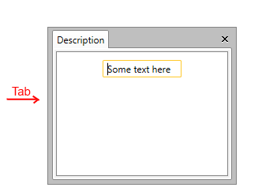

# How to Disable the Tab Navigation of RadDocking Elements

By default, when tab navigation is used, it is possible to focus __RadDocking__ itself as well as some of its elements such as GridResizer and AutoHideArea.

With R2 2016 of UI for WPF, we introduced a way to easily disable the tab navigation of __RadDocking__ elements. This allows the user to directly navigate to the elements inside the active pane content when the Tab key is pressed.

>important You can use the approach explained here when using [Implicit Styles]() to set a theme to the Docking control.

Let’s, for example, have a simple RadDocking definition as shown in __Example 1__.

#### __[XAML] Example 1: Simple RadDocking definition__

{{region xaml-raddocking-how-to-disable-tab-navigation_0}}
	<telerik:RadDocking Width="240" Height="200">
	    <telerik:RadDocking.DocumentHost>
	        <telerik:RadSplitContainer>
	            <telerik:RadPaneGroup>
	                <telerik:RadPane Header="Description">
	                    <TextBox Text="Some text here"  Width="100" Margin="10" />
	                </telerik:RadPane>
	            </telerik:RadPaneGroup>
	        </telerik:RadSplitContainer>
	    </telerik:RadDocking.DocumentHost>
	</telerik:RadDocking>
{{endregion}}

In the example, when RadDocking receives the focus, a user needs to push the Tab key several times in order to navigate to the TextBox inside the pane as shown in __Figure 1__.   

#### __Figure 1: RadDocking behavior when Tab key is pressed multiple times__

In order to change this behavior, you will need to set the __IsTabStop__ property to __False__ for some elements inside __RadDocking__. You can use Styles targeting these elements added inside App.xaml.

#### __[XAML] Example 2: Applying IsTabStop through the Styles of RadDocking elements__

{{region xaml-raddocking-how-to-disable-tab-navigation_1}}
	<Application.Resources>
	    <ResourceDictionary>
	        <ResourceDictionary.MergedDictionaries>
	            <ResourceDictionary Source="/Telerik.Windows.Themes.Office_Black;component/Themes/System.Windows.xaml"/>
	            <ResourceDictionary Source="/Telerik.Windows.Themes.Office_Black;component/Themes/Telerik.Windows.Controls.xaml"/>
	            <ResourceDictionary Source="/Telerik.Windows.Themes.Office_Black;component/Themes/Telerik.Windows.Controls.Navigation.xaml"/>
	            <ResourceDictionary Source="/Telerik.Windows.Themes.Office_Black;component/Themes/Telerik.Windows.Controls.Docking.xaml"/>
	        </ResourceDictionary.MergedDictionaries>
	
	        
	        
	        
	        
	    </ResourceDictionary>
	</Application.Resources>
{{endregion}}

>__Example 2__ uses the Office_Black theme, however, the approach is applicable for all themes.

After applying the Styles declared in __Example 2__, the focus goes directly to the TextBox when the user presses the Tab key as shown in __Figure 2__.

#### __Figure 2: RadDocking behavior after disabling Tab navigation of its elements__

