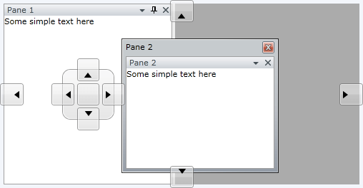
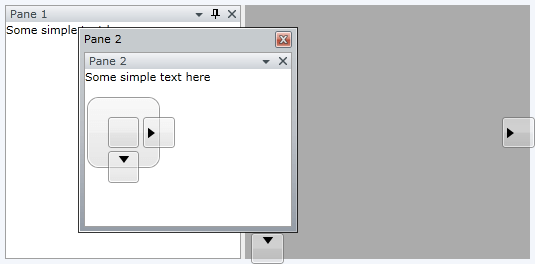
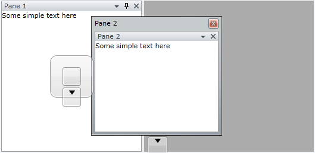
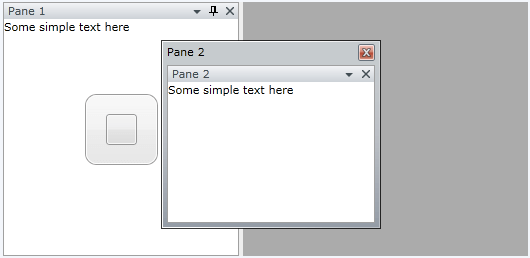

# How to Implement Conditional Docking

There are cases, in which you want to __disable__ the user's ability to __dock__ panes to any of the sides. In this case you need to implement conditional docking.

You could use the __PreviewShowCompass__ event of the __RadDocking__ control in combination with the __Is<*>IndicatorVisible__ series of properties of the __Compass__ class. Where <*> could be one of the following:

* __Left__

* __Top__

* __Right__

* __Bottom__

* __Center__

For the purpose of this tutorial, the following __RadDocking__ declaration will be used:

#### __XAML__

{{region xaml-raddocking-how-to-implement-conditional-docking_0}}
	<telerik:RadDocking x:Name="radDocking">
	    <telerik:RadSplitContainer>
	        <telerik:RadPaneGroup>
	            <telerik:RadPane x:Name="radPane" Header="Pane 1">
	                <TextBlock Text="Some simple text here"/>
	            </telerik:RadPane>
	            <telerik:RadPane x:Name="radPane2" Header="Pane 2">
	                <TextBlock Text="Some simple text here"/>
	            </telerik:RadPane>
	        </telerik:RadPaneGroup>
	    </telerik:RadSplitContainer>
	</telerik:RadDocking>
{{endregion}}

When you try to drag and dock the "Pane 2", then all [compass indicators]() are available.

In order to implement conditional docking, you need to perform the following instructions.

Attach to the __PreviewShowCompass__ event of the __RadDocking__ control.

#### __XAML__

{{region xaml-raddocking-how-to-implement-conditional-docking_1}}
	<telerik:RadDocking x:Name="radDocking1" PreviewShowCompass="radDocking_PreviewShowCompass">
{{endregion}}

Switch to the code-behind. The __PreviewShowCompassEventArgs__ exposes a __Compass__ property. You need to use the __Is<*>IndicatorVisible__ series of properties of the __Compass__ class in order to disable any of the compass indicators.

* __IsLeftIndicatorVisible__ - If you want to disable the left compass indicator, then set the __IsLeftIndicatorVisible__ property of the passed event arguments to __False__. 

#### __C#__

{{region cs-raddocking-how-to-implement-conditional-docking_2}}
	private void radDocking_PreviewShowCompass(object sender, Telerik.Windows.Controls.Docking.PreviewShowCompassEventArgs e)
	{
	    e.Compass.IsLeftIndicatorVisible = false;
	}
{{endregion}}

#### __VB.NET__

{{region vb-raddocking-how-to-implement-conditional-docking_3}}
	Private Sub radDocking_PreviewShowCompass(sender As Object, e As Telerik.Windows.Controls.Docking.PreviewShowCompassEventArgs)
		e.Compass.IsLeftIndicatorVisible = False
	End Sub
{{endregion}}

* __IsTopIndicatorVisible__ - If you want to disable the top compass indicator, then set the __IsTopIndicatorVisible__ property of the passed event arguments to __False__. 

#### __C#__

{{region cs-raddocking-how-to-implement-conditional-docking_4}}
	private void radDocking_PreviewShowCompass1(object sender, Telerik.Windows.Controls.Docking.PreviewShowCompassEventArgs e)
	{
	    e.Compass.IsLeftIndicatorVisible = false;
	    e.Compass.IsTopIndicatorVisible = false;
	}
{{endregion}}

#### __VB.NET__

{{region vb-raddocking-how-to-implement-conditional-docking_5}}
	Private Sub radDocking_PreviewShowCompass(ByVal sender As Object, ByVal e As Telerik.Windows.Controls.Docking.PreviewShowCompassEventArgs)
		e.Compass.IsLeftIndicatorVisible = False
		e.Compass.IsTopIndicatorVisible = False
	End Sub
{{endregion}}

 

* __IsRightIndicatorVisible__ - If you want to disable the right compass indicator, then set the __IsRightIndicatorVisible__ property of the passed event arguments to __False__. 

#### __C#__

{{region cs-raddocking-how-to-implement-conditional-docking_6}}
	private void radDocking_PreviewShowCompass2(object sender, Telerik.Windows.Controls.Docking.PreviewShowCompassEventArgs e)
	{
	    e.Compass.IsLeftIndicatorVisible = false;
	    e.Compass.IsTopIndicatorVisible = false;
	    e.Compass.IsRightIndicatorVisible = false;
	}
{{endregion}}

#### __VB.NET__

{{region vb-raddocking-how-to-implement-conditional-docking_7}}
	Private Sub radDocking_PreviewShowCompass(ByVal sender As Object, ByVal e As Telerik.Windows.Controls.Docking.PreviewShowCompassEventArgs)
		e.Compass.IsLeftIndicatorVisible = False
		e.Compass.IsTopIndicatorVisible = False
		e.Compass.IsRightIndicatorVisible = False
	End Sub
{{endregion}}

* __IsBottomIndicatorVisible__ - If you want to disable the bottom compass indicator, then set the __IsBottomIndicatorVisible__ property of the passed event arguments to __False__. 

#### __C#__

{{region cs-raddocking-how-to-implement-conditional-docking_8}}
	private void radDocking_PreviewShowCompass3(object sender, Telerik.Windows.Controls.Docking.PreviewShowCompassEventArgs e)
	{
	    e.Compass.IsLeftIndicatorVisible = false;
	    e.Compass.IsTopIndicatorVisible = false;
	    e.Compass.IsRightIndicatorVisible = false;
	    e.Compass.IsBottomIndicatorVisible = false;
	}
{{endregion}}

#### __VB.NET__

{{region vb-raddocking-how-to-implement-conditional-docking_9}}
	Private Sub radDocking_PreviewShowCompass(ByVal sender As Object, ByVal e As Telerik.Windows.Controls.Docking.PreviewShowCompassEventArgs)
		e.Compass.IsLeftIndicatorVisible = False
		e.Compass.IsTopIndicatorVisible = False
		e.Compass.IsRightIndicatorVisible = False
		e.Compass.IsBottomIndicatorVisible = False
	End Sub
{{endregion}}

* __IsCenterIndicatorVisible__ - If you want to disable the center compass indicator, then set the __IsCenterIndicatorVisible__ property of the passed event arguments to __False__. 

#### __C#__

{{region cs-raddocking-how-to-implement-conditional-docking_10}}
	private void radDocking_PreviewShowCompass4(object sender, Telerik.Windows.Controls.Docking.PreviewShowCompassEventArgs e)
	{
	    e.Compass.IsLeftIndicatorVisible = false;
	    e.Compass.IsTopIndicatorVisible = false;
	    e.Compass.IsRightIndicatorVisible = false;
	    e.Compass.IsBottomIndicatorVisible = false;
	    e.Compass.IsCenterIndicatorVisible = false;
	}
{{endregion}}

#### __VB.NET__

{{region vb-raddocking-how-to-implement-conditional-docking_11}}
	Private Sub radDocking_PreviewShowCompass(ByVal sender As Object, ByVal e As Telerik.Windows.Controls.Docking.PreviewShowCompassEventArgs)
		e.Compass.IsLeftIndicatorVisible = False
		e.Compass.IsTopIndicatorVisible = False
		e.Compass.IsRightIndicatorVisible = False
		e.Compass.IsBottomIndicatorVisible = False
		e.Compass.IsCenterIndicatorVisible = False
	End Sub
{{endregion}}

In the last case, all compass indicators are disabled.

>tipThere is an alternative approach to disable the docking. You need to set the initial position of the [RadSplitContainer]() to __FloatingOnly__.

## See Also

 * [Compass]()

 * [Drag and Drop]()

 * [How to Freeze the Layout]()
