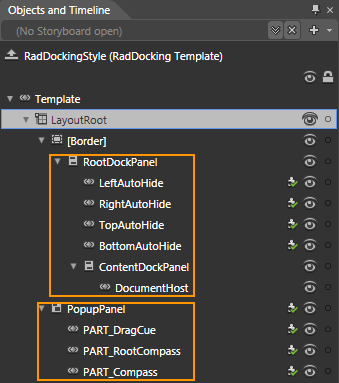

# Templates Structure

This topic will explain you the structure of the __RadDocking__ template and describe the elements in it.

Except the standard layout controls like __Grid__ and __Border__, the template contains one specific control - RootDockPanel of type __DockPanel__. They handle all of the functionality around the docking.

Take a look at the child elements of the __RootDockPanel__:

1. __LeftAutoHide__ - represents the auto hide area for the left part of the __RadDocking__ control.

1. __RightAutoHide__ - represents the auto hide area for the right part of the __RadDocking__ control.

1. __TopAutoHide__ - represents the auto hide area for the top part of the __RadDocking__ control.

1. __BottomAutoHide__ - represents the auto hide area for the bottom part of the __RadDocking__ control.

1. __ContentDockPanel__ - hosts the content of the __RadDocking__ control (such as [RadSplitContainers](), [RadPaneGroups]() etc.)

1. __DocumentHost__- represents the central content area of the __RadDocking__ control. [Read more here.]()

## See Also

 * [Overview]()

 * [Templating the RadDocking]()

 * [Visual Structure]()