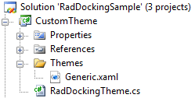

# Overview

>tip This topic will present you with the simple way of creating a theme. It's suitable for themes which contain less XAML. The advanced approach is more performant, especially when creating themes for the larger controls. To learn more about the advanced approach read the [Creating a Custom Theme]() topic in the common section.

The __RadDocking__ uses controls such as __PaneHeader__, [RadPaneGroup](), [ToolWindow](), [RadSplitContainer]() that are usually created dynamically depending on the user's actions. Such controls cannot be styled declaratively in XAML. In order to style them you have to apply a theme to your __RadDocking__ control that contains the styles for them. 

>By applying a theme, the style for a particular control will be set to all of the controls of this type.

## Creating the Theme

Before theming the controls involved with the __RadDocking__ control, you have to create a __ResourceDictionary__ that will represent your theme. For example, create the following structure in your project.



In the __RadDockingTheme.xaml__ you will place the styles and the resources for your theme.

Before theming the controls involved with the __RadDocking__ control, you have to create a Class Library project that will represent your theme. For example create a project with the following name.



In the __Generic.xaml__ you should place the styles and the resources for your theme.

>The __RadDockingTheme__ class should inherit from the Telerik.Windows.Controls.__Theme__ class.

## Applying a Theme

The theme can be easily set to your __RadDocking__ control in the following way.

#### __C#__

{{region cs-raddocking-theming-overview_0}}
	public StylingPaneHeader()
	{
	    InitializeComponent();
	    StyleManager.SetTheme( this.radDocking, new Theme());
	}
{{endregion}}

#### __VB.NET__

{{region vb-raddocking-theming-overview_1}}
	Public Sub New()
		InitializeComponent()
		StyleManager.SetTheme(Me.radDocking, New Theme())
	End Sub
{{endregion}}

#### __XAML__

{{region xaml-raddocking-theming-overview_2}}
	<UserControl.Resources>
	    <local:CustomTheme x:Key="MyTheme" />
	 </UserControl.Resources>
	        <Grid>
	            <telerik:RadDocking x:Name="radDocking"
	                                telerik:StyleManager.Theme="{StaticResource MyTheme}">
	            </telerik:RadDocking>
	        </Grid>
{{endregion}}

#### __C#__

{{region cs-raddocking-theming-overview_3}}
	public StylingPaneHeader1()
	{
	    InitializeComponent();
	    StyleManager.SetTheme(this.radDocking, new RadDockingTheme());
	}
{{endregion}}

#### __VB.NET__

{{region vb-raddocking-theming-overview_4}}
	Public Sub New()
		InitializeComponent()
		StyleManager.SetTheme(Me.radDocking, New RadDockingTheme())
	End Sub
{{endregion}}

To learn more about theming controls read the common theming topics on this matter. If you are new to the controls they will give you a basic knowledge about it.

Read the following topics to learn:

* [Theming the Pane Header]()

* [Theming the RadPaneGroup]()

* [Theming the ToolWindow]()

* [Theming the RadSplitContainer]()

## See Also

 * [Styling and Appearance - Overview] () 
