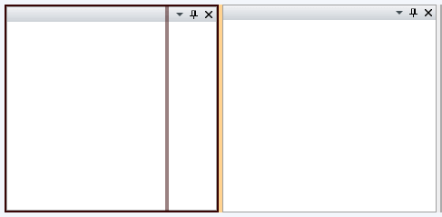

# Theming the RadSplitContainer

To modify the appearance of the __RadSplitContainer__ you have to create a custom theme and place a style that targets the __RadSplitContainer__ control in it. The topic assumes that you have already created a theme with a __ResourceDictionary__ that will host the styles and the resources for your custom theme. If not take a look at the overview section about [creating the theme](#CreatingTheme). The topic also assumes that you have already created the style that will be used for the __RadSplitContainer__ control. To learn how to style it take a look at the [Styling the RadSplitContainer]() topic.

Copy the created style with all of the resources it uses and place it in the __ResourceDictionary__ that represents the theme for your __RadDocking__ control.

#### __XAML__

{{region xaml-raddocking-theming-radsplitcontainer_0}}
	<ResourceDictionary xmlns="http://schemas.microsoft.com/winfx/2006/xaml/presentation"
	    xmlns:x="http://schemas.microsoft.com/winfx/2006/xaml">
	    <!--Paste the style and all of the resources it uses here. -->
	    
	</ResourceDictionary>
{{endregion}}

The next step is to declare the required namespaces in the resource dictionary.

#### __XAML__

{{region xaml-raddocking-theming-radsplitcontainer_1}}
	<ResourceDictionary xmlns="http://schemas.microsoft.com/winfx/2006/xaml/presentation"
	    xmlns:x="http://schemas.microsoft.com/winfx/2006/xaml"
	    xmlns:telerik="http://schemas.telerik.com/2008/xaml/presentation">
	    <!--...-->
	</ResourceDictionary>
{{endregion}}



Finally, in order to make the style default for all of the __RadSplitContainer__ controls you have to leave it without a key. Remove the key from the style.

#### __XAML__

{{region xaml-raddocking-theming-radsplitcontainer_2}}
	
{{endregion}}



To apply the theme got to the UserControl that hosts your __RadDocking__ control and set it through the code-behind.

#### __C#__

{{region cs-raddocking-theming-radsplitcontainer_3}}
	public App()
	{
	    InitializeComponent();
	    StyleManager.SetTheme( this.radDocking, new RadDockingTheme());
	}
{{endregion}}

#### __VB.NET__

{{region vb-raddocking-theming-radsplitcontainer_4}}
	Public Sub New()
		InitializeComponent()
		StyleManager.SetTheme(Me.radDocking, New Theme())
	End Sub
	
	Private Property radDocking As DependencyObject
{{endregion}}



Finally in order to make the style default for all of the __RadSplitContainer__controls you have to set it to the following value.

#### __XAML__

{{region xaml-raddocking-theming-radsplitcontainer_5}}
	
{{endregion}}



To see how to apply the theme read [here](#ApplyingTheme).

Here is a snapshot of a sample result.

## See Also

 * [Theming - Overview]()

 * [Styling the RadSplitContainer]()

 * [Split Container]()
