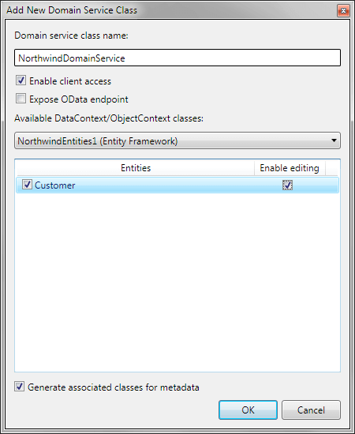

# Getting Started

This tutorial will walk you through the creation of a sample application that contains __RadGridView__ bound to __RadDomainDataSource__. 

>tip If you are using Open RIA services with 4.5 version you need to add a reference to the __Telerik.Windows.Controls.DomainServices.OpenRia45__ which is built against it.

## Creating the Silverlight application

1. Start Visual Studio 2010 and create a new ___Silverlight Application___.

2. Do not forget to check the __Enable WCF Ria Services__ option:

 

## Creating the Model and the DomainDataService

Now that we have the web application, we will add our data model using the Northwind database. 

1. In the server project (___SilverlightApplication2.Web___) add a new __ADO.NET Entity Data Model__ and generate the entities from the __Customers__ table of the __Northwind__ database. 

2. __Rebuild the project__ so when we add the __DomainDataSource__ - it will see the generated entities.

3. In the server project (___SilverlightApplication2.Web___) add a new __Domain Service Class__ and select the Customers entities:

4. Click ___OK___ and rebuild the solution

## Adding RadGridView and RadDomainDataSource

Now that we are ready with the server side, let's go to the client side - the Silverlight project.

1. Add References to the following Telerik assemblies:

	* __Telerik.Windows.Controls__ (mandatory for both RadGridView and RadDomainDataSource)

	* __Telerik.Windows.Data__ (mandatory for both RadGridView and RadDomainDataSource)

	* __Telerik.Windows.Controls.DomainServices__ (mandatory for RadDomainDataSource)

	* __Telerik.Windows.Controls.GridView__ (mandatory for RadGridView)

	* __Telerik.Windows.Controls.Input__ (mandatory for RadGridView)

2. Now add the __RadGridView__ and __RadDomainDataSource__ controls to the user control. You can add them by dragging them from the __Toolbox__ and dropping it over the XAML or do it manually by writing the XAML code that is shown below. 

#### __XAML__

{{region domaindatasource-getting-started_0}}

	<UserControl x:Class="SilverlightApplication2.MainPage"
	    xmlns="http://schemas.microsoft.com/winfx/2006/xaml/presentation"
	    xmlns:x="http://schemas.microsoft.com/winfx/2006/xaml"
	    xmlns:d="http://schemas.microsoft.com/expression/blend/2008"
	    xmlns:mc="http://schemas.openxmlformats.org/markup-compatibility/2006"
	    xmlns:server="clr-namespace:SilverlightApplication2.Web"             
	    xmlns:telerik="http://schemas.telerik.com/2008/xaml/presentation"
	    mc:Ignorable="d"
	    d:DesignHeight="300" d:DesignWidth="400">
	    <Grid x:Name="LayoutRoot" Background="White">
	        <telerik:RadDomainDataSource Name="customersDomainDataSource" 
	                                     QueryName="GetCustomersQuery"
	                                     AutoLoad="True">    
	            <telerik:RadDomainDataSource.DomainContext>
	                <server:NorthwindDomainContext />
	            </telerik:RadDomainDataSource.DomainContext>
	        </telerik:RadDomainDataSource>
	
	        <telerik:RadGridView Name="customerGridView"
	                             ItemsSource="{Binding DataView, ElementName=customersDomainDataSource}"
	                             IsBusy="{Binding IsBusy, ElementName=customersDomainDataSource}"/>
	    </Grid>
	</UserControl>
{{endregion}}

Several important things to notice:

* The import of the telerik schema: ___xmlns:telerik="http://schemas.telerik.com/2008/xaml/presentation"___

* The import of the server namespace: ___xmlns:server="clr-namespace:SilverlightApplication2.Web"___

* Declarations of the __RadDomainDataSource__ and __RadGridView__.

* The __AutoLoad__ property of the __RadDomainDataSource__ instructs it to load the data automatically when the page loads. 

* The __QueryName__ points to the query of the domain data service on the server

* __DomainContext__ - points to the context that has been created on the server

* __DataView__ - the data that comes from the server is stored in the __DataView__ property, so we bind the __RadGridView__ to it.

* __IsBusy__ [optional] - bind the __IsBusy__ property of __RadGridView__ to the __IsBusy__ property of the __RadDomainDataSource__ so you get a loading indicator during the load operation.

* Click __Ctrl + F5__ to run the application and see __RadGridView__ populated with the data from the Customers table.

A sample project can be downloaded from [here](http://blogs.telerik.com/rossenhristov/posts/10-12-24/introducing_raddomaindatasource_for_silverlight.aspx).

