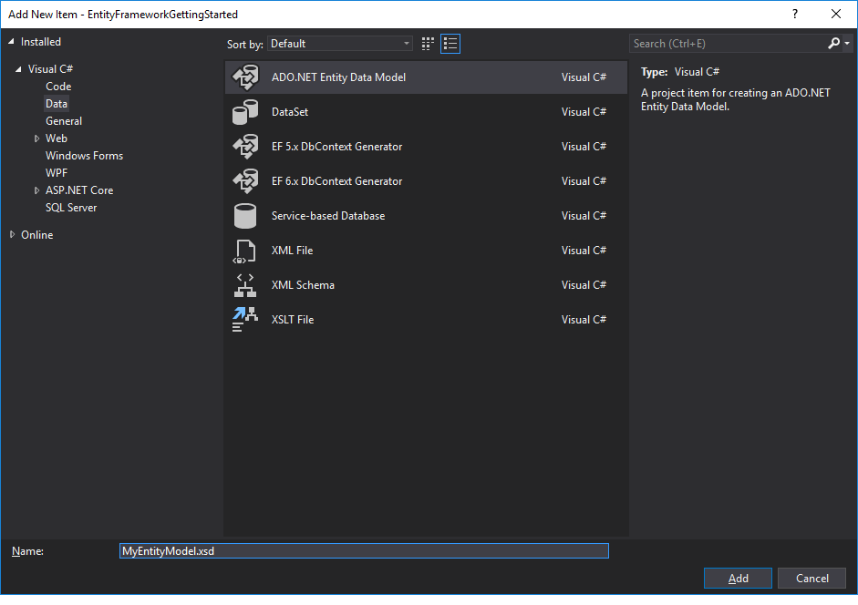
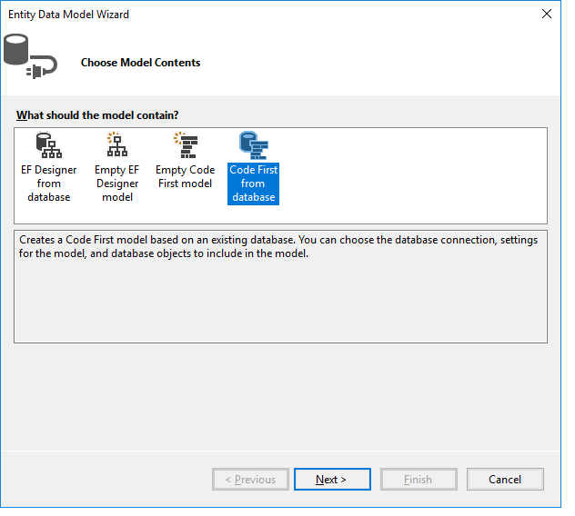

# Getting Started

This tutorial will walk you through the creation of a sample application that contains __RadGridView__ bound to __RadEntityFrameworkDataSource__.

* [Creating the WPF Application](#creating-the-wpf-application)
* [Creating the Model](#creating-the-model)
* [Adding RadGridView and RadEntityFrameworkDataSource](#adding-radgridview-and-radentityframeworkdatasource)

As of version __2013 Q3 SP1__ we have added support for __EntityFramework 6.0__. You will need to reference the __Telerik.Windows.Controls.EntityFramework60__ assembly, rather than the __Telerik.Windows.Controls.EntityFramework__ one in order for this to work.

## Creating the WPF Application

1. Note that __RadEntityFrameworkDataSource__ is built on top of the [ADO.NET Entity Framework](https://docs.microsoft.com/en-us/ef/ef6/). Basic Entity Framework experience is required for working with __RadEntityFrameworkDataSource__.

2. Start Visual Studio and create a new WPF Application.

## Creating the Model

Now that we have the application, we will add our entity model using the AdventureWorks database. 

1. In the project add a new __ADO.NET Entity Data Model__. You need to make sure that **Data** is selected from the left menu.

2. Choose to create a model using the code first approach from an existing database.

3. Choose the data connection (for example the __AdventureWorks__ database). In order to learn how to add the AdventureWorks database, check out the [AdventureWorks Readme](https://github.com/Microsoft/sql-server-samples/tree/master/samples/databases/adventure-works) article.

4. Generate the entities from all of the tables in the __AdventureWorks__ database.

5. Click __Finish__ and __rebuild the solution__.

## Adding RadGridView and RadEntityFrameworkDataSource

Now let's go to the client side.

**1.** Add References to the following __Telerik__ assemblies:

* __Telerik.Windows.Controls__ (mandatory for both __RadGridView__ and __RadEntityFrameworkDataSource__)

* __Telerik.Windows.Controls.EntityFramework__ (mandatory for __RadEntityFrameworkDataSource__ with EF **5.0** or previous)

	or

* __Telerik.Windows.Controls.EntityFramework60__ (mandatory for __RadEntityFrameworkDataSource__ with EF **6.0** or later)

* __Telerik.Windows.Controls.GridView__ (mandatory for __RadGridView__)

* __Telerik.Windows.Controls.Input__ (mandatory for __RadGridView__)

* __Telerik.Windows.Data__ (mandatory for both __RadGridView__ and __RadEntityFrameworkDataSource__)

**2.** Now add the __RadGridView__ and __RadEntityFrameworkDataSource__ controls to the main window. **Example 1** demonstrates how you can do that.

#### __[XAML] Example 1: Adding RadGridView and RadEntityFrameworkDataSource__

{{region xaml-entityframework-getting-started-1}}
	<Window x:Class="EntityFrameworkGettingStarted.MainWindow"
			xmlns="http://schemas.microsoft.com/winfx/2006/xaml/presentation"
			xmlns:x="http://schemas.microsoft.com/winfx/2006/xaml"
			xmlns:d="http://schemas.microsoft.com/expression/blend/2008"
			xmlns:mc="http://schemas.openxmlformats.org/markup-compatibility/2006"
			xmlns:local="clr-namespace:EntityFrameworkGettingStarted"
			xmlns:telerik="http://schemas.telerik.com/2008/xaml/presentation"
			mc:Ignorable="d"
			Title="MainWindow" Height="450" Width="800">
		<Grid>
			<telerik:RadEntityFrameworkDataSource Name="EntityFrameworkDataSource" QueryName="Customers">
				<telerik:RadEntityFrameworkDataSource.DbContext>
					<local:MyEntityModel/>
				</telerik:RadEntityFrameworkDataSource.DbContext>
			</telerik:RadEntityFrameworkDataSource>
			<telerik:RadGridView ItemsSource="{Binding DataView, ElementName=EntityFrameworkDataSource}"/>
		</Grid>
	</Window>
{{endregion}}

>importantSince __Q3 SP1 2012__ we have added the __RadEntityFrameworkDataSource.DbContext__ property which should be set instead of the **ObjectContext** property for versions of Entity Framework newer than version **5.0**. If you are using an older version of Entity Framework, you can set the **RadEntityFrameworkDataSource.ObjectContext** property.

Several important things to notice:

* The import of the telerik schema: __xmlns:telerik="[http://schemas.telerik.com/2008/xaml/presentation](http://schemas.telerik.com/2008/xaml/presentation)__

* The __QueryName__ points to the query of the data source.

* __DbContext__ - points to the context that has been created.

* __DataView__ - the data that comes from the query is stored in the __DataView__ property, so we bind the __RadGridView__ to it.

## RelatedObjects

The __RelatedObjects__ property of the RadEntityFrameworkDataSource allows you to specify the names of the related entities that need to be retrieved. For example, if your main entity set is called "Customers", you might want to retrieve the "Orders"  collection in case you want to get the related Orders for each Customer from the database.

#### __[XAML] Example 2: Using the RelatedObjects__
{{region xaml-entityframework-getting-started-1}}

    <telerik:RadEntityFrameworkDataSource Name="EntityFrameworkDataSource" QueryName="Customers">
        <telerik:RadEntityFrameworkDataSource.RelatedObjects>
            <sys:String>Orders</sys:String>
        </telerik:RadEntityFrameworkDataSource.RelatedObjects>
        <telerik:RadEntityFrameworkDataSource.DbContext>
			<local:MyEntityModel/>
		</telerik:RadEntityFrameworkDataSource.DbContext>
    </telerik:RadEntityFrameworkDataSource>
{{endregion}}

## See also

* [Create a simple data application with WPF and Entity Framework 6](https://docs.microsoft.com/en-us/visualstudio/data-tools/create-a-simple-data-application-with-wpf-and-entity-framework-6)