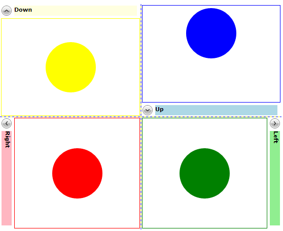
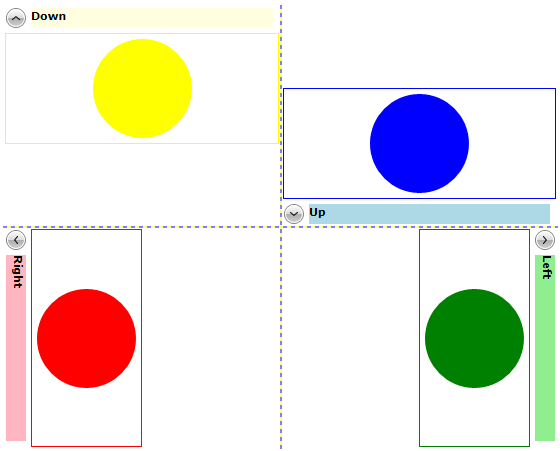
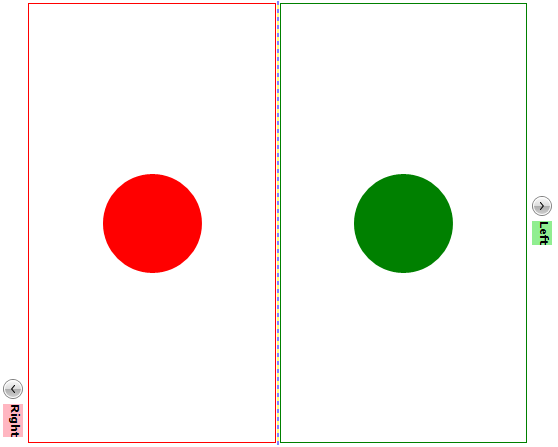

# Alignment

You can control the alignment of the __RadExpander__ control through the __HorizontalAlignment__ and __VerticalAlignment__ properties. Moreover, if you need to further customize the __RadExpander__'s __Content__ alignment you can take advantage of the __HorizontalContentAlignment__ and __VerticalContentAlignment__ properties. And if you want to control the alignment of the __RadExpander__'s __Header__, you can use the __HorizontalHeaderAlignment__ and __VerticalHeaderAlignment__ properties. By default all these properties are set to __Stretch__ so that the __RadExpander__ control is always stretch thus taking up all available space.

>The alignment properties depend on the __ExpandDirection__ of the control. Therefore before setting the alignment properties, you should carefully plan how you need to render the control depending on the available area as well as the __ExpandDirection__ of the control. 

#### __[XAML] Example 1: Setting ExpandDirection property__
{{region xaml-radexpander-features-alignment_0}}
	<Grid x:Name="LayoutRoot" Width="555" Height="444" Background="White" ShowGridLines="True">
	    <Grid.RowDefinitions>
	        <RowDefinition Height="*" />
	        <RowDefinition Height="*" />
	    </Grid.RowDefinitions>
	    <Grid.ColumnDefinitions>
	        <ColumnDefinition Width="*" />
	        <ColumnDefinition Width="*" />
	    </Grid.ColumnDefinitions>
	    <telerik:RadExpander Grid.Row="0" Grid.Column="0" ExpandDirection="Down" Header="Down">
	        <Border BorderBrush="Yellow" BorderThickness="1">
	            <Ellipse Width="99" Height="99" Margin="5" Fill="Yellow" />
	        </Border>
	    </telerik:RadExpander>
	    <telerik:RadExpander Grid.Row="0" Grid.Column="1" ExpandDirection="Up" Header="Up">
	        <Border BorderBrush="Blue" BorderThickness="1">
	            <StackPanel Orientation="Vertical">
	                <Ellipse Width="99" Height="99" Margin="5" Fill="Blue" />
	            </StackPanel>
	        </Border>
	    </telerik:RadExpander>
	    <telerik:RadExpander Grid.Row="1" Grid.Column="0" ExpandDirection="Right" Header="Right">
	        <Border BorderBrush="Red" BorderThickness="1">
	            <Ellipse Width="99" Height="99" Margin="5" Fill="Red" />
	        </Border>
	    </telerik:RadExpander>
	    <telerik:RadExpander Grid.Row="1" Grid.Column="1" ExpandDirection="Left" Header="Left">
	        <Border BorderBrush="Green" BorderThickness="1">
	            <Ellipse Width="99" Height="99" Margin="5" Fill="Green" />
	        </Border>
	    </telerik:RadExpander>
	</Grid>
{{endregion}}

#### Figure 2: RadExpander directions

## HorizontalAlignment and VerticalAlignment properties

You can control the vertical and horizontal alignment of the control through the __HorizontalAlignment__ and __VerticalAlignment__ properties. By default both properties are set to __Stretch.__ However, if you want the control to take up only as much space as it needs, you can define the __VerticalAlignment__ and __HorizontalAlignment__ properties accordingly to the __ExpandDirection__ of the control:

#### __[XAML] Example 2: Setting HorizontalAlignment and VerticalAlignment properties__
{{region xaml-radexpander-features-alignment_1}}
	<Grid x:Name="LayoutRoot" Width="555" Height="444" Background="White" ShowGridLines="True">
	    <Grid.RowDefinitions>
	        <RowDefinition Height="*" />
	        <RowDefinition Height="*" />
	    </Grid.RowDefinitions>
	    <Grid.ColumnDefinitions>
	        <ColumnDefinition Width="*" />
	        <ColumnDefinition Width="*" />
	    </Grid.ColumnDefinitions>
	    <telerik:RadExpander Grid.Row="0" Grid.Column="0" ExpandDirection="Down" Header="Down" VerticalAlignment="Top">
	        <Border BorderBrush="Yellow" BorderThickness="1">
	            <Ellipse Width="99" Height="99" Margin="5" Fill="Yellow" />
	        </Border>
	    </telerik:RadExpander>
	    <telerik:RadExpander Grid.Row="0" Grid.Column="1" ExpandDirection="Up" Header="Up" VerticalAlignment="Bottom">
	        <Border BorderBrush="Blue" BorderThickness="1">
	            <StackPanel Orientation="Vertical">
	                <Ellipse Width="99" Height="99" Margin="5" Fill="Blue" />
	            </StackPanel>
	        </Border>
	    </telerik:RadExpander>
	    <telerik:RadExpander Grid.Row="1" Grid.Column="0" ExpandDirection="Right" Header="Right" HorizontalAlignment="Left">
	        <Border BorderBrush="Red" BorderThickness="1">
	            <Ellipse Width="99" Height="99" Margin="5" Fill="Red" />
	        </Border>
	    </telerik:RadExpander>
	    <telerik:RadExpander Grid.Row="1" Grid.Column="1" ExpandDirection="Left" Header="Left" HorizontalAlignment="Right">
	        <Border BorderBrush="Green" BorderThickness="1">
	            <Ellipse Width="99" Height="99" Margin="5" Fill="Green" />
	        </Border>
	    </telerik:RadExpander>
	</Grid>
{{endregion}}

#### Figure 2: HorizontalAlignment and VerticalAlignment properties visual appearance

>Please note that when the __VerticalAlignment__/__HorizontalAlignment__ properties match the __ExpandDirection__, the __Header__ will move aside as the content is expanded. 

## HorizontalContentAlignment and VerticalContentAlignment properties

You can use the __HorizontalContentAlignment__ and __VerticalContentAlignment__ properties to control how the __RadExpander's__ __Content__ will be rendered. For example you can use the properties to set the __RadExpander's__ __Content__ to take up only as much space as it needs:

#### __[XAML] Example 3: Setting HorizontalContentAlignment and VerticalContentAlignment properties__
{{region xaml-radexpander-features-alignment_2}}
	<Grid x:Name="LayoutRoot" Width="555" Height="444" Background="White" ShowGridLines="True">
	    <Grid.RowDefinitions>
	        <RowDefinition Height="*" />
	        <RowDefinition Height="*" />
	    </Grid.RowDefinitions>
	    <Grid.ColumnDefinitions>
	        <ColumnDefinition Width="*" />
	        <ColumnDefinition Width="*" />
	    </Grid.ColumnDefinitions>
	    <telerik:RadExpander Grid.Row="0" Grid.Column="0" ExpandDirection="Down" VerticalContentAlignment="Top">
	        <telerik:RadExpander.Header>
	            <Border Background="LightYellow">
	                <TextBlock Text="Down" FontWeight="Bold" />
	            </Border>
	        </telerik:RadExpander.Header>
	        <Border BorderBrush="Yellow" BorderThickness="1">
	            <Ellipse Width="99" Height="99" Margin="5" Fill="Yellow" />
	        </Border>
	    </telerik:RadExpander>
	    <telerik:RadExpander Grid.Row="0" Grid.Column="1" ExpandDirection="Up" VerticalContentAlignment="Bottom">
	        <telerik:RadExpander.Header>
	            <Border Background="LightBlue">
	                <TextBlock Text="Up" FontWeight="Bold" />
	            </Border>
	        </telerik:RadExpander.Header>
	        <Border BorderBrush="Blue" BorderThickness="1">
	            <StackPanel Orientation="Vertical">
	                <Ellipse Width="99" Height="99" Margin="5" Fill="Blue" />
	            </StackPanel>
	        </Border>
	    </telerik:RadExpander>
	    <telerik:RadExpander Grid.Row="1" Grid.Column="0" ExpandDirection="Right" HorizontalContentAlignment="Left">
	        <telerik:RadExpander.Header>
	            <Border Background="LightPink">
	                <TextBlock Text="Right" FontWeight="Bold" />
	            </Border>
	        </telerik:RadExpander.Header>
	        <Border BorderBrush="Red" BorderThickness="1">
	            <Ellipse Width="99" Height="99" Margin="5" Fill="Red" />
	        </Border>
	    </telerik:RadExpander>
	    <telerik:RadExpander Grid.Row="1" Grid.Column="1" ExpandDirection="Left" HorizontalContentAlignment="Right">
	        <telerik:RadExpander.Header>
	            <Border Background="LightGreen">
	                <TextBlock Text="Left" FontWeight="Bold" />
	            </Border>
	        </telerik:RadExpander.Header>
	        <Border BorderBrush="Green" BorderThickness="1">
	            <Ellipse Width="99" Height="99" Margin="5" Fill="Green" />
	        </Border>
	    </telerik:RadExpander>
	</Grid>
{{endregion}}

#### Figure 2: 

## HorizontalHeaderAlignment and VerticalHeaderAlignment properties

You can control how to render the __RadExpander's__ __Header__ through the __HorizontalHeaderAlignment__ and __VerticalHeaderAlignment__ properties. These properties should be set accordingly to the __ExpandDirection__ value. 

If the __RadExpander's__ __ExpandDirection__ is __Up__ or __Down__, you can control the __Header's__ alignment through the __HorizontalHeaderAlignment.__ The property exposes the following enumeration: 

* __Center:__ The __RadExpander.Header's__ content will be centered in the header part of the __RadExpander ControlTemplate__

* __Right:__ The __RadExpander.Header's__ content will be right-aligned in the header part of the __RadExpander ControlTemplate__

* __Left:__ The __RadExpander.Header's__ content will be left-aligned in the header part of the __RadExpander ControlTemplate__

* __Stretch:__ The __RadExpander.Header's__ content will be stretched throughout the header part of the __RadExpander ControlTemplate__

#### __[XAML] Example 4: Setting HorizontalHeaderAlignment property__
{{region radexpander-features-alignment_3}}
	<Grid x:Name="LayoutRoot" Width="555" Height="444" Background="White" ShowGridLines="True">
	    <Grid.ColumnDefinitions>
	        <ColumnDefinition Width="*" />
	        <ColumnDefinition Width="*" />
	    </Grid.ColumnDefinitions>
	    <telerik:RadExpander Grid.Column="0" ExpandDirection="Down" HorizontalHeaderAlignment="Center">
	        <telerik:RadExpander.Header>
	            <Border Background="LightYellow">
	                <TextBlock Text="Down" FontWeight="Bold" />
	            </Border>
	        </telerik:RadExpander.Header>
	        <Border BorderBrush="Yellow" BorderThickness="1">
	            <Ellipse Width="99" Height="99" Margin="5" Fill="Yellow" />
	        </Border>
	    </telerik:RadExpander>
	    <telerik:RadExpander Grid.Column="1" ExpandDirection="Up" HorizontalHeaderAlignment="Right">
	        <telerik:RadExpander.Header>
	            <Border Background="LightBlue">
	                <TextBlock Text="Up" FontWeight="Bold" />
	            </Border>
	        </telerik:RadExpander.Header>
	        <Border BorderBrush="Blue" BorderThickness="1">
	            <StackPanel Orientation="Vertical">
	                <Ellipse Width="99" Height="99" Margin="5" Fill="Blue" />
	            </StackPanel>
	        </Border>
	    </telerik:RadExpander>
	</Grid>
{{endregion}}

#### Figure 3: HorizontalHeaderAlignment with ExpandDirection set to Down and Up

If the __RadExpander's__ __ExpandDirection__ is __Right__ or __Left__, you can control the position of the __Header's__ content through again the __HorizontalHeaderAlignment__ property.

#### __[XAML] Example 5: Setting HorizontalHeaderAlignment property__
{{region radexpander-features-alignment_4}}
	<Grid x:Name="LayoutRoot" Width="555" Height="444" Background="White" ShowGridLines="True">
	    <Grid.ColumnDefinitions>
	        <ColumnDefinition Width="*" />
	        <ColumnDefinition Width="*" />
	    </Grid.ColumnDefinitions>
	    <telerik:RadExpander Grid.Column="0" ExpandDirection="Right" HorizontalHeaderAlignment="Right">
	        <telerik:RadExpander.Header>
	            <Border Background="LightPink">
	                <TextBlock Text="Right" FontWeight="Bold" />
	            </Border>
	        </telerik:RadExpander.Header>
	        <Border BorderBrush="Red" BorderThickness="1">
	            <Ellipse Width="99" Height="99" Margin="5" Fill="Red" />
	        </Border>
	    </telerik:RadExpander>
	    <telerik:RadExpander Grid.Column="1" ExpandDirection="Left" HorizontalHeaderAlignment="Center">
	        <telerik:RadExpander.Header>
	            <Border Background="LightGreen">
	                <TextBlock Text="Left" FontWeight="Bold" />
	            </Border>
	        </telerik:RadExpander.Header>
	        <Border BorderBrush="Green" BorderThickness="1">
	            <Ellipse Width="99" Height="99" Margin="5" Fill="Green" />
	        </Border>
	    </telerik:RadExpander>
	</Grid>
{{endregion}}

#### Figure 4: HorizontalHeaderAlignment with ExpandDirection set to Right and Left

## See Also  
* [Getting Started]()
* [Expand Direction]()
