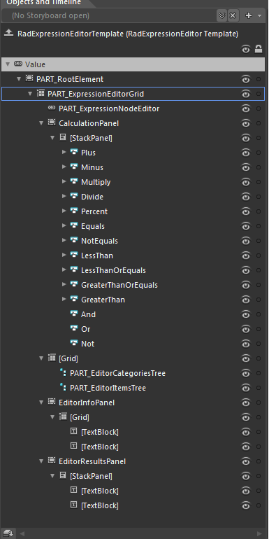
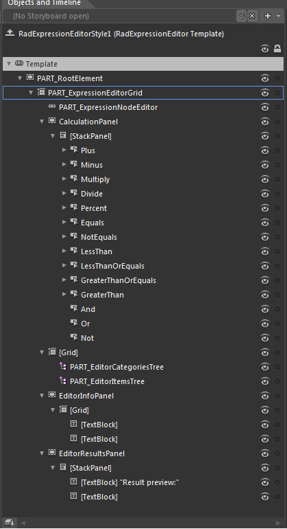

# Templates Structure

Like most UI controls, __RadExpressionEditor__ allows you to template it in order to change the control from inside. Except for templating the whole control, you can template parts of it or even independent controls related to it. 

This topic will make you familiar with the template structure of __RadExpressionEditor__.

## RadExpressionEditor

* __PART_RootElement__ - hosts the elements of the template. It represents the border of the __RadExpressionEditor__ and is of type __Border__.

* __PART_ExpressionEditorGrid__ - provides rows for the template elements. It represents the background of the __RadExpressionEditor__ and is of type __Grid__.

* __PART_ExpressionNodeEditor__ - represents the editor of __RadExpressionEditor__ and it is of type __ExpressionTextBox__.

* __CalculationPanel__ - represents the __Panel__ which hosts the __ExpressionEditor’s__ buttons and is of type __Border__.

* __StackPanel__

* __Plus__ - represents the __Plus__ button and is of type __RadButton__.

* __[Path]__

* __Minus__- represents the __Minus__ button and is of type __RadButton__.

* __[Path]__

* __Multiply__- represents the __Multiply__ button and is of type __RadButton__.

* __[Path]__

* __Divide__- represents the __Divide__ button and is of type  __RadButton__.

* __[Path]__

* __Percent__- represents the __Percent__ button and is of type __RadButton__.

* __[Path]__

* __Equals__- represents the __Equals__ button and is of type __RadButton__.

* __[Path]__

* __NotEquals__- represents the __NotEquals__ button and is of type __RadButton__.

* __[Path]__

* __LessThan__- represents the __LessThan__ button and is of type __RadButton__.

* __[Path]__

* __LessThanOrEquals__- represents the __LessThanOrEquals__ button and is of type __RadButton__.

* __[Path]__

* __GreaterThanOrEquals__- represents the __GreaterThanOrEquals__ button and is of type __RadButton__.

* __[Path]__

* __GreaterThan__ - represents the __GreaterThan__ button and is of type __RadButton__.

* __[Path]__

* __And__- represents the __And__ button and is of type __RadButton__.

* __Or__- represents the __Or__ button and is of type __RadButton__.

* __Not__- represents the __Not__ button and is of type __RadButton__.

* __Grid__

* __PART_EditorCategoriesTree__- represents the __Categories__ of the functions exposed by __RadExpressionEditor__ and is of type __RadTreeView__. 

* __PART_EditorItemsTree__- represents the items of the functions exposed by __RadExpressionEditor__ and is of type __RadTreeView__.

* __EditorInfoPanel__- represents the info panel of __RadExpressionEditor__, which provides information about a specific functions exposed by __RadExpressionEditor__ and is of type __Border__.

* __Grid__

* __TextBlock__ - represents the __QuickInfo__ of the __SelectedItem__ in __RadExpressionEditor__ and it is of type __TextBlock__.

* __TextBlock__ - represents the __Description__ of the __SelectedItem__ in __RadExpressionEditor__ and it is of type __TextBlock__.

* __EditorResultsPanel__- represents the results panel of __RadExpressionEditor__, which provides information about the returned result by the performed calculations. 

* __StackPanel__

* __TextBlock__

* __TextBlock__- represents the result preview of __RadExpressionEditor__ and it is of type __TextBlock__.


			 







