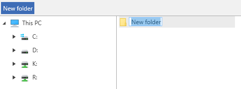
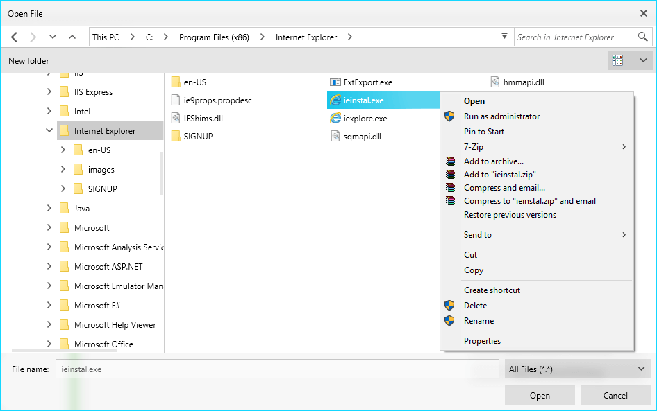

# Common

This articles shows the features shared between all file dialogs controls - __RadOpenFileDialog, RadSaveFileDialog, RadOpenFolderDialog__ and __ExplorerControl__ .

* [Setting Initial Directory](#setting-initial-directory)
* [Setting the Initial Layout of the Tiles](#setting-the-initial-layout-of-the-tiles)
* [New Folder Button](#new-folder-button)
* [Edit Mode](#edit-mode)
* [Disable the Automatic Expanding to Current Directory](#disable-the-automatic-expanding-to-current-directory)
* [Show Hidden Files](#show-hidden-files)

## Setting Initial Directory

All the dialog controls expose a __InitialDirectory__ property that determines the directory that will be opened when the dialog shows.

#### __[C#] Example 1: Setting initial directory__ 
{{region radfiledialogs-features-common-0}}
	RadSaveFileDialog saveFileDialog = new RadSaveFileDialog();	
	saveFileDialog.Owner = this;
	
	saveFileDialog.InitialDirectory = @"C:\Temp\";
	
	saveFileDialog.ShowDialog();	
{{endregion}}

## Setting the Initial Layout of the Tiles

All the dialog controls expose a __InitialSelectedLayout__ property that determines the initial layout of the list with the files

#### __[C#] Example 2: Setting initial layout__ 
{{region radfiledialogs-features-common-1}}
	RadSaveFileDialog saveFileDialog = new RadSaveFileDialog();	
	saveFileDialog.Owner = this;
	
	saveFileDialog.InitialSelectedLayout = Telerik.Windows.Controls.FileDialogs.LayoutType.Tiles;
	
	saveFileDialog.ShowDialog();	
{{endregion}}

#### Figure 1: RadOpenFileDialog in Tile view mode in the Office2016 theme  

The layout is determined by the LayoutType enum that provides the following modes:

* __SmallIcons__

* __MediumIcons__

* __LargeIcons__

* __ExtraLargeIcons__

* __List__

* __Tiles__

* __Details__

## New Folder Button

Since __R1 2018__, you can add a new folder in all the dialog controls with the __New Folder__ button. The created folder enters edit mode in all [Layout View Modes](#setting-the-initial-layout-of-the-tiles). 

#### Figure 2: New folder button and new folder in edit mode in the Office2016 theme

## Edit Mode

In order to edit the selected file/folder, you can press the __F2__ key. Alternatively, you can click on the TextBlock which holds the file/folder name in all layouts except the **Details** layout where you can click on the cell holding the file/folder name. If you try to add a reserved character in a file/folder name, you will receive the warning illustrated in **Figure 3**:

#### Figure 3: Reserved character warning in the Office2016 theme  

Trying to change the file extension prompts the message box shown in **Figure 4**:

#### Figure 4: Changing file extension message box in the Office2016 theme  

## Using the ContextMenu

As of __R1 2018 RadFileDialogs__ has a ContextMenu. The well-known ContextMenu used in Windows is used for this purpose. It is available for the __RadListBox, RadTreeView and RadGridView__ components used in the Main Pane.

#### Figure 5: Showing the ContextMenu

## Disable the Automatic Expanding to Current Directory
By default the main pane with the files/folders and the navigation tree are synced and when you navigate through the folders the selection in the tree navigation pane will also be updated. To disable this you can set the __ExpandToCurrentDirectory__ property of the dialog to False.

#### __[C#] Example 3: Disabling the automatic expanding to current directory__ 
{{region radfiledialogs-features-common-2}}
	RadOpenFileDialog openFileDialog = new RadOpenFileDialog();
	openFileDialog.Owner = theOwnerWindow;
	openFileDialog.ExpandToCurrentDirectory = false;
	openFileDialog.ShowDialog();
{{endregion}}

>tip When enabled the automatic expanding always synchronizes the files/folders list with the navigation tree. If you want to sync them only on load of the control, you can skip setting the property initially and then subscribe to the Loaded event of the dialog. In the event handler you can set the ExpandToCurrentDirectory property to False.

## Show Hidden Files

By default the file dialogs don't show hidden files and folders. To show them you can set the __ShowHiddenFiles__ property of the corresponding file dialog control to True.

#### __[C#] Example 4: Enable showing hidden files and folders__ 
{{region radfiledialogs-features-common-3}}
	RadOpenFileDialog openFileDialog = new RadOpenFileDialog();
	openFileDialog.Owner = this;
	openFileDialog.ShowHiddenFiles = true;
	openFileDialog.ShowDialog();            
{{endregion}}

#### Figure 5: Showing hidden files  

## See Also 
* [Custom Places]()
* [Filtering]()
