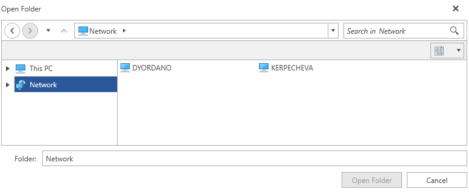

# Network Locations

Since **R3 2018**, the RadFileDialogs as well as the ExplorerControl provide out of the box support for Network Locations.

## Enabling Network Locations

In order for the RadFileDialogs and ExplorerControl to show the Network drive and all of the available network locations, you can set the **ShowNetworkLocations** property to **True**. This is demonstrated in **Example 1**.

#### [C#] Example 1: Showing Network Locations in RadOpenFileDialog  
{{region cs-radfiledialogs-features-network-locations_0}} 
    RadOpenFileDialog openFileDialog = new RadOpenFileDialog(); 
    openFileDialog.Owner = theHostWindowInstance; 
    openFileDialog.ShowNetworkLocations = true;  
    openFileDialog.ShowDialog();
{{endregion}}

#### __Figure 1: Result from Example 1 in the Office2016 Theme__

> **ShowNetworkLocations** is not a dependency property and does not support runtime change.

## Specifics of Network Nodes

Network nodes differ from normal nodes in some aspects which are described below:

* Network PC nodes as well as network shared folders are not editable. Normal folders which are children of shared folders, on the other hand, are editable.

* Network PC nodes and their shared folders are not draggable as opposed to the normal nodes/folders.

* The context menu for the network nodes differs from the one for normal nodes. 

* The **New Folder** button is available in shared folders, however it is not available in network pc nodes.

## Accessing Network Nodes 

Network nodes can be accessed either though the Path Navigation Pane by typing "\\\\" followed by the name of the network node, or by setting the **InitialDirectory** of the dialog or **CurrentDirectoryPath** of the ExplorerControl to a valid node path.  

## Opening Server Nodes

The RadFileDialogs as well as the ExplorerControl also support creating nodes based on a valid server path. They can be opened by typing "\\\\" followed by the name of the server in the Path Navigation Pane, or by setting the **InitialDirectory** of the dialog or **CurrentDirectoryPath** of the ExplorerControl to a valid server path. An example of a valid server path is "\\\\localhost".

## Changes
 
In order to introduce support for the network locations in the RadFileDialogs, some changes in the infrastructure were introduced after **R3 2018**:

* **DirectoryInfoWrapper** now inherits from the new class **DirectoryBaseWrapper** which inherits from **FileSystemInfoWrapper**. Previously DirectoryInfoWrapper directly inherited FileSystemInfoWrapper.

* HistoryNavigationPaneControl's DirectoryHistory property is now **RadObservableCollection of DirectoryBaseWrapper**. Previously it was **RadObservableCollection of DirectoryInfoWrapper**.

* IDialogViewModel's InitialDirectory property is now **DirectoryBaseWrapper**. Previously it was **DirectoryInfoWrapper**.

* ICurrentDirectoryViewModel InitialDirectory property is now **DirectoryBaseWrapper**. Previously it was **DirectoryInfoWrapper**.

## See Also

* [Common Features]()
* [ExplorerControl]()
* [RadOpenFileDialog]()
* [RadOpenFolderDialog]()
* [RadSaveFileDialog]()
