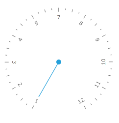
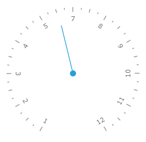

# Creating Radial Gauge

One of the gauges you can create with the __RadGauge__ control, is a radial gauge. It is represented by a circle container with a scale in it. Additionally, it can display various indicators that point to a certain value on the scale. This topic will walk you through the creation of a sample application that contains a radial RadGauge.  

* [Assembly References](#assembly-references)  
* [Defining a RadialGauge with a Radial Scale](#defining-a-radialgauge-with-a-radialscale)
* [Defining an Indicator](#defining-an-indicator)
* [Set Indicator's Position](#set-indicators-position)

## Assembly References

In order to use the __RadGauge__ control in your projects, you have to add references to the following assemblies:			

* __Telerik.Windows.Controls__
* __Telerik.Windows.Controls.DataVisualization__

## Defining a RadialGauge with a RadialScale

The radial gauge type is represented by the __RadRadialGauge__ class. The __RadRadialGauge__ control is used for wrapping radial scales. You can place one or more __RadialScale__ objects inside of it. In order to define a scale inside the RadialGauge control you have to use the RadialScale control. The RadialGauge works as an ItemsControl, which takes RadialScale controls as items. This means that you can have more than one scale inside the radial gauge. 

>To use the __RadGauge__ control and its components in XAML you have to declare the following namespace:
>`xmlns:telerik="http://schemas.telerik.com/2008/xaml/presentation"`	

#### __[XAML] Example 1: Creating RadRadialGauge with a RadialScale__
{{region xaml-radgauge-getting-started-creating-radial-gauge_2}}
	<telerik:RadRadialGauge x:Name="radialGauge"
	                        Width="300"
	                        Height="300">
	    <telerik:RadialScale Min="1"
	                         Max="12">
	    </telerik:RadialScale>
	</telerik:RadRadialGauge>
{{endregion}}

>tip To learn more about the usage of the __RadialScale__ control read the [Radial Scale]() topic.  

#### __Image 1: Result from Example 1__

> The examples in this article are styled with the [Windows8]() theme.

## Defining an Indicator

The __RadialScale__ control allows you to display different types of indicators that point to a value on the scale. To specify an indicator, use the __Indicators__ property, which is of type __UIElementCollection__. This means that the __Indicators__ property can hold more than one indicator. Example 2 shows a RadialScale that uses a __Needle__ indicator to mark the current value as well as __Pinpoint__ to mark the center of the Gauge.        

#### __[XAML] Example 2: Adding Indicators__
{{region radgauge-getting-started-creating-radial-gauge_3}}
	 <telerik:RadRadialGauge x:Name="radialGauge"
	                        Width="300"
	                        Height="300">
	    <telerik:RadialScale Min="1"
	                         Max="12">
	        <telerik:RadialScale.Indicators>
	            <telerik:Needle />
	            <telerik:Pinpoint/>
	        </telerik:RadialScale.Indicators>
	    </telerik:RadialScale>
	</telerik:RadRadialGauge>
{{endregion}}

#### __Image 2: Result from Example 2__

## Set Indicator's Position

To make the indicator point to a certain value from the scale, you have to use the __Value__ property of the indicator. Example 3 shows how you can work with this property:        

#### __[XAML] Example 3: Setting indicator's position__
{{region xaml-radgauge-getting-started-creating-radial-gauge_4}}
	<telerik:RadRadialGauge Name="radialGauge"
	                    Width="300"
	                    Height="300">
	    <telerik:RadialScale Name="scale"
	                    Min="1"
	                    Max="11">
	        <telerik:RadialScale.Indicators>
	            <telerik:Needle Name="needle" Value="6" />
	            <telerik:Pinpoint />
	        </telerik:RadialScale.Indicators>
	    </telerik:RadialScale>
	</telerik:RadRadialGauge>
{{endregion}}

#### __Image 3: Result from Example 3__

## See also

* [Ranges]()
* [Indicators]()
* [Ticks]()
* [Labels]()