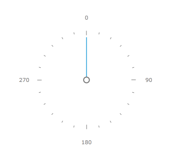

# Create Compass

This example will demonstrate how to customize a __Radial Gauge__ to create compass.

For the purpose we'll create a Radial Gauge with the following parameters that define the radial scale range: __StartAngle__, __SweepAngle__, __Radius__ and several properties for the layout of the Minor and Major Ticks. The __StartAngle__ and __SweepAngle__ are specified in degrees (0 to 360), starting from the right side of the gauge, going clockwise (note, that positive angle direction starts from positive X and goes to the positive Y. Since the screen coordinates start from top-left, the Y axis points downwards, instead of upwards, the positive direction of the angle is clockwise instead of the mathematically accepted counter-clockwise). The scale __Radius__ and __Center__ are measured as a fraction (0.0 to 1.0) of the space available for scale in the surrounding container.
Here is the XAML code:

#### __XAML__
{{region radgauge-customize-radialgauge-layout_0}}
	<telerik:RadRadialGauge Width="250" Height="250" telerik:StyleManager.Theme="Windows8">
	    <telerik:RadialScale StartAngle="270"
									SweepAngle="360"
									Min="0"  
									Max="360"    
	                                Radius="0.95"
									MajorTickStep="90" 
	                                ShowLastLabel="False"                                 
									LabelRotationMode="None"
	                                LabelLocation="Outside"
									MajorTickLocation="Inside"
	                                MajorTickOffset="0.05*"
									MiddleTickLocation="Inside"
	                                MiddleTickRelativeHeight="0.03*"
									MinorTicks="1"
									MiddleTicks="6"
	                                MiddleTickRelativeWidth="0.01*" 
	                                MiddleTickOffset="0.05*" >
	        <telerik:RadialScale.Indicators>
	            <telerik:Needle x:Name="needle" Value="0"/>
	            <telerik:Pinpoint Background="White" BorderBrush="#FF767676" BorderThickness="1" />
	        </telerik:RadialScale.Indicators>
	    </telerik:RadialScale>
	</telerik:RadRadialGauge>
{{endregion}}

Our gauge looks like this:

To make it look more like compass we'll need to customize the labels so that they are the four cardinal directions - N(North), E(east), S(south) and W(west). To remove the default gauge labels we'll use *LabelTemplate*. We'll also need to customize the needle. All this will be done via Styles:

#### __XAML__
{{region radgauge-customize-radialgauge-layout_1}}
	<UserControl.Resources>
		<telerik:Windows8Colors x:Key="Windows8Colors" />
		<SolidColorBrush x:Key="AccentBrush" Color="{Binding Source={StaticResource Windows8Colors}, Path=Palette.AccentColor}" />
		<SolidColorBrush x:Key="ValidationBrush" Color="{Binding Source={StaticResource Windows8Colors}, Path=Palette.ValidationColor}" />
		<SolidColorBrush x:Key="BasicBrush" Color="{Binding Source={StaticResource Windows8Colors}, Path=Palette.BasicColor}" />
		<SolidColorBrush x:Key="StrongBrush" Color="{Binding Source={StaticResource Windows8Colors}, Path=Palette.StrongColor}" />
		<SolidColorBrush x:Key="MarkerBrush" Color="{Binding Source={StaticResource Windows8Colors}, Path=Palette.MarkerColor}" />

		<DataTemplate x:Key="TickLabelEmpty">
			<Grid />
		</DataTemplate>

		

	</UserControl.Resources>
	<Grid >
		<telerik:RadRadialGauge Width="250" Height="250" telerik:StyleManager.Theme="Windows8">
			<telerik:RadialScale StartAngle="270"
								SweepAngle="360"
								Min="0"  
								Max="360"    
								Radius="0.95"
								MajorTickStep="90"     
								LabelTemplate="{StaticResource TickLabelEmpty}"
								LabelRotationMode="None"
								LabelLocation="Outside"
								MajorTickLocation="Inside"
								MajorTickOffset="0.05\*"
								MiddleTickLocation="Inside"
								MiddleTickRelativeHeight="0.03*"
								MinorTicks="1"
								MiddleTicks="6"
								MiddleTickRelativeWidth="0.01\*" 
								MiddleTickOffset="0.05\*" >
				<telerik:RadialScale.Indicators>
					<telerik:Needle x:Name="needle" Value="0"  Style="{StaticResource CustomNeedle}"/>
					<telerik:Pinpoint Background="White" BorderBrush="#FF767676" BorderThickness="1" />
				</telerik:RadialScale.Indicators>

				<telerik:RadialScale.CustomItems>
					<TextBlock Text="N" telerik:ScaleObject.Value="0" />
					<TextBlock Text="E" telerik:ScaleObject.Value="90" />
					<TextBlock Text="S" telerik:ScaleObject.Value="180" />
					<TextBlock Text="W" telerik:ScaleObject.Value="270" />
					<Ellipse telerik:ScaleObject.Value="0" />
					<Ellipse telerik:ScaleObject.Value="90" />
					<Ellipse telerik:ScaleObject.Value="180" />
					<Ellipse telerik:ScaleObject.Value="270" />
				</telerik:RadialScale.CustomItems>
			</telerik:RadialScale>
		</telerik:RadRadialGauge>
	</Grid>
{{endregion}}

Here's the result:

You may additionally customize the appearance of the compass. For example we can add an outer border and some custom ticks. The full source code for our compass is shown below:

#### __XAML__
{{region radgauge-customize-radialgauge-layout_2}}
	<UserControl.Resources>
		<telerik:Windows8Colors x:Key="Windows8Colors" />
		<SolidColorBrush x:Key="AccentBrush" Color="{Binding Source={StaticResource Windows8Colors}, Path=Palette.AccentColor}" />
		<SolidColorBrush x:Key="ValidationBrush" Color="{Binding Source={StaticResource Windows8Colors}, Path=Palette.ValidationColor}" />
		<SolidColorBrush x:Key="BasicBrush" Color="{Binding Source={StaticResource Windows8Colors}, Path=Palette.BasicColor}" />
		<SolidColorBrush x:Key="StrongBrush" Color="{Binding Source={StaticResource Windows8Colors}, Path=Palette.StrongColor}" />
		<SolidColorBrush x:Key="MarkerBrush" Color="{Binding Source={StaticResource Windows8Colors}, Path=Palette.MarkerColor}" />

		<DataTemplate x:Key="TickLabelEmpty">
			<Grid />
		</DataTemplate>

		

		
	</UserControl.Resources>
	<Grid >
		<telerik:RadRadialGauge Width="250" Height="250" 
								telerik:StyleManager.Theme="Windows8" OuterBorderThickness="2" OuterBorderBrush="{StaticResource StrongBrush}">
			<telerik:RadialScale StartAngle="270"
								SweepAngle="360"
								Min="0"  
								Max="360"    
								Radius="0.95"
								MajorTickStep="90"     
								LabelTemplate="{StaticResource TickLabelEmpty}"
								LabelRotationMode="None"
								LabelLocation="Outside"
								MajorTickLocation="Inside"
								MajorTickOffset="0.05\*"
								MiddleTickLocation="Inside"
								MiddleTickRelativeHeight="0.03\*"
								MinorTicks="1"
								MiddleTicks="6"
								MiddleTickRelativeWidth="0.01\*" 
								MiddleTickOffset="0.05\*" >
				<telerik:RadialScale.Indicators>
					<telerik:Needle x:Name="needle" Value="0"  Style="{StaticResource CustomNeedle}"/>
					<telerik:Pinpoint Background="White" BorderBrush="#FF767676" BorderThickness="1" />
				</telerik:RadialScale.Indicators>

				<telerik:RadialScale.CustomItems>
					<TextBlock Text="N" telerik:ScaleObject.Value="0" />
					<TextBlock Text="E" telerik:ScaleObject.Value="90" />
					<TextBlock Text="S" telerik:ScaleObject.Value="180" />
					<TextBlock Text="W" telerik:ScaleObject.Value="270" />
					
					<Ellipse telerik:ScaleObject.Value="0"
							  Style="{StaticResource CustomTick}"/>
					<Ellipse telerik:ScaleObject.Value="90" 
							  Style="{StaticResource CustomTick}"/>
					<Ellipse telerik:ScaleObject.Value="180"
							  Style="{StaticResource CustomTick}"/>
					<Ellipse telerik:ScaleObject.Value="270" 
							  Style="{StaticResource CustomTick}"/>
				</telerik:RadialScale.CustomItems>
			</telerik:RadialScale>
		</telerik:RadRadialGauge>
	</Grid>
{{endregion}}

