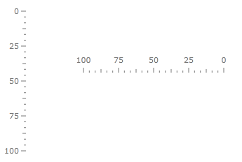

# Linear Scale Overview

LinearScale is used to control the overall layout of tick marks, tick labels, indicators, and ranges, as well render an optional scale bar.

## Scale Bar

The scale bar is rendered by the LinearScale element as a continuous band between top and bottom of the gauge. The scale bar is also used as a basis for the placement of child elements, such as the tick marks.

The height of the scale bar is controlled by the __RelativeHeight__ property for the __RadVerticalLinearGauge__ and the width of the scale bar is controlled by the __RelativeWidth__ property for the __RadHorizontalLinearGauge__ respectively. This value should be between 0 and 1 and is relative to the height of the container which contains this scale.

The location of the scale is controlled with the __RelativeX__ and __RelativeY__ properties.

The thickness of the scale bar is controlled by the __StartWidth__ and __EndWidth__ properties.

By default, the values start from the minimum value and move to the maximum value. It is possible to reverse this direction by setting the __IsReversed__ property to true:

The default distribution for a linear scale is __RegularDistribution__. When the scale has logarithmic distribution, it might be of type __ClassicLogarithmicDistribution__ or __RangeLogarithmicDistribution__. When the __IsLogarithmic__ property is set to true, base 10 is used for the logarithmic scale by default. 
To modify the base of the logarithmic scale, set the __LogarithmicBase__ property accordingly:        

The scale elements like tick mark, label or indicator can have dynamically changed tooltip associated with it. This behavior is controlled by TootipFormat property which can be set at the correspondent property element:

#### __XAML__
{{region linear-scale-overview_1}}
	<telerik:RadHorizontalLinearGauge Grid.Column="2" Width="250" Height="100" telerik:StyleManager.Theme="Windows8">
	    <telerik:HorizontalLinearScale Min="0" Max="100"
	                         MajorTickTooltipFormat="{}{Value|F0} current value">
	    </telerik:HorizontalLinearScale>
	</telerik:RadHorizontalLinearGauge>
{{endregion}}

The only parameter is passed to the tooltip format string is value at the element location.