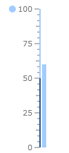

# State Indicator

The State Indicator is a shape with arbitrary size located anywhere in the scale. If state indicator's value put into one of the scale ranges then shape is filled with brush of this range. To add state indicator to the scale you have to include StateIndicator element to the list of the scale indicators:

#### __XAML__
{{region linear-scale-state-indicator_0}}
	<telerik:RadVerticalLinearGauge Width="100" Height="250" telerik:StyleManager.Theme="Windows8">
	    <telerik:VerticalLinearScale IsInteractive="True"
	                         RangeLocation="Outside"
	                         RangeOffset="-0.02*">
	        <telerik:VerticalLinearScale.Ranges>
	            <telerik:GaugeRange Min="0" Max="50"
	                                StartWidth="0.02"
	                                EndWidth="0.02"
	                                Background="#FF23568F"
	                                TickBackground="#FF23568F"
	                                LabelForeground="#FF23568F"
	                                IndicatorBackground="#FF23568F" />
	            <telerik:GaugeRange Min="50" Max="100"
	                                StartWidth="0.02"
	                                EndWidth="0.02"
	                                Background="#FFA0CCFF"
	                                TickBackground="#FFA0CCFF"
	                                LabelForeground="#FFA0CCFF"
	                                IndicatorBackground="#FFA0CCFF" />
	        </telerik:VerticalLinearScale.Ranges>
	        <telerik:VerticalLinearScale.Indicators>
	            <telerik:BarIndicator UseRangeColor="True" 
	                                  Value="60"
	                                  StartWidth="0.06"/>
	
	            <telerik:StateIndicator UseRangeColor="True"  
	                                    Value="60"
	                                    telerik:ScaleObject.RelativeWidth="0.10*"
	                                    telerik:ScaleObject.RelativeHeight="0.04*"
	                                    telerik:ScaleObject.RelativeX="0.04"
	                                    telerik:ScaleObject.RelativeY="0.12"/>
	        </telerik:VerticalLinearScale.Indicators>
	    </telerik:VerticalLinearScale>
	</telerik:RadVerticalLinearGauge>
{{endregion}}

The State indicator supports the following features:

1. Layout

2. The 'RelativeX' property specifies the position of Numeric Indicator left side relative to a scale width. 

3. The 'RelativeY' property specifies the position of Numeric Indicator top side relative to a scale height. 

4. The 'RelativeHeight' property specifies height of the Numeric Indicator relative to a scale height. 

5. The 'RelativeWidth' property specifies width of the Numeric Indicator relative to a scale height. 

6. Appearance

7. The default State Indicator template exposes the Background, BorderBrush and StrokeThickness properties for easy customizations.

8. You can change the State Indicator's template to setup specific appearance.
