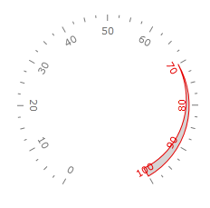

# Labels

Tick labels are shown for major tick marks. You can set label location around scale bar, font properties (like family, size and foreground), format of the label, or even change whole control template for label. 

For the purpose of this tutorial the code snippet in __Example 1__ will be used.

#### __[XAML] Example 1: RadialScale example__
{{region radial-scale-labels_0}}
	<telerik:RadRadialGauge Width="200" Height="200" telerik:StyleManager.Theme="Windows8">
	    <telerik:RadialScale Min="0" Max="100"
	            MajorTicks="8"
	            MiddleTicks="2"
	            MinorTicks="3">
	    </telerik:RadialScale>
	</telerik:RadRadialGauge>
{{endregion}}

## Label Location

You can change the location of the labels by using the __LabelLocation__. 

## Label Rotation Mode

You can control the label rotation on the radial scale using __LabelRotationMode__ property. It can have the following values: __None__, 
__Automatic__, __SurroundIn__, __SurroundOut__. 

## Label Use Range Color

You can use the GaugeRange element on a radial scale to re-color labels automatically. The RadialScale has the boolean __LabelUseRangeColor__ property. If it is True, then each label within the range uses a color according to the specified range's LabelForeground property:

#### __[XAML] Example 2: Set the LabelUseRangeColor property__
{{region radial-scale-labels_1}}
	<telerik:RadRadialGauge Width="200" Height="200" telerik:StyleManager.Theme="Windows8">
	    <telerik:RadialScale Min="0" Max="100"
	                            LabelLocation="Inside"
	                            LabelUseRangeColor="True">
	        <telerik:RadialScale.Ranges>
	            <telerik:GaugeRange Min="70"
	                                Max="100"
	                                StartWidth="0"
	                                EndWidth="0.1"
	                                Background="#FFD6D4D4"
	                                Stroke="#FFE50000"
	                                StrokeThickness="1"
	                                LabelForeground="#FFE50000">
	            </telerik:GaugeRange>
	        </telerik:RadialScale.Ranges>
	    </telerik:RadialScale>
	</telerik:RadRadialGauge>
{{endregion}}

## Label Format

To change the format of the labels, you can use the __LabelFormat__ property. __Example 3__ demonstrate how you could add a **%** symbol to the labels.

#### __[XAML] Example 3: Set the LabelFormat property__
{{region radial-scale-labels_1}}
	<telerik:RadRadialGauge Margin="20 20 20 10" telerik:StyleManager.Theme="Office2016">
		<telerik:RadialScale Min="0" Max="100" Loaded="RadialScale_Loaded"
			MajorTicks="8" 
			MiddleTicks="2" 
			MinorTicks="3"
			LabelFormat="{}{0}%"/>
	</telerik:RadRadialGauge>
{{endregion}}

## Label Offset

In a scenario where you want to offset the labels in order to avoid overlaps for example, you can set the __LabelOffset__ property.

#### __[XAML] Example 3: Set the LabelOffset property__
{{region radial-scale-labels_1}}
	<telerik:RadRadialGauge Margin="20 20 20 10" telerik:StyleManager.Theme="Office2016">
		<telerik:RadialScale Min="0" Max="100" Loaded="RadialScale_Loaded"
							MajorTicks="8" 
							MiddleTicks="2" 
							MinorTicks="3" 
							LabelOffset="80"/>
	</telerik:RadRadialGauge>
{{endregion}}

## Common Properties

Other properties which can be used to further customize the labels are:

* LabelTemplate
* LabelTooltipFormat
* LabelToolTipStyle
* LabelToolTipTemplate
