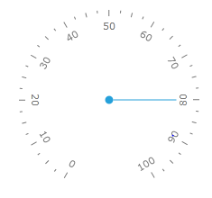
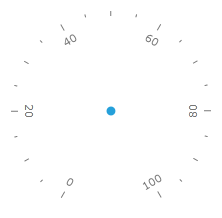
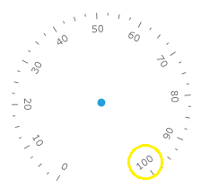
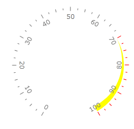
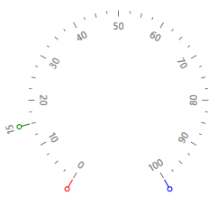

# Tick marks

Tick marks allow displaying value intervals along the gauge scale. There are 3 types of the tick marks:

1. __Major__ - specify primary value intervals. MajorTicks or MajorTickStep property of the scale specifies the number of the value intervals along the entire length of the scale bar. Major tick marks can have a label. You can specify common properties and appearance for the major tick marks using MajorTick property of the scale.

2. __Middle__ - specify secondary value intervals. MiddleTicks property of the scale specifies the number of the secondary value intervals inside the primary value interval. Middle tick marks can't have labels. You can specify common properties and appearance of the middle tick mark using MiddleTick property of the scale.

3. __Minor__ - specify third level of the value intervals. MinorTicks scale's property specifies number of the third level value intervals inside the secondary value interval. Minor tick marks can't have labels. You can specify common properties and appearance of the minor tick mark using MinorTick property of the scale.

There are 2 alternative ways to set number of the major ticks along the scale. This first one is using MajorTicks property. It sets number of the of the value intervals along the entire length of the scale bar:

#### __XAML__
{{region radial-scale-tick-marks_0}}
	<telerik:RadRadialGauge Width="200" Height="200" telerik:StyleManager.Theme="Windows8">
	    <telerik:RadialScale Min="0" Max="100" MajorTicks="10">
	        <telerik:RadialScale.Indicators>
	            <telerik:Needle x:Name="needle" Value="80"/>
	            <telerik:Pinpoint/>
	        </telerik:RadialScale.Indicators>
	    </telerik:RadialScale>
	</telerik:RadRadialGauge>
{{endregion}}

The second one uses MajorTickStep property. It sets length of the single tick interval in the scale units:

#### __XAML__
{{region radial-scale-tick-marks_1}}
	<telerik:RadRadialGauge Width="200" Height="200" telerik:StyleManager.Theme="Windows8">
	    <telerik:RadialScale Min="0" Max="100" MajorTickStep="20">
	        <telerik:RadialScale.Indicators>
	            <telerik:Pinpoint/>
	        </telerik:RadialScale.Indicators>
	    </telerik:RadialScale>
	</telerik:RadRadialGauge>
{{endregion}}

Sometimes desirable length of the major tick (MajorTickStep) creates situations when major tick mark at the end point of scale is shown very close to the last regular one:

In this situation we can use ShowLastLabel property to indicate whether the tick mark at the end position should be shown:

#### __XAML__
{{region radial-scale-tick-marks_2}}
	<telerik:RadRadialGauge Width="200" Height="200" telerik:StyleManager.Theme="Windows8">
	    <telerik:RadialScale Min="0" Max="102"
	                         MajorTickStep="10" ShowLastLabel="False">
	        <telerik:RadialScale.Indicators>
	            <telerik:Pinpoint/>
	        </telerik:RadialScale.Indicators>
	    </telerik:RadialScale>
	</telerik:RadRadialGauge>
{{endregion}}

By default, the major tick marks start from the minimum scale value and move clock-wise to the maximum value. But you can shift first and last major tick marks along scale using StartTickOffset and EndTickOffset properties:

To change the layout of the tick marks you may use their correspondent properties:

#### __XAML__
{{region radial-scale-tick-marks_3}}
	<telerik:RadRadialGauge Width="200" Height="200" telerik:StyleManager.Theme="Windows8">
	    <telerik:RadialScale Min="0" Max="100"
	                     StartTickOffset="10" EndTickOffset="-10"
	                     MajorTicks="8" MiddleTicks="2" MinorTicks="3"
	                     MajorTickLocation="OverCenter"
	                     MajorTickRelativeHeight="0.1*"
	                     MiddleTickLocation="OverCenter"
	                     MiddleTickRelativeHeight="0.08*"
	                     MinorTickLocation="OverCenter"
	                     MinorTickRelativeHeight="0.05*">
	    </telerik:RadialScale>
	</telerik:RadRadialGauge>
{{endregion}}

The Major, Middle and Minor ticks have the boolean UseRangeColor property. If it is True, then each tick mark within the specified range uses a color according to the range's TickBackground property:

#### __XAML__
{{region radial-scale-tick-marks_4}}
	<telerik:RadRadialGauge Width="200" Height="200" telerik:StyleManager.Theme="Windows8">
	    <telerik:RadialScale
	                MajorTickLocation="OverCenter"
	                MajorTickUseRangeColor="True"
	                MiddleTickLocation="OverCenter"
	                MiddleTickUseRangeColor="True"
	                MinorTickLocation="OverCenter"
	                MinorTickUseRangeColor="True">
	        <telerik:RadialScale.Ranges>
	            <telerik:GaugeRange Min="70" Max="100"
	                                Background="Yellow"
	                                StrokeThickness="1"
	                                TickBackground="Red"
	                                StartWidth="0"
	                                EndWidth="0.1">
	            </telerik:GaugeRange>
	        </telerik:RadialScale.Ranges>
	    </telerik:RadialScale>
	</telerik:RadRadialGauge>
{{endregion}}

## Custom Tick Marks

The RadGauge control provides very flexible standard tick marks and labels, but sometimes it is necessary to show additional tick marks and labels in particular scale position. Custom tick marks allow you to do it. Custom tick marks can be placed at a specific value (shown at value 25 in the images below) by setting the Value property. Just like the major and minor tick marks, the look of the custom tick marks can be fully customized.

The additional tick marks are defined in the CustomItems collection of the RadialScale:

#### __XAML__
{{region radial-scale-tick-marks_5}}
	<telerik:RadRadialGauge Width="200" Height="200" telerik:StyleManager.Theme="Windows8">
		<telerik:RadRadialGauge.Resources> 
			
			                
		</telerik:RadRadialGauge.Resources>
		<telerik:RadialScale Min="0" Max="100">
			<telerik:RadialScale.CustomItems>
				<Ellipse telerik:ScaleObject.Value="0" Style="{StaticResource CustomTick}" Stroke="Red" />
				<Ellipse telerik:ScaleObject.Value="15" Style="{StaticResource CustomTick}" Stroke="Green" />
				<Ellipse telerik:ScaleObject.Value="100" Style="{StaticResource CustomTick}" Stroke="Blue" />
				<Rectangle telerik:ScaleObject.Value="0" Style="{StaticResource CustomTickLine}" Fill="Red"/>
				<Rectangle telerik:ScaleObject.Value="15" Style="{StaticResource CustomTickLine}" Fill="Green"/>
				<Rectangle telerik:ScaleObject.Value="100" Style="{StaticResource CustomTickLine}" Fill="Blue"/>                    
				<TextBlock Text="15" telerik:RadialScale.RotationMode="SurroundOut"
						   telerik:ScaleObject.Value="15" Margin="18" telerik:ScaleObject.Location="Outside"/>
			</telerik:RadialScale.CustomItems>
		</telerik:RadialScale>
	</telerik:RadRadialGauge>
{{endregion}}

## Off position

Some gauge applications require that indicator clearly show when there is not valid data currently available. The special "Off Position" tick mark can be created using CustomTickMark control. When double.NaN value is passed to the scale indicator it looks for "Off position" and points to it if found. You can decorate it on your own using styling and templating ability. To force a particular tick mark to behave like "Off position" you should change its "Type" property to be "OffPosition". You can precisely set position of this tick mark by setting its "Value" property. It can be located outside the scale Max and Min values.
