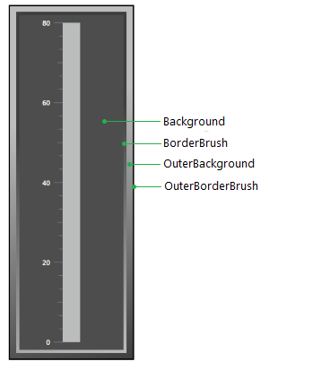
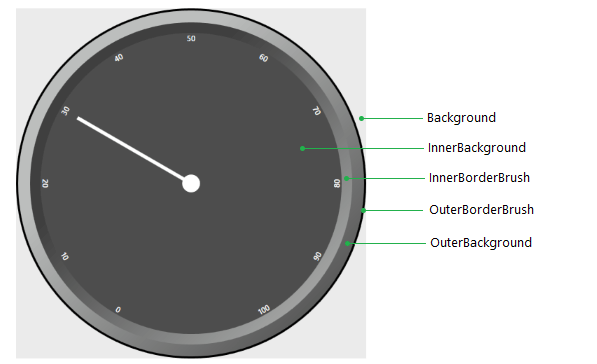
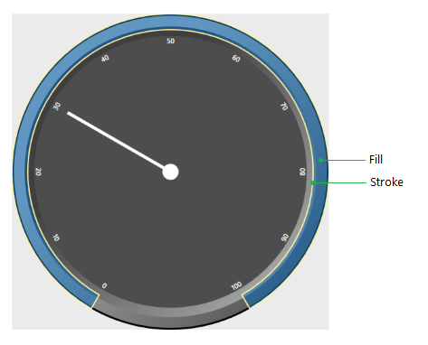

# Backgrounds and Borders

The controls in the RadGauge suite have several properties that can be used to customize their backgrounds and borders. 

* [Linear Gauge](#linear-gauge)
* [Radial Gauge](#radial-gauge)

## Linear Gauge

The linear gauges have the following color properties.

* __Background__: Gets or sets a brush that describes the background of the control
* __BorderBrush__: Gets or sets a brush that describes the border of the control
* __BorderThickness__: Gets or sets the thickness of the BorderBrush
* __OuterBackground__: Gets or sets a brush that describes the outer background of the control
* __OuterBorderBrush__: Gets or sets a brush that describes the outer border of the control
* __OuterBorderThickness__: Gets or sets the thickness of the OuterBorderBrush

__Figure 1__ demonstrates how these properties affect the control.

#### __Figure 1: Customized RadVerticalLinearGauge control__

> The example demonstrates only the RadVerticalLinearGauge but all linear gauges can be customized using the properties above.

## Radial Gauge

The radial gauges have the following color properties.

* __InnerBackground__: Gets or sets a brush that describes the outer background of the control
* __Background__: Gets or sets a brush that describes the background of the control
* __OuterBackground__: Gets or sets a brush that describes the outer background of the control
* __OuterBorderBrush__: Gets or sets a brush that describes the outer border of the control
* __OuterBorderThickness__: Gets or sets the thickness of the OuterBorderBrush
* __InnerBorderBrush__: Gets or sets a brush that describes the inner border of the control
* __InnerBorderThickness__: Gets or set the thickness of the InnerBorderBrush

__Figure 2__ demonstrates how these properties affect the control.

#### __Figure 2: Customized RadRadialGauge control__

You can also customize the __RadialScale’s__ colors using its __Fill__, __Stroke__ and __StrokeThickness__ properties.

* __Fill__: Gets or sets a brush that describes the fill of the scale
* __Stroke__: Gets or sets a brush that describes the stroke of the scale
* __StrokeThickness__: Gets or sets the thickness of the scale’s stroke

#### __Figure 3: Customized RadialScale__

> The example demonstrates only the RadRadialGauge but all radial gauges can be customized using the properties above.

## See Also  
* [RadRadialGauge]()
* [RadVerticalLinearGauge]()
* [RadialScale]()
