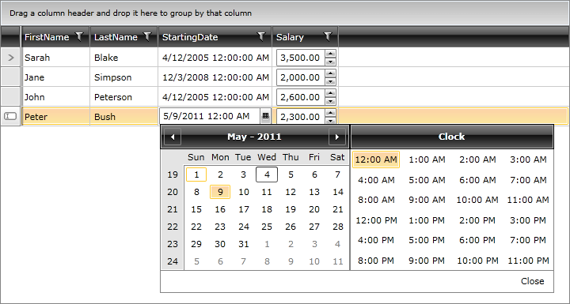
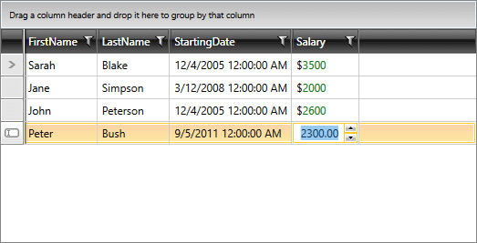

# Setting CellTemplate and CellEditTemplate

RadGridView provides a set of predefined column types like __GridViewCheckBoxColumn__, __GridViewComboBoxColumn__, __GridViewSelectColumn__, etc., which enable you to customize it according to the particular requirements and the type of properties exposed in your business object.

In addition, when a standard **GridViewDataColumn** is used, the RadGridView control automatically generates controls for the cell when it is in both view and edit mode.

#### Default controls in view mode

* __TextBlock__: For **string**, **numeric** and **DateTime** properties

* __CheckBox__: For **boolean** properties

#### Default editors

* __TextBox__: For **string** and **numeric** properties

* __CheckBox__: For **boolean** properties

* __RadDatePicker__: For **DateTime** properties

However, sometimes it may turn out that you want to extend the functionality of your columns and define a different editor, for example. This can be easily achieved by creating a __CellTemplate__ or __CellEditTemplate__ for a column.

* __CellTemplate__: Gets or sets the data template for the cell in view mode.

* __CellEditTemplate__: Gets or sets the data template for the cell in edit mode.

>You can also conditionally apply different templates for the different items by using the [CellTemplateSelector and CellEditTemplateSelector]() properties.

**Example 1** demonstrates how you can use both of these properties to customize your columns.

#### __[XAML] Example 1: Setting columns' CellTemplate and CellEditTemplate__

{{region xaml-radgridview-columns-celltemplate-and-celledittemplate_0}}
	<telerik:RadGridView x:Name="EmployeesGrid" AutoGenerateColumns="False" ItemsSource="{Binding Employees}">
	    <telerik:RadGridView.Columns>
	        <telerik:GridViewDataColumn DataMemberBinding="{Binding FirstName}" />
	        <telerik:GridViewDataColumn DataMemberBinding="{Binding LastName}" />
	        <telerik:GridViewDataColumn DataMemberBinding="{Binding StartingDate}">
	            <telerik:GridViewDataColumn.CellEditTemplate>
	                <DataTemplate>
	                    <telerik:RadDateTimePicker SelectedDate="{Binding StartingDate}" IsTooltipEnabled="False"/>
	                </DataTemplate>
	            </telerik:GridViewDataColumn.CellEditTemplate>
	        </telerik:GridViewDataColumn>
	        <telerik:GridViewDataColumn DataMemberBinding="{Binding Salary}">
	            <telerik:GridViewDataColumn.CellTemplate>
	                <DataTemplate>
	                    <telerik:RadNumericUpDown Value="{Binding Salary}" />
	                </DataTemplate>
	            </telerik:GridViewDataColumn.CellTemplate>
	        </telerik:GridViewDataColumn>
	    </telerik:RadGridView.Columns>
	</telerik:RadGridView>
{{endregion}}

The RadGridView defined above will be displayed as shown in **Figure 1**.

#### Figure 1: RadGridView with CellTemplate and CellEditTemplate defined

As you can see, the editor for a column of type __DateTime__ is a __RadDateTimePicker__, while the template for the **Salary** column is now a __RadNumericUpDown__.

>important When a __CellEditTemplate__ is defined for a column, the __default validation__ mechanism is __bypassed__ as you're directly binding to the source property. If you require this validation, you can create a custom column editor instead as demonstrated [here]().

Although the example above illustrates defining either a __CellTemplate__ or __CellEditTemplate__, it is possible to set them both for the same column. **Example 2** shows how this can be done.

#### __[XAML] Example 2: Setting the CellTemplate and CellEditTemplate of a single column__

{{region xaml-radgridview-columns-celltemplate-and-celledittemplate_1}}
	<telerik:RadGridView x:Name="EmployeesGrid" AutoGenerateColumns="False" ItemsSource="{Binding Employees}">
		<telerik:RadGridView.Columns>
			<telerik:GridViewDataColumn DataMemberBinding="{Binding FirstName}" />
			<telerik:GridViewDataColumn DataMemberBinding="{Binding LastName}" />
			<telerik:GridViewDataColumn DataMemberBinding="{Binding StartingDate}" />
			<telerik:GridViewDataColumn DataMemberBinding="{Binding Salary}">
				<telerik:GridViewDataColumn.CellTemplate>
					<DataTemplate>
						<StackPanel Orientation="Horizontal">
							<TextBlock Text="$" />
							<TextBlock Text="{Binding Salary}" Foreground="Green" />
						</StackPanel>
					</DataTemplate>
				</telerik:GridViewDataColumn.CellTemplate>
				<telerik:GridViewDataColumn.CellEditTemplate>
					<DataTemplate>
						<telerik:RadNumericUpDown Value="{Binding Salary}" />
					</DataTemplate>
				</telerik:GridViewDataColumn.CellEditTemplate>
			</telerik:GridViewDataColumn>
		</telerik:RadGridView.Columns>
	</telerik:RadGridView>
{{endregion}}

The RadGridView defined above will be displayed as shown in **Figure 1**.

#### Figure 2: RadGridView with CellTemplate and CellEditTemplate defined for a single column

If you want to set these properties in code-behind, you can check [this help article]().

>tipHaving DataMemberBinding set to StartingDate, the aggregation, sorting, grouping and filtering operations on this column will be done based on the StartingDate property.

>In case the user does not need to perform any aggregation, sorting, grouping or filtering operations for the column, then you can use a [GridViewColumn]() instead.

>In a scenario when there is a column.CellEditTemplate defined, the new value of the editor is not available in the arguments of the __CellEditEnded__ event raised when committing an edit. To get the right value in __e.NewValue__, you can create your own [Custom Column]() and override its __GetNewValueFromEditor__ method.

## See Also

* [CellTemplateSelector and CellEditTemplateSelector]()
* [Using DataTemplate in Code]()
* [Basic Column]()
* [Defining Columns]()
* [Customizing Columns]()
* [Data Formatting]()
