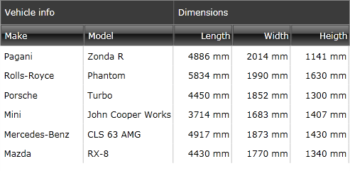

# Column Groups

Columns in RadGridView may be grouped in __column groups__ visually represented by common column headers.
        
## Define Column Groups

To enable __column grouping__ you need to add **GridViewColumnGroup** instances to RadGridView's **ColumnGroups** collection as illustrated in **Example 1**.
     
#### __[XAML] Example 1: Define column groups__

{{region xaml-gridview-columns-column-headers_3}}
	<telerik:RadGridView x:Name="RadGridView1" GridLinesVisibility="Vertical" Width="450" CanUserFreezeColumns="False" AutoGenerateColumns="False" IsFilteringAllowed="False" ShowGroupPanel="False" RowIndicatorVisibility="Collapsed">
	    <telerik:RadGridView.ColumnGroups>
	        <telerik:GridViewColumnGroup Name="VehicleInfo" Header="Vehicle info" />
	        <telerik:GridViewColumnGroup Name="Dimensions" Header="Dimensions" />
	    </telerik:RadGridView.ColumnGroups>
	    <telerik:RadGridView.Columns>
	        <telerik:GridViewDataColumn DataMemberBinding="{Binding Make}" ColumnGroupName="VehicleInfo" />
	        <telerik:GridViewDataColumn DataMemberBinding="{Binding Model}" ColumnGroupName="VehicleInfo" />
	        <telerik:GridViewDataColumn DataMemberBinding="{Binding Length}" ColumnGroupName="Dimensions" />
	        <telerik:GridViewDataColumn DataMemberBinding="{Binding Width}" ColumnGroupName="Dimensions" />
	        <telerik:GridViewDataColumn DataMemberBinding="{Binding Height}" ColumnGroupName="Dimensions" />
	    </telerik:RadGridView.Columns>
	</telerik:RadGridView>
{{endregion}}

#### Figure 1: RadGridView with Column Groups

Please observe that to add a specific column to a certain column group, you need to set the __ColumnGroupName__ property of the column to match the value of the __Name__ property of the relevant __GridViewColumnGroup__.

Note also that the __GridViewColumnGroup__ class has a __Header__ property which defines the content to be shown inside the common header. It may be a simple string or a visual element. 

>tip In case that no header is specified the **Name** of the __GridViewColumnGroup__ will be displayed.

## Nested Column Groups

Column groups can also be __nested__. **Example 2** shows how this is achieved.
 
#### __[XAML] Example 2: Nested column groups__

{{region xaml-gridview-columns-column-headers_5}}
	<telerik:RadGridView.ColumnGroups>
	    <telerik:GridViewColumnGroup Name="Data" Header="Data">
	        <telerik:GridViewColumnGroup Name="VehicleInfo" Header="Vehicle info" />
	        <telerik:GridViewColumnGroup Name="Dimensions" Header="Dimensions" />
	    </telerik:GridViewColumnGroup>
	</telerik:RadGridView.ColumnGroups>
{{endregion}}

#### Figure 2: Nested column groups

## Define Custom Header

You can define a __custom header__ for the __GridViewColumnGroup__ through its **HeaderTemplate**.

#### __[XAML] Example 3: Define GridViewColumnGroup.HeaderTemplate__

{{region xaml-gridview-columns-column-headers_6}}
	<telerik:GridViewColumnGroup Name="Data">
	    <telerik:GridViewColumnGroup.HeaderTemplate>
	        <DataTemplate>
	            <TextBlock Text="Data"/>
	        </DataTemplate>
	    </telerik:GridViewColumnGroup.HeaderTemplate>
	</telerik:GridViewColumnGroup>
{{endregion}}

In addition, you can style the headers by defining a style targeting the **CommonColumnHeader** element and setting it as the **HeaderStyle** for the **GridViewColumnGroup**. For information on how to apply an implicit style, have a look at the [Styling Column Groups]() article.

## Virtualization Modes

Column groups also support **UI virtualization** meaning that only the visual elements that are loaded in the viewable area are processed. This way, the performance of the control can be significantly enhanced.

This functionality can be configured through the __EnableColumnGroupsVirtualization__ boolean property. Its default value is **True** in which case UI virtualization is enabled.

This mode is especially useful in more complicated scenarios where additional features such as [frozen columns](), [reordering of columns](), etc. are used.

>important When the column group virtualization feature is enabled, __column group names should be unique__.

## Add or Remove Multiple Column Groups at Once

As of **R3 2020 SP** the ColumnGroups property is of type [RadObservableCollection]() which exposes the **AddRange** and **RemoveRange** methods that can be used when adding or removing multiple groups at once in order to improve performance.

#### __[C#] Example 4: Add or remove multiple column groups at once__

{{region cs-gridview-columns-column-headers_8}}
	this.GridView.ColumnGroups.AddRange(groupsToAdd);
	
	this.GridView.ColumnGroups.RemoveRange(groupsToRemove);
{{endregion}}

#### __[VB.NET] Example 4: Add or remove multiple column groups at once__

{{region vb-gridview-columns-column-headers_8}}
	Me.GridView.ColumnGroups.AddRange(groupsToAdd)

	Me.GridView.ColumnGroups.RemoveRange(groupsToRemove)
{{endregion}}

An alternative is to use the **SuspendNotifications** and **ResumeNotifications** methods prior and after adding or removing the groups.

#### __[C#] Example 5: Suspend and resume notifications__

{{region cs-gridview-columns-column-headers_9}}
	this.GridView.ColumnGroups.SuspendNotifications();
	foreach (var group in groupsToAdd)
	{
		this.GridView.ColumnGroups.Add(group);
	}

	foreach (var group in groupsToRemove)
	{
		this.GridView.ColumnGroups.Remove(group);
	}

	this.GridView.ColumnGroups.ResumeNotifications();
{{endregion}}

#### __[VB.NET] Example 5: Suspend and resume notifications__

{{region vb-gridview-columns-column-headers_9}}
	Me.GridView.ColumnGroups.SuspendNotifications()
	For Each group In groupsToAdd
		Me.GridView.ColumnGroups.Add(group)
	Next group

	For Each group In groupsToRemove
		Me.GridView.ColumnGroups.Remove(group)
	Next group

	Me.GridView.ColumnGroups.ResumeNotifications()
{{endregion}}

## Specific Scenarios

This section will cover some specific scenarios when using column groups.

For the purpose of this demonstration we will define the following groups.

#### __[XAML] Example 6: Sample column groups setup__

{{region xaml-gridview-columns-column-headers_7}}
	<telerik:RadGridView.ColumnGroups>			
		<telerik:GridViewColumnGroup Name="Level2group1">
			<telerik:GridViewColumnGroup Name="Level1group11"/>
			<telerik:GridViewColumnGroup Name="Level1group12"/>
		</telerik:GridViewColumnGroup>
		<telerik:GridViewColumnGroup Name="Level2group2">
			<telerik:GridViewColumnGroup Name="Level1group21"/>
			<telerik:GridViewColumnGroup Name="Level1group22"/>
		</telerik:GridViewColumnGroup>
	</telerik:RadGridView.ColumnGroups>
{{endregion}}

In case the user moves the frozen column splitter in the middle of an existing column group, then it will be __divided into two separate groups__. **Figures 3 to 5** demonstrate this scenario.

#### Figure 3: Initial setup with FrozenColumnSplitter at default position

#### Figure 4: A duplicate column group is created when FrozenColumnSplitter moved after the first column

#### Figure 5: ColumnGroup's Header is still visible after scrolling to the right

When scrolling horizontally, the column group header remains visible until there are still visible sub-columns under the specific group.

Defined column groups are now __drawn only if they are specified for at least one visible column__. 

When some GridViewColumns do not have a **ColumnGroupName** specified, they are __placed under an empty ColumnGroup__. This is illustrated in **Figure 6**.

#### Figure 6: Various setups illustrating the default space fill
 

## See Also

* [Styling Column Groups]()
* [Column Headers]()
* [Reordering Columns]()
* [Frozen Columns]()
