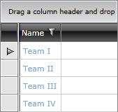

# Dynamic Hyperlink Column

__GridViewDynamicHyperlinkColumn__ derives from [GridViewBoundColumnBase]() class. Except the binding to the desired property of your business object it allows you to easily build a URL for the hyperlink that hosts the content.

## GridViewDynamicHyperlinkColumn vs GridViewHyperlinkColumn

The advantage of the GridViewDynamicHyperlinkColumn over the [GridViewHyperlinkColumn]() is that it allows you to build a Uri by combining the values of several properties of your business object. If you have the entire Uri that you want to navigate to in a single property, you can use a GridViewHyperlinkColumn.

## Properties

Here is a list of the most important properties:

* __DataMemberBinding__: Allows you to specify the property of the business object to be displayed as value in the cell. It is automatically displayed as a link.

* __NavigateUrlMemberPaths__: Comma separated property names, the values of which will be inserted at the placeholder positions defined in the __NavigateUrlFormatString__.

* __NavigateUrlFormatString__: Allows you to provide a format string for the value of the URL.  
 
>To learn more about formatting you can check [Data Formatting]() topic. 

* __TargetName__: Specifies the location to open the link.

#### __[XAML] Example 1: Define GridViewDynamicHyperlinkColumn in XAML.__
{{region xaml-radgridview-columns-column-types-dynamic-hyperlink-column_0}}
	<telerik:RadGridView x:Name="radGridView"
	                 AutoGenerateColumns="False">
	    <telerik:RadGridView.Columns>
			<!-- The value of the MiddleUrlPart property will go to the {0} placeholder and the value of the EndUrlPart will go to the {1} placeholder-->
	        <telerik:GridViewDynamicHyperlinkColumn DataMemberBinding="{Binding Name}"
	                         NavigateUrlMemberPaths="MiddleUrlPart, EndUrlPart"
	                         NavigateUrlFormatString="{} http://oficialleaguesite.com/{0}/{1}"
	                         TargetName="_blank" />
	    </telerik:RadGridView.Columns>
	</telerik:RadGridView>
{{endregion}}

You can also directly configure the navigate url to be a complete one and specify an empty format as demonstrated in __Example 2__, though in such a scenario it would be easier to use a [GridViewHyperlinkColumn]().

#### __[XAML] Example 2: Define navigate url without additional format.__
{{region xaml-radgridview-columns-column-types-dynamic-hyperlink-column_1}}
	<telerik:GridViewDynamicHyperlinkColumn 
	 DataMemberBinding="{Binding Name}"
	 NavigateUrlMemberPaths="TeamUrl"
	 NavigateUrlFormatString="{} {0}"
	 TargetName="_blank" />
{{endregion}}  

__Figure 1: GridViewDynamicHyperlinkColumn in RadGridView__ 

>tip In order to handle the __Click__ event of the hyperlink, you can use the approach demonstrated in the [GridViewHyperlinkColumn Click Event]() article.

## See also
* [Hyperlink Column]()
* [CellTemplate and CellEditTemplate]()