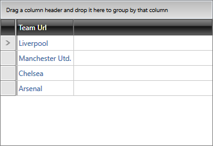

# Hyperlink Column

__GridViewHyperlinkColumn__ derives from the [GridViewBoundColumnBase]() class and its content is represented by a __HyperlinkButton__ control.

## Properties

Here's a list of properties that the column exposes:

* __DataMemberBinding__: Here you need to specify the property of the business object which is the actual link that will be navigated to. The type of the property can be a **Uri** or a plain **string**.

* __ContentBinding__: You can specify the property of the business object to be displayed as the value in the cell. If this binding is not specified, the actual link provided as the DataMemberBinding is displayed.
            
* __TargetName__: Gets or sets the name of a target window or frame for the hyperlink.

## Defining the Data

For the purposes of this article we will assume that the data objects expose **Name** and **TeamUrl** properties as defined in **Example 1**.

#### __[C#] Example 1: The Club class__

{{region cs-radgridview-columns-column-types-hyperlink-column_1}}
	public class Club : ViewModelBase
	{   
	    private string name;
		public string Name
        {
            get { return this.name; }
            set
            {
                if (value != this.name)
                {
                    this.name = value;
                    this.OnPropertyChanged("Name");
                }
            }
        }

	    private string teamUrl;
	    public string TeamUrl
	    {
	        get { return this.teamUrl; }
	        set
	        {
	            if (value != this.teamUrl)
	            {
	                this.teamUrl = value;
	                this.OnPropertyChanged("TeamUrl");
	            }
	        }
	    }
	}
{{endregion}}

#### __[VB.NET] Example 1: The Club class__

{{region vb-radgridview-columns-column-types-hyperlink-column_2}}
	Public Class Club
	    Inherits ViewModelBase		
		
		Private m_name As String
		Public Property Name() As String
			Get
				Return Me.m_name
			End Get
			Set(ByVal value As String)
				If value <> Me.m_name Then
					Me.m_name = value
					Me.OnPropertyChanged("Name")
				End If
			End Set
		End Property

	    Private m_teamUrl As String
	    Public Property TeamUrl() As String
	        Get
	            Return Me.m_teamUrl
	        End Get
	        Set(value As String)
	            If value <> Me.m_teamUrl Then
	                Me.m_teamUrl = value
	                Me.OnPropertyChanged("TeamUrl")
	            End If
	        End Set
	    End Property
	End Class
{{endregion}}

## Set Up the Hyperlink Column

If you bind the RadGridView control to a collection of **Club** objects, you can define the GridViewHyperlinkColumn column as shown in **Example 2**.

#### __[XAML] Example 2: Define GridViewHyperlinkColumn in XAML__

{{region xaml-radgridview-columns-column-types-hyperlink-column_3}}
	<telerik:RadGridView x:Name="radGridView" ItemsSource="{Binding Clubs}" AutoGenerateColumns="False">
	    <telerik:RadGridView.Columns>
	        <telerik:GridViewHyperlinkColumn Header="Team Url" DataMemberBinding="{Binding TeamUrl}" ContentBinding="{Binding Name}" />
	    </telerik:RadGridView.Columns>
	</telerik:RadGridView>
{{endregion}}

**Figure 1** illustrates the result of the code in **Example 1**.

#### Figure 1: RadGridView with a hyperlink column

# See also

* [Dynamic Hyperlink Column]()
* [CellTemplate and CellEditTemplate]()