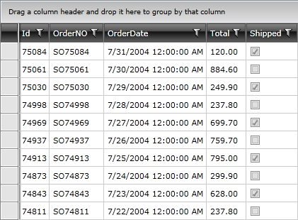
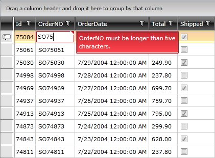
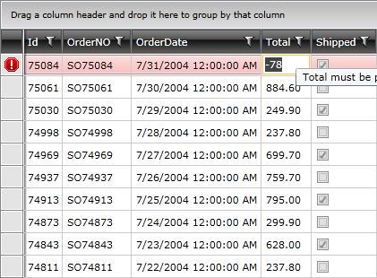
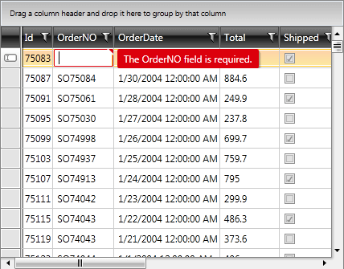

# Data Validation

One of the most important features provided by __RadGridView__ is the __data validation__. Data validation features enable you to take complete control of the data entered in your grid's cells.
      
The purpose of this tutorial is to show you how to validate data using __RadGridView__.

* [Setting the Mode for the Validation](#setting-the-mode-for-the-validation)

* [Setting the Validation Type](#setting-the-validation-type)
      
* [Validating Data on a Cell Level](#validating-data-on-a-cell-level)

* [Validating Data on a Property Level](#validating-data-on-a-property-level)

* [Validating Data on a Row Level](#validating-data-on-a-row-level)

* [Validating Data through Data Annotations](#validating-data-through-data-annotations)

* [Examples](#examples)

>The data validation is controllable through events. Be sure you are familiar with all [validation events]() exposed by the __RadGridView__.
        

For the purpose of this tutorial, we will use the __RadGridView__ declaration in __Example 1__. The __RadGridView__ is [populated]() with some sample data.
      

#### __[XAML] Example 1: Declare RadGridView__
{{region xaml-gridview-managing-data-validation_0}}
	<telerik:RadGridView x:Name="radGridView"/>
{{endregion}}

#### __Figure 1: Standard appearance of RadGridView__

## Setting the Mode for the Validation 

RadGridView exposes a property - ValidatesOnDataErrors - that controls the way the data validation, provided by IDataErrorInfo and INotifyDataErrorInfo Interfaces, is performed. It may be set to one of the following values:

* __None__: Denotes that RadGridView will not perform any validation.

* __InViewMode__: Denotes that RadGridView will perform validation only in view mode.

* __InEditMode__: Denotes that RadGridView will perform validation only in edit mode. If the RadGridView is initially loaded with an incorrect value, no error messages will be displayed.

* __Default__: This is the default value. It combines the two previous ones - InViewMode | InEditMode. 


>*Telerik.Windows.Data.INotifyDataErrorInfo* interface was created for WPF 4.0. version since *System.ComponentModel.INotifyDataErrorInfo* was available for Silverlight only. If using WPF 4.5, please reference *System.ComponentModel.INotifyDataErrorInfo* instead.


## Setting the Validation Type

In __R2 2016__, Telerik introduced the __ValidationType__ property of RadGridView. It provides you with the possibility to choose what type of validation to apply for each instance of RadGridView. It is a __Flags Enumeration__ and can take the following values:

*  __None__: None of the validation mechanisms is respected.
*  __DataAnnotations__: Only validation through data annotations is respected.
*  __IDataErrorInfo__: Only validation through the __IDataErrorInfo__ interface is respected.
*  __INotifyDataErrorInfo__: Only validation through the __INotifyDataErrorInfo__ interface is respected.
*  __Default__: Validation through all three mechanisms is respected.

#### __[XAML] Example 2: Set the ValidationType property of RadGridView__
{{region xaml-gridview-managing-data-validation_11}}
	<telerik:RadGridView x:Name="radGridView" ValidationType="Default"/>
{{endregion}}

## Validating Data on a Cell Level
 
The cell validation occurs when a __GridViewCell__ is edited and its new data is about to be committed. At this moment, a __CellValidating__ event is fired and since the new value is not committed yet to the underlying data object, here is the perfect place for applying a custom UI validation.        

__Example 3__ shows how to validate the __OrderNo__ property of the __Order__ object to be longer than 5 characters.        

Attach to the __CellValidating__ event, which is exposed by the __RadGridView__.        

#### __[XAML] Example 3: Attach to the CellValidating event__
{{region xaml-gridview-managing-data-validation_1}}
	<telerik:RadGridView CellValidating="radGridView_CellValidating"/>
{{endregion}}

Switch to the code-behind and add your custom validation logic in the event handler.

#### __[C#] Example 3: Add custom logic in the code behind__
{{region cs-gridview-managing-data-validation_2}}
	private void radGridView_CellValidating(object sender, Telerik.Windows.Controls.GridViewCellValidatingEventArgs e)
	{
	    if (e.Cell.Column.UniqueName == "OrderNO")
	    {
	        if (e.NewValue.ToString().Length < 5)
	        {
	            e.IsValid = false;
	            e.ErrorMessage = "OrderNO must be longer than five characters.";
	        }
	    }
	}
{{endregion}}

#### __[VB.NET] Example 3: Add custom logic in the code behind__
{{region vb-gridview-managing-data-validation_3}}
	Private Sub radGridView_CellValidating(ByVal sender As Object, ByVal e As Telerik.Windows.Controls.GridViewCellValidatingEventArgs)
	    If e.Cell.Column.UniqueName = "OrderNO" Then
	        If e.NewValue.ToString().Length < 5 Then
	            e.IsValid = False
	            e.ErrorMessage = "OrderNO must be longer than five characters."
	        End If
	    End If
	End Sub
{{endregion}}

When you try to enter an order number that has fewer than five characters, you should see a validation message that is similar to the one in __Figure 2__.

#### __Figure 2: RadGridView's appearance after validation__

When you set the __e.IsValid__ property to __False__, this will cancel the editing process and will return focus to the invalid __GridViewCell__. After this UI layer validation is successful (__e.IsValid__ is __True__, which is the default value). Then the Data layer validation occurs. This is the validation that is built into the business object implementation.

>important If the edited cell's column has a **CellEditTemplate** set, the **e.NewValue** argument will always be **null**. You can get the new value through the **e.EditingElement** parameter instead.         

## Validating Data on a Property Level

An alternative approach is to use validation on a __property level__ as shown in __Example 4__. In this case, you need to throw an exception when an incorrect value is about to be set. This results in a binding validation error (__Figure 3__) and the __GridViewBoundColumnBase__ editor will enter into an invalid state.

#### __[C#] Example 4: Set validation on a property level__
{{region cs-gridview-managing-data-validation_4}}
	public class Order
	{
	    private string orderNo;
	    public string OrderNO
	    {
	        get
	        {
	            return this.orderNo;
	        }
	        set
	        {
	            if (value.Length < 5)
	            {
	                throw new Exception("OrderNo should be longer than 5 characters.");
	            }
	            this.orderNo = value;
	        }
	    }
	
	    public int Total { get; internal set; }
	}
{{endregion}}

#### __[VB.NET] Example 4: Set validation on a property level__
{{region vb-gridview-managing-data-validation_5}}
	Public Class Order
	    Private m_orderNo As String
	
	    Public Property OrderNO() As String
	        Get
	            Return Me.m_orderNo
	        End Get
	        Set(ByVal value As String)
	            If value.Length < 5 Then
	                Throw New Exception("OrderNo should be longer than 5 characters.")
	            End If
	            Me.m_orderNo = value
	        End Set
	    End Property
	
	    Public Property Total As Integer
	End Class
{{endregion}}

#### __Figure 3: RadGridView's appearance after validation__

>An exception of any kind will result in a validation error, and an exception message will appear as an error tooltip.

## Validating Data on a Row Level

In the previous examples, the data was validated per cell, using the __CellValidating__ event or property validation. You can do the same thing per row, using the __RowValidating__ event. The __RowValidating__ event is very similar to the __CellValidating__ event. However, instead of getting an individual cell, you are getting an entire row.

__Example 5__ shows how to validate the __OrderNO__ and __Total__ properties of the __Order__ object.

Attach to the __RowValidating__ event, which is exposed by the __RadGridView__.

#### __[XAML] Example 5: Attach to the RowValidating event__
{{region xaml-gridview-managing-data-validation_6}}
	<telerik:RadGridView RowValidating="radGridView_RowValidating"/>
{{endregion}}

Switch to the code-behind and add your custom validation logic in the event handler as demonstrated in **Example 6**.

#### __[C#] Example 6: Apply custom logic in the RowValidating event__
{{region cs-gridview-managing-data-validation_7}}
	private void radGridView_RowValidating(object sender, Telerik.Windows.Controls.GridViewRowValidatingEventArgs e)
	{
	
	    Order order = e.Row.DataContext as Order;
	    if (String.IsNullOrEmpty(order.OrderNO) || order.OrderNO.Length < 5)
	    {
	        GridViewCellValidationResult validationResult = new GridViewCellValidationResult();
	        validationResult.PropertyName = "OrderNO";
	        validationResult.ErrorMessage = "OrderNO is required and must be at least five characters";
	        e.ValidationResults.Add(validationResult);
	        e.IsValid = false;
	    }
	
	    if (order.Total < 0)
	    {
	        GridViewCellValidationResult validationResult = new GridViewCellValidationResult();
	        validationResult.PropertyName = "Total";
	        validationResult.ErrorMessage = "Total must be positive";
	        e.ValidationResults.Add(validationResult);
	        e.IsValid = false;
	    }
	}
{{endregion}}

#### __[VB.NET] Example 6: Apply custom logic in the RowValidating event__
{{region vb-gridview-managing-data-validation_8}}
	Private Sub radGridView_RowValidating(ByVal sender As Object, ByVal e As Telerik.Windows.Controls.GridViewRowValidatingEventArgs)
	    Dim order As Order = TryCast(e.Row.DataContext, Order)
	    If [String].IsNullOrEmpty(order.OrderNO) OrElse order.OrderNO.Length < 5 Then
	        Dim validationResult As New GridViewCellValidationResult()
	        validationResult.PropertyName = "OrderNO"
	        validationResult.ErrorMessage = "OrderNO is required and must be at least five characters"
	        e.ValidationResults.Add(validationResult)
	        e.IsValid = False
	    End If
	    If order.Total < 0 Then
	        Dim validationResult As New GridViewCellValidationResult()
	        validationResult.PropertyName = "Total"
	        validationResult.ErrorMessage = "Total must be positive"
	        e.ValidationResults.Add(validationResult)
	        e.IsValid = False
	    End If
	End Sub
{{endregion}}

A few things worth mentioning here:

* In order to access the new values, you should grab the row's __DataContext__ (in this case, it is an __Order__). For the old values, use the __OldValues__ property.

* The __GridViewCellValidationResult__ object is used for displaying error messages when the user enters wrong data.

* The RowValidating event fires each time a GridViewRow gets loaded into the viewport, whether in edit mode or not. You can avoid executing any custom logic defined in your event handler by checking the __EditOperationType__ property of the GridViewRowValidatingEventArgs. 

#### __Figure 4: RadGridView's appearance after validation on row level was applied__

Once you have added such errors, you will have to explicitly clear them when needed. Read this [help article]() for information about how to clear user defined errors.

## Validating Data Through Data Annotations

RadGridView also allows you to take advantage of the __System.ComponentModel.DataAnnotations__ assembly.

**Example 7** shows you how to use __DataAnnotations__ in order to validate the __OrderNO__ property of the __Order__ object.

#### __[C#] Example 7: Set validation through data DataAnnotations__
{{region cs-gridview-managing-data-validation_9}}
	[Required]
	public string OrderNO
	{
	    get
	    {
	        return this.orderNo;
	    }
	    set
	    {
	        ValidationContext validationContext = new ValidationContext(this, null, null);
	        validationContext.MemberName = "OrderNO";
	        Validator.ValidateProperty(value, validationContext);
	        this.orderNo = value;
	    }
	}
{{endregion}}

#### __[VB.NET] Example 7: Set validation through data DataAnnotations__
{{region vb-gridview-managing-data-validation_10}}
	<Required()>
	Public Property OrderNO() As String
	    Get
	        Return Me.m_orderNo
	    End Get
	    Set(ByVal value As String)
	        Dim validationContext As New ValidationContext(Me, Nothing, Nothing)
	        validationContext.MemberName = "OrderNO"
	        Validator.ValidateProperty(value, validationContext)
	        Me.m_orderNo = value
	    End Set
	End Property
{{endregion}}

>In order to use DataAnnotations you should add a reference to the __System.ComponentModel.DataAnnotations__ assembly.       

>tip The following __Validation Attributes__ are available:

* __RequiredAttribute__: Specifies that a value must be provided for a property.

* __RegularExpressionAttribute__: Designates a regular expression to be used for validation of the associated member.

* __StringLengthAttribute__: Specifies the maximum and minimum number of characters that are allowed for an entity member.

* __RangeAttribute__: Designates the minimum and maximum constraints for the associated member.

* __DateTypeAttribute__: Specifies the name of an additional type to associate with an entity member.

* __CustomValidationAttribute__: Designates a customized method to execute to validate the entity member.

You can see the result in __Figure 5__.

#### __Figure 5: Appearance of RadGridView after DataAnnotations valididation is applied__

>tipOnce the UI and Data validation is passed (i.e., the Binding tried to update the value for the bound property), the __CellValidated__ event is raised. The ValidationResult can be valid or not. Here you can also add a custom logic like changing the visual state of the editor (through the e.EditorElement).

## Examples

For a general example on how to validate the data, you can check our Validation
 [ WPF Demos.](https://demos.telerik.com/wpf/)[online demos.](https://demos.telerik.com/silverlight/#GridView/Validation)

You can also download runnable projects from our online SDK repository [here](https://github.com/telerik/xaml-sdk/); the examples are listed under __GridView__.
        
* __GridView/ValidationIDataErrorInfo__.

* __GridView/ValidationINotifyDataErrorInfo__.            

Although GitHub is a very well-known platform, we saw a better and easier approach for reviewing our examples in our SDK Samples Browser. The [SDK Samples Browser](https://demos.telerik.com/wpf-sdkbrowser/) is an application that automatically connects to GitHub and downloads the XAML SDK repository locally to a location that could be set by the user. After download is complete, the application gives a very convenient navigation between all the available examples and a search functionality that doesn’t simply search by control’s names but also through the example’s names and descriptions.

## See Also
 * [Validation errors not cleared]()
 * [Validation Events]()
    
