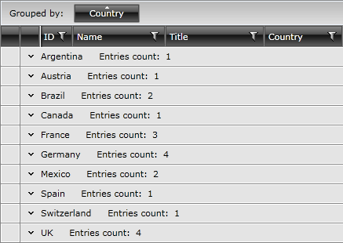
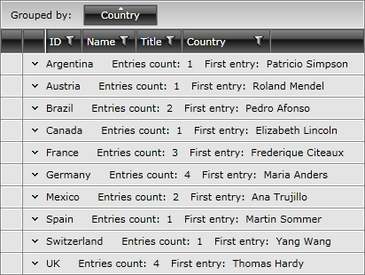
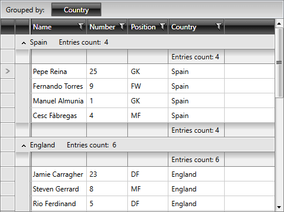
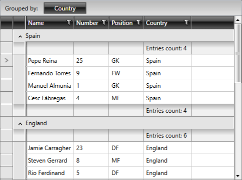
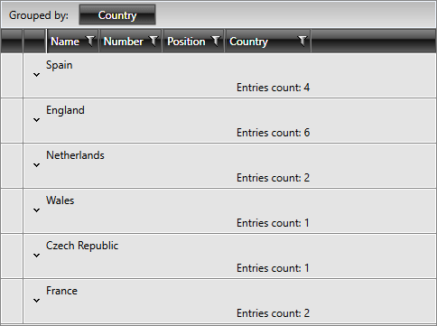

# Group Aggregates

When you are using [programmatic grouping](), you can add aggregate functions to the group rows. These functions allow you to display information about the data in the group such as first item, last item, count of items etc. 

The available functions are:

* __AverageFunction__: Returns the average of the values in a group. 

* __CountFunction__: Returns the number of all items in a group. 

* __FirstFunction__: Returns first element from a group according to the current sorting. 

* __LastFunction__: Returns last element from a group according to the current sorting. 

* __MaxFunction__: Returns the Max of the values in a group. 

* __MinFunction__: Returns the Min of the values in a group. 

* __SumFunction__: Returns the Sum of all values for the group.

>tipYou can also create your own custom functions similar to these by inheriting __Telerik.Windows.Data.EnumerableAggregateFunction__ class. An example can be found  [here](https://demos.telerik.com/silverlight/#GridView/CustomAggregates)in the __Custom Aggregate Function__ RadGridView example from our [demos](https://demos.telerik.com/wpf/).

Each aggregate function has a caption and a result, which are displayed next to the group title. 

#### __[XAML] Example 1: Defining a GroupDescriptor with AggregateFunction__

{{region xaml-gridview-grouping-aggregates_0}}

	<telerik:RadGridView x:Name="radGridView"
	                         AutoGenerateColumns="False">
	    <telerik:RadGridView.GroupDescriptors>
	        <telerik:GroupDescriptor Member="Country"
	                                     SortDirection="Ascending">
	            <telerik:GroupDescriptor.AggregateFunctions>
	                <telerik:CountFunction Caption="Entries count: " />
	            </telerik:GroupDescriptor.AggregateFunctions>
	        </telerik:GroupDescriptor>
	    </telerik:RadGridView.GroupDescriptors>
	    ...
	</telerik:RadGridView>
{{endregion}}

#### __[C#] Example 2: Defining a GroupDescriptor with AggregateFunction programmatically__

{{region cs-gridview-grouping-aggregates_1}}

	CountFunction f = new CountFunction();
	f.Caption = "Entries Count: ";
	GroupDescriptor countryDescriptor = new GroupDescriptor();
	countryDescriptor.Member = "Country";
	countryDescriptor.SortDirection = ListSortDirection.Ascending;
	countryDescriptor.AggregateFunctions.Add( f );
	this.radGridView.GroupDescriptors.Add( countryDescriptor );
{{endregion}}

#### __[VB.NET] Example 2: Defining a GroupDescriptor with AggregateFunction programmatically__

{{region vb-gridview-grouping-aggregates_2}}

	Dim f As New CountFunction()
	f.Caption = "Entries Count: "
	Dim countryDescriptor As New GroupDescriptor()
	countryDescriptor.Member = "Country"
	countryDescriptor.SortDirection = ListSortDirection.Ascending
	countryDescriptor.AggregateFunctions.Add(f)
	Me.radGridView.GroupDescriptors.Add(countryDescriptor)
{{endregion}}

#### Figure 1: RadGridView With Group Aggregates

You can add multiple functions to the __AggregateFunctions__ collection and they will be visualized one after another.

#### __[XAML] Example 3: Defining a GroupDescriptor with multiple AggregateFunctions__

{{region xaml-gridview-grouping-aggregates_3}}

	<telerik:RadGridView x:Name="radGridView"
	                         AutoGenerateColumns="False">
	    <telerik:RadGridView.GroupDescriptors>
	        <telerik:GroupDescriptor Member="Country"
	                                     SortDirection="Ascending">
	            <telerik:GroupDescriptor.AggregateFunctions>
	                <telerik:CountFunction Caption="Entries count: " />
	                <telerik:FirstFunction Caption="First entry: " />            
	            </telerik:GroupDescriptor.AggregateFunctions>
	        </telerik:GroupDescriptor>
	    </telerik:RadGridView.GroupDescriptors>
	    ...
	</telerik:RadGridView>
{{endregion}}

#### __[C#] Example 4: Defining a GroupDescriptor with multiple AggregateFunctions programmatically__

{{region cs-gridview-grouping-aggregates_4}}

	CountFunction f = new CountFunction();
	f.Caption = "Entries Count: ";
	FirstFunction f1 = new FirstFunction();
	f.Caption = "FirstEntry: ";
	GroupDescriptor countryDescriptor = new GroupDescriptor();
	countryDescriptor.Member = "Country";
	countryDescriptor.SortDirection = ListSortDirection.Ascending;
	countryDescriptor.AggregateFunctions.Add( f );
	countryDescriptor.AggregateFunctions.Add( f1 );
	this.radGridView.GroupDescriptors.Add( countryDescriptor );
{{endregion}}

#### __[VB.NET] Example 4: Defining a GroupDescriptor with multiple AggregateFunctions programmatically__

{{region vb-gridview-grouping-aggregates_5}}

	Dim f As New CountFunction()
	f.Caption = "Entries Count: "
	Dim f1 As New FirstFunction()
	f.Caption = "FirstEntry: "
	Dim countryDescriptor As New GroupDescriptor()
	countryDescriptor.Member = "Country"
	countryDescriptor.SortDirection = ListSortDirection.Ascending
	countryDescriptor.AggregateFunctions.Add(f)
	countryDescriptor.AggregateFunctions.Add(f1)
	Me.radGridView.GroupDescriptors.Add(countryDescriptor)
{{endregion}}

#### __Figure 2: RadGridView with GroupDescriptor and AggregateFunctions defined__

>The __FirstFunction__ will display the value returned by the __ToString()__ method of your business object.
        
## Show Group Header Aggregates

You can also add [aggregate functions on a column level]().

#### __[XAML] Example 5: Aggregate functions on a column level__

{{region xaml-gridview-grouping-aggregates_6}}

	<telerik:RadGridView Name="playersGrid"
							ItemsSource="{Binding Players}" 
							AutoGenerateColumns="False"
							GroupRenderMode="Flat"
                            ShowGroupFooters="True">
		<telerik:RadGridView.GroupDescriptors>
			<telerik:GroupDescriptor Member="Country" SortDirection="Ascending" />
		</telerik:RadGridView.GroupDescriptors>
		<telerik:RadGridView.Columns>
			<telerik:GridViewDataColumn DataMemberBinding="{Binding Name}" />
			<telerik:GridViewDataColumn DataMemberBinding="{Binding Number}"/>
			<telerik:GridViewDataColumn DataMemberBinding="{Binding Position}"/>
			<telerik:GridViewDataColumn DataMemberBinding="{Binding Country}">
				<telerik:GridViewDataColumn.AggregateFunctions>
					<telerik:CountFunction Caption="Entries count: " />
				</telerik:GridViewDataColumn.AggregateFunctions>
			</telerik:GridViewDataColumn>
		</telerik:RadGridView.Columns>
	</telerik:RadGridView>
{{endregion}}

In this case, you can show the aggregate results for a particular group in a special row just below the group header row. This row is divided into cells which are aligned with the respective columns and show the aggregate results for the particular column.

This feature can be controlled by applying a __Style__ targeting the **GroupHeaderRow** and setting its **ShowGroupHeaderColumnAggregates** property to **True**. As the GroupHeaderRow is only used in the **Flat** [GroupRenderMode]() of the control, this feature is only available in this mode.

#### __[XAML] Example 6: Settng the ShowGroupHeaderColumnAggregates property of the GroupHeaderRow__

{{region xaml-gridview-grouping-aggregates_7}}
	
{{endregion}}

#### __Figure 3: Aggregates aligned with columns__

>The type of this row is **GridViewGroupFooterRow**, the same as the one shown when the **ShowGroupFooters** of the RadGridView control is set to **True**. The cells in turn are of the **GridViewGroupFooterCell** type.

When using this feature, it is likely that you don't need the default group row aggregates to be shown any more. You can hide them by setting the **ShowHeaderAggregates** property of the GroupHeaderRow to **False**.
        
#### __[XAML] Example 7: Setting the ShowHeaderAggregates property of GroupHeaderRow to False__

{{region xaml-gridview-grouping-aggregates_8}}
	
{{endregion}}

#### __Figure 4: RadGridView with ShowHeaderAggregates set to False__

## Align Aggregates in GroupHeaderRow

The aggregate results are shown right next to the group key by default. Via the **ColumnAggregatesAlignment** property of the RadGridView, you can place the results below the column for which they are defined. The property has the following possible values:

* __NoAlignment__: Aggregate results are not aligned to columns.

* __BelowGroupKey__: Aggregate results are aligned to columns and placed below the group key.

* __NextToGroupKey__: Aggregate results are aligned to columns and placed on the same row as the group key.

#### __Figure 5: RadGridView with ColumnAggregatesAlignment set to NoAlignment__

#### __Figure 6: RadGridView with ColumnAggregatesAlignment set to BelowGroupKey__

#### __Figure 7: RadGridView with ColumnAggregatesAlignment set to NextToGroupKey__

## See Also

 * [Aggregate Functions]()
 * [Basic Grouping]()
 * [Programmatic Grouping]()
 * [Group Footers]()
