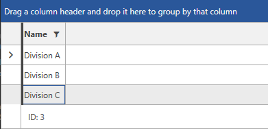

# Row Details Template

The __Row Details__ template is defined through the __RowDetailsTemplate__ property of the __RadGridView__.

>tip To learn how to manage the displaying of the __Row Details__, read [this topic]().
	
## Basic RowDetails Template

__Example 1__ shows a basic row details template. You can observe the result in __Figure 1__.
		
> The next examples use the __Team__, __Division__ and __DivisionService__ classes defined in Examples 1, 2 and 3 in the following [article](). The setting of the ItemsSource in Examples 1 and 2 is shown in __Example 3__.

#### __[XAML] Example 1: Basic RowDetails Template__

{{region xaml-radgridview-row-details-template_0}}
	<telerik:RadGridView Name="rowTemplateRadGridView"
						 AutoGenerateColumns="False"
						 GroupRenderMode="Flat"
						 RowDetailsVisibilityMode="VisibleWhenSelected">
		<telerik:RadGridView.Columns>
			<telerik:GridViewDataColumn DataMemberBinding="{Binding Name}"/>
		</telerik:RadGridView.Columns>

		<telerik:RadGridView.RowDetailsTemplate>
			<DataTemplate>
				<StackPanel Orientation="Horizontal" Margin="10">
					<TextBlock Text="ID: " />
					<TextBlock Text="{Binding Id}" />
				</StackPanel>
			</DataTemplate>
		</telerik:RadGridView.RowDetailsTemplate>
	</telerik:RadGridView>
{{endregion}}

__Figure 1:__ Displays the result of the applied __Basic RowDetails Template__.

## Complex RowDetails Template

__Example 2__ shows a complex row details template, which contains another RadGridView. You can observe the result in __Figure 2__.

#### __[XAML] Example 2: Definition of Complex RowDetails Template__

{{region xaml-radgridview-row-details-template_1}}
	<telerik:RadGridView Name="rowTemplateRadGridView"
							AutoGenerateColumns="False"
							GroupRenderMode="Flat"
							RowDetailsVisibilityMode="VisibleWhenSelected">
		<telerik:RadGridView.Columns>
			<telerik:GridViewDataColumn DataMemberBinding="{Binding Name}"/>
		</telerik:RadGridView.Columns>

		<telerik:RadGridView.RowDetailsTemplate>
			<DataTemplate>
				<telerik:RadGridView Name="playersGrid" 
									 ItemsSource="{Binding Teams}" 
									 AutoGenerateColumns="False"
									 Height="200">
					<telerik:RadGridView.Columns>
						<telerik:GridViewDataColumn DataMemberBinding="{Binding Id}"/>
						<telerik:GridViewDataColumn DataMemberBinding="{Binding Name}"/>
						<telerik:GridViewDataColumn DataMemberBinding="{Binding Place}"/>
					</telerik:RadGridView.Columns>
				</telerik:RadGridView>
			</DataTemplate>
		</telerik:RadGridView.RowDetailsTemplate>
	</telerik:RadGridView>
{{endregion}}

>important You should specify a Height for the RadGridView in the RowDetailsTemplate. Otherwise the [UI Virtualization]() mechanism will be disabled. 

__Figure 2:__ Displays the result of the applied __Complex RowDetails Template__.  

#### __[C#] Example 3: Setting the ItemsSource for Examples 1 and 2__

{{region cs-radgridview-row-details-template_2}}
	public MainWindow()
	{
		InitializeComponent();

		this.rowTemplateRadGridView.ItemsSource = DivisionsService.GetDivisions();
	}
{{endregion}}

#### __[VB.NET] Example 3: Setting the ItemsSource for Examples 1 and 2__

{{region vb-radgridview-row-details-template_1}}
	Public Sub New()
		InitializeComponent()

		Me.rowTemplateRadGridView.ItemsSource = DivisionsService.GetDivisions()
	End Sub
{{endregion}}

## See Also  
 * [RowDetails Overview]()  
 * [Toggle RowDetails Column]()
 * [Row Details Visibility]()
 * [External Row Details]()
 * [Customizing the Row Details]()