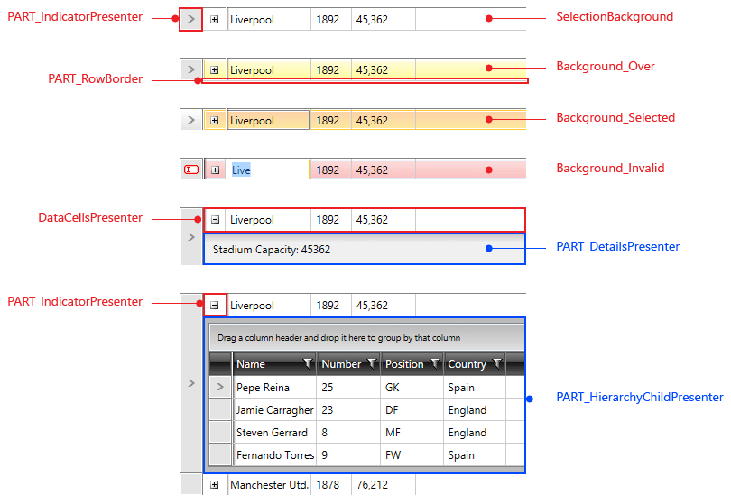
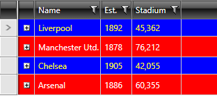

# Styling Rows

>tipBefore reading this topic, you might find it useful to get familiar with the [Template Structure of the GridViewRow](#gridviewrow).


> As of __R3 2018 RadGridView__ supports setting the __Background__ of the selected row and as of __R1 2019 SP1__ it supports setting the __MouseOverBackground__ of the row. More information can be found in the [SelectedBackground and MouseOverBackground]() article.


In this article we will discuss the following topics:

* [Targeting the GridViewRow Element](#targeting-the-gridviewrow-element)

* [Setting RadGridView's RowStyle and AlternateRowsStyle](#setting-radgridviews-rowstyle-and-alternaterowsstyle)

* [Setting RadGridView's RowStyleSelector and AlternateRowsStyleSelector](#setting-radgridviews-rowstyleselector-and-alternaterowsstyleselector)

#### __Figure 1: GridViewRow template structure__

## Targeting the GridViewRow Element

In order to style all RadGridView rows of an application, you should create an appropriate style targeting the __GridViewRow__ element.

You have two options:

* To create an empty style and set it up on your own.

* To copy the default style of the control and modify it.

>To learn how to modify the default GridViewCell style, please refer to the [Modifying Default Styles]() article.

#### __[XAML] Example 1: Styling all rows of an application__

	{{region xaml-gridview-styling-row-1}}
	
{{endregion}}

>If you're using [Implicit Styles](), you should base your style on the __GridViewRowStyle__.

## Setting RadGridView's RowStyle and AlternateRowStyle

__RadGridView__ exposes the __RowStyle__ and __AlternateRowStyle__ properties of type __Style__. __GridViewRow__ elements can be styled by providing an appropriate style for each of these properties.

>In order to use the __AlternateRowStyle__, you should first set the **AlternationCount** property of your __RadGridView__. For example, if you want to alternate each second row, you have to set its value to 2.

#### __[XAML] Example 2: Setting a column's CellStyle__

	{{region xaml-gridview-styling-row-2}}
	<telerik:RadGridView RowStyle="{StaticResource GridViewRowStyle}"
	AlternationCount="2"
	AlternateRowStyle="{StaticResource GridViewAlternateRowStyle}" />
{{endregion}}

#### __Figure 2: RadGridView with styled rows__

## Setting RadGridView's RowStyleSelector and AlternateRowsStyleSelector

You could also use RadGridView's **RowStyleSelector** and **AlternateRowsStyleSelector** properties to style rows differently based on a specific condition. More details about how this can be achieved can be found in the [RowStyleSelector article]().

## See Also

 * [Alternating Rows]()

 * [Styling the Row Details]()

 * [Styling the Group Row]()

 * [Styling the Header Row]()
