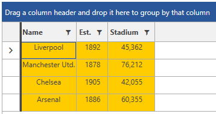
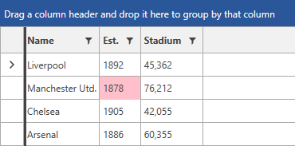

# Styling Cells

In this article, we discuss various approaches to style the RadGridView cells:

* [Styling all RadGridView cells](#styling-all-radgridview-cells)

* [Setting a Column's CellStyle](#setting-a-columns-cellstyle)

* [Setting a Column's CellStyleSelector](#setting-a-columns-cellstyleselector)

* [Setting the SelectedBackground of the Cell](#setting-the-selectedbackground-of-the-cell)

* [Setting the BorderBrush of the CurrentCell](#setting-the-borderbrush-of-the-currentcell)

* [Setting the MouseOverBackground of the Cell](#setting-the-mouseoverbackground-of-the-cell)

>tip To get the most of this article, make sure you are already familiar with the [Template Structure of the GridViewCell](#gridviewcell).

#### __Figure 1: GridViewCell template structure__

## Styling all RadGridView cells

To style all __RadGridView__ cells of an application, create a style that targets the __GridViewCell__ element.

You have two options:

* To create an empty style and set it up on your own.

* To copy the default style of the control and [modify it]().

#### __[XAML] Example 1: Styling all cells of an application__

{{region xaml-gridview-styling-cell_0}}
	
{{endregion}}

>If you're using [Implicit Styles](), base your style on the __GridViewCellStyle__ that is defined for the corresponding theme.

#### __Figure 2: RadGridView with styled cells in the Office2016 theme__

## Setting a Column's CellStyle

You can also style __RadGridView Cells__ by creating an appropriate __Style__ for the **GridViewCell** element and setting it as the __CellStyle__ property of the respective __GridView Column__. 

#### __[XAML] Example 2: Setting a column's CellStyle__
{{region xaml-gridview-styling-cell_1}}
	<telerik:GridViewDataColumn DataMemberBinding="{Binding Name}"
	                Header="Name"
	                CellStyle="{StaticResource GridViewCellStyle}" />
{{endregion}}

## Setting a Column's CellStyleSelector

You could also use a column's **CellStyleSelector** property to style cells differently based on a specific condition. For more details about this approach, see the [CellStyleSelector article]().

## Setting the SelectedBackground of the Cell

As of __RadGridView R3 2018__, you can set the Background of the selected cell by setting the **SelectedBackground** property of the GridViewCell.

#### __[XAML] Example 3: Setting the SelectedBackground of the GridViewCell__
{{region xaml-gridview-styling-cell_2}}
	
{{endregion}}

#### __Figure 3: Result from Example 3 in the Office2016 theme__

## Setting the BorderBrush of the CurrentCell

As of __RadGridView R3 2018__, you can set the BorderBrush of the current cell, by setting the **CurrentBorderBrush** property of the GridViewCell. 

**Example 4** demonstrates how to set the BorderBrush of the current cell to transparent. You can compare **Figure 3** and **Figure 4** to notice that the border of the current cell is not visible.

#### __[XAML] Example 4: Setting the CurrentBorderBrush of the GridViewCell__
{{region xaml-gridview-styling-cell_3}}
	
{{endregion}}

#### __Figure 4: Result from Example 4 in the Office2016 theme__

> After you have set the __CurrentBorderBrush__ to __Transparent__, if you start navigating through the cells with the keyboard, you will be able to see the FocusVisual border. If you want to hide it as well, you can set the __FocusVisualStyle__ of the GridViewCell to null through a style similar to __Example 4__.

## Setting the MouseOverBackground of the Cell

As of __RadGridView R1 2019 SP1__, you can change the MouseOver Background of the cells through the __MouseOverBackground__ property of the GridViewCell. This is demonstrated in __Example 5__.

#### __[XAML] Example 5: Setting the MouseOverBackground of the GridViewCell__
{{region xaml-gridview-styling-cell_4}}
	
{{endregion}}

#### __Figure 5: Result from Example 5 in the Office2016 theme__

> In order for the MouseOverBackground of the cell to take effect, set the [SelectionUnit](#selection-units) of RadGridView to __Mixed__ or __Cell__.

## See Also

 * [Styling the GridViewEditorPresenter]()

 * [Styling the Column Footers]()

 * [Styling the Column Headers]()

 * [Change Background for Disabled Grid Elements]()
