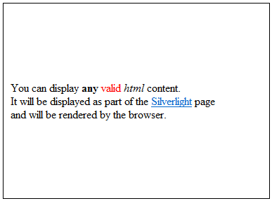

# Display HTML string in RadHtmlPlaceholder

Displaying HTML can be achieved by setting the HtmlSource property of RadHtmlPlaceholder. Any valid HTML content will be displayed as part of the Silverlight page layout and will be rendered by the browser.

#### __XAML__
{{region radhtmlplaceholder-howto-displayhtml_0}}
	<UserControl x:Class="RadHtmlPlaceholderDemo.Page" 
	             xmlns="http://schemas.microsoft.com/winfx/2006/xaml/presentation"
	             xmlns:x="http://schemas.microsoft.com/winfx/2006/xaml"
	             xmlns:telerik="http://schemas.telerik.com/2008/xaml/presentation"
	             Width="400"
	             Height="300">
	    <Grid x:Name="LayoutRoot" Background="White">
	        <Border BorderBrush="Black" BorderThickness="1">
	            <telerik:RadHtmlPlaceholder x:Name="RadHtmlPlaceholder1" Margin="10" />
	        </Border>
	    </Grid>
	</UserControl>
{{endregion}}

#### __C#__
{{region radhtmlplaceholder-howto-displayhtml_1}}
	using System.Windows;
	using System.Windows.Controls;
	namespace RadHtmlPlaceholderDemo
	{
		public partial class Page : UserControl
		{
			public Page()
			{
				InitializeComponent();
				Loaded += new RoutedEventHandler(Page_Loaded);
			}
			void Page_Loaded(object sender, RoutedEventArgs e)
			{
				RadHtmlPlaceholder1.HtmlSource = @"You can display <b>any</b> valid
	<i>html</i> content. It will be displayed as part of the <a href=""http://silverlight.net"" 
	target=""_blank"">Silverlight</a> page  and will be rendered by the browser.";
			}
		}
	}
{{endregion}}

#### __VB.NET__
{{region radhtmlplaceholder-howto-displayhtml_1}}
	Imports System.Windows
	Imports System.Windows.Controls
	Namespace RadHtmlPlaceholderDemo
		Partial Public Class Page
			Inherits UserControl
			Public Sub New()
				InitializeComponent()
				Loaded += New RoutedEventHandler(AddressOf Page_Loaded)
			End Sub
			Private Sub Page_Loaded(ByVal sender As Object, ByVal e As RoutedEventArgs)
				RadHtmlPlaceholder1.HtmlSource = "You can display <b>any</b> valid "
	<i>html</i> content. It will be displayed as part of the <a href=""http://silverlight.net"" target=""_blank"">
		Silverlight</a> page  and will be rendered by the browser."
			End Sub
		End Class
	End Namespace
{{endregion}}

## See Also 
 * [Integrating RadHtmlPlaceholder and RadWindow]()
 * [RadHtmlPlaceholder Events]()
 * [Display HTML string in RadHtmlPlaceholder]()
 * [Display external page in RadHtmlPlaceholder]()
 * [Getting Started]()