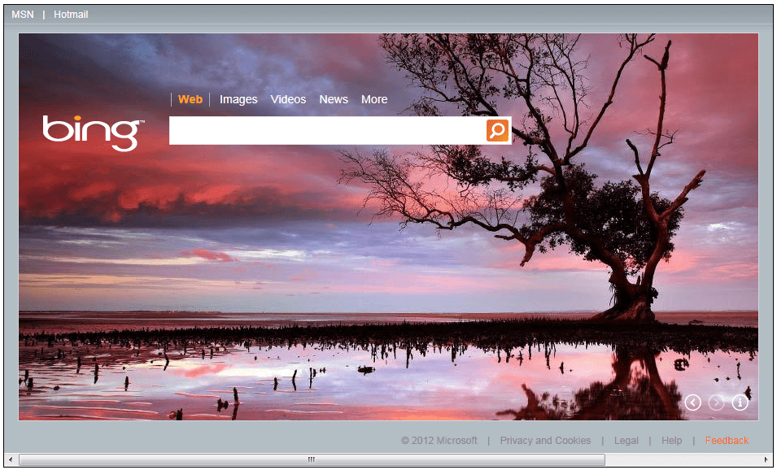

# Getting Started

Another important note is that the Silverlight plug-in that hosts the control has to be Windowless enabled. For example, if the Silverlight control is hosted in an .aspx page, then:

#### [ASPX] Example 1: Setting the windowless parameter in ASPX page
    

        <asp:silverlight id="Xaml1" windowless="true" runat="server" source="~/ClientBin/RadHtmlPlachoderDemo.xap"
            minimumversion="2.0.31005.0" width="100%" height="100%" />
    

If hosted in .html page then:

#### [HTML] Example 2: Setting the windowless parameter in HTML page
    

        <object data="data:application/x-silverlight-2," type="application/x-silverlight-2"
            width="100%" height="100%">
            <param name="source" value="ClientBin/RadHtmlPlachoderDemo.xap" />
            <param name="onerror" value="onSilverlightError" />
            <param name="background" value="white" />
            <param name="minRuntimeVersion" value="2.0.31005.0" />
            <param name="autoUpgrade" value="true" />
            <param name="windowless" value="true" />
            
        </object>
        <iframe style='visibility: hidden; height: 0; width: 0; border: 0px'></iframe>
    

Once the Silverlight plug-in is Windowless enabled, then adding RadHtmlPlaceholder is pretty simple:

>In order to use the __RadHtmlPlaceholder__ control in your projects you have to add reference to the __Telerik.Windows.Controls__ assembly. You can find more info [here](http://www.telerik.com/help/wpf/installation-installing-controls-dependencies-wpf.html).You can find more info [here](http://www.telerik.com/help/silverlight/installation-installing-controls-dependencies.html).

#### [XAML] Example 3: Defining RadHtmlPlaceholder
{{region radhtmlplaceholder-getting-started_2}}
	<UserControl x:Class="RadHtmlPlaceholderDemo.Page" 
	             xmlns="http://schemas.microsoft.com/winfx/2006/xaml/presentation"
	             xmlns:x="http://schemas.microsoft.com/winfx/2006/xaml"
	             xmlns:telerik="http://schemas.telerik.com/2008/xaml/presentation"
	             Width="700"
	             Height="480">
	    <Grid x:Name="LayoutRoot" Background="White">
	        <Border BorderBrush="Black" BorderThickness="1">
	            <telerik:RadHtmlPlaceholder SourceUrl="http://www.bing.com" />
	        </Border>
	    </Grid>
	</UserControl>
{{endregion}}

>If you are using the default Silverlight Template project in Visual Studio you may need to modify a little bit the CSS styles defined in the page, otherwise in some cases unneeded scrollbars could be displayed in the page.

#### [CSS] Example 4: Original Style
    

#### [CSS] Example 5: Modified Style

    

>If you would like to enable your __Silverlight__ application to have access to your browser __DOM__ you can do so through the parameter called __EnableHtmlAccess__ Add that parameter on the __Silverlight__ plug-in that hosts the control and you’ll get access to the __DOM__.

#### [HTML] Example 6: Setting EnabledHtmlAccess in HTML

    

        <object data="data:application/x-silverlight-2," type="application/x-silverlight-2" width="100%" height="100%">
            <param name="source" value="ClientBin/RadHtmlPlachoderDemo.xap"/>
            <param name="onerror" value="onSilverlightError" />
            <param name="background" value="white" />
            <param name="minRuntimeVersion" value="2.0.31005.0" />
            <param name="autoUpgrade" value="true" />
            <param name="windowless" value="true" />
            <param name="enablehtmlaccess" value="true"/>
            
        </object>
        <iframe style='visibility:hidden;height:0;width:0;border:0px'></iframe>
    

## See Also  
 * [Integrating RadHtmlPlaceholder and RadWindow]()
 * [RadHtmlPlaceholder Events]()
 * [Display HTML string in RadHtmlPlaceholder]()
 * [Display external page in RadHtmlPlaceholder]()
 * [Getting Started]()