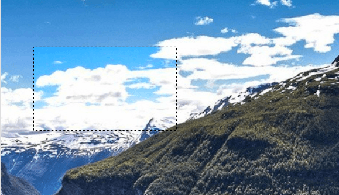
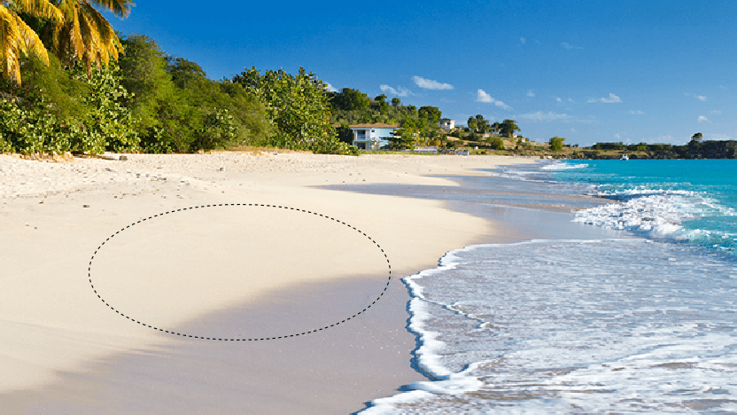
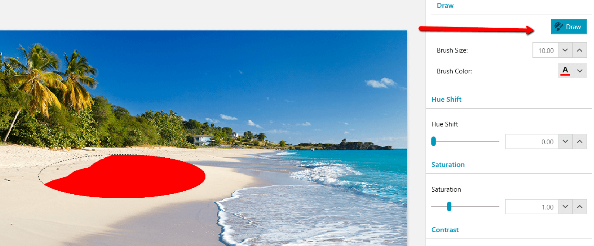

# Selection Tool

The SelectionTool is one of the tools that come out-of-the-box with RadImageEditor. It allows you to select a specific area from an image and apply different effects to it.

The selection isolates parts of the image. By selecting specific areas, the user can edit and apply effects to portions of the image while leaving the unselected areas untouched. When a selection is active it will be surrounded by a dashed outline to indicate the area.

#### __[XAML] Example 1: Define selection tool item__
{{region radimageeditor-tools-selection-tool-0}}
	<telerik:ImageToolItem ImageKey="Selection" 
						   telerik:LocalizationManager.ResourceKey="ImageEditor_Selection" 
						   Command="commands:ImageEditorRoutedCommands.ExecuteTool">
		<telerik:ImageToolItem.CommandParameter>
			<tools:SelectionTool >
				<tools:SelectionTool.SelectionShapes>
					<shapes:RectangleShape />
					<shapes:EllipseShape />
					<shapes:FreeformShape />
				</tools:SelectionTool.SelectionShapes>
			</tools:SelectionTool>
		</telerik:ImageToolItem.CommandParameter>
	</telerik:ImageToolItem>
{{endregion}}

#### Figure 1: Selection tool selection area

> The code snippets points to the following namespace:
> `xmlns:tools="clr-namespace:Telerik.Windows.Media.Imaging.Tools;assembly=Telerik.Windows.Controls.ImageEditor"`  
> `xmlns:shapes="clr-namespace:Telerik.Windows.Media.Imaging.Shapes;assembly=Telerik.Windows.Controls.ImageEditor"`  
> `xmlns:commands="clr-namespace:Telerik.Windows.Media.Imaging.ImageEditorCommands.RoutedCommands;assembly=Telerik.Windows.Controls.ImageEditor"`

## Predefined Selection Area Shapes

There are several predefined shapes that are used for selection.

* __FreeformShape__: Allows to draw a freeform selection region. The edge of the selected region will follow the mouse cursor as it is dragged around the canvas. The shape will automatically be closed with a straight line from the current cursor location back to the start point.

	#### Figure 2: Free form shape selection
	

* __RectangleShape__: Draws rectangles or square selection region (when the LockRatio property is set to true).
	
	#### Figure 3: Rectangle shape selection
	
	
* __EllipseShape__: Allows you to create ellipse or circle selection region (when the LockRatio property is set to true).
	
	#### Figure 4: Ellipse shape selection
	

	
## Custom Selection Area Shapes

The SelectionTool allows you to define custom shapes that can be used to select an area. You can see how to define a custom shape in the [Shape Tool](#how-to-create-a-custom-shape) article.

## Tool Settings

Activating the tool opens a settings pane which contains the supported effects that can be applied to the selection region. You could also switch the different selection modes by using a combobox.

#### Figure 5: Tool settings UI

By default, all set effects are applied when a new selection is made. The Auto Reset Settings checkbox could be used if you want to reset the effects when a new selection is made.

You can draw in the selection region by pressing the Draw toggle button.

#### Figure 6: Drawing in the selection area

## See also  
* [Draw Tool]()
* [Crop Tool]()