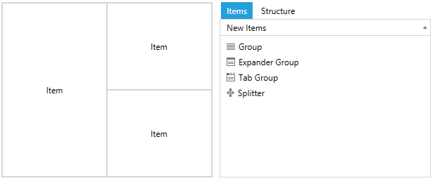
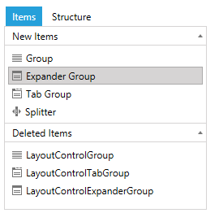

# LayoutControlToolBoxView

__LayoutControlToolBoxView__ is the control that represents the toolbox. This article demonstrates how to set it up and associate it with RadLayoutControl. 

#### __[XAML] Example 1: Setting up the toolbox__  
{{region radlayoutcontrol-features-toolbox-toolboxview-0}}
	 <StackPanel Orientation="Horizontal">
        <telerik:RadLayoutControl x:Name="layout" Width="300" Height="250">
            <Button Content="Item" />
            <telerik:LayoutControlGroup Orientation="Vertical">
                <Button Content="Item" />
                <Button Content="Item"/>
            </telerik:LayoutControlGroup>
        </telerik:RadLayoutControl>
        <telerik:LayoutControlToolBoxView LayoutControl="{Binding ElementName=layout}" Width="300" Height="250"/>
    </StackPanel>
{{endregion}}

The toolbox can be associated with RadLayoutControl through its __LayoutControl__ property (see __Example 1__).
	
#### __Figure 1: Final result__  

>Dropping items from the toolbox into the layout control is allowed only if the layout control is in [edit mode]().

You can __get, add or remove__ the elements from the toolbox using the __NewItems__ and __DeletedItems__ collections of the __LayoutControlToolBoxView__ control.

## Tracking the deleted items

The toolbox allows you to track and restore the items that was removed from the layout. Once an item is deleted, it is added in the __DeletedItems__ collection of the LayoutControlToolBoxView. You can restore the element back in the layout by drag/droping it from the Deleted Items to the __RadLayoutControl__.

>important This feature is disabled by default. You can enable it by setting the __TrackDeletedItems__ property to __True__.

#### __[XAML] Example 2: Enabling the deleted items tracking__
{{region radlayoutcontrol-features-toolbox-toolboxview-1}}
	<telerik:LayoutControlToolBoxView TrackDeletedItems="True"/>
{{endregion}}
	
#### __Figure 2: Deleted items__

## LayoutControlHierarchicalNodeProxy

__LayoutControlHierarchicalNodeProxy__ is the model of the toolbox items. The __LayoutControlToolBoxView__ element exposes two collections – one with the elements displayed in the __New Items__ section and another one displayed in the __Deleted Items__ section. The collections can be accessed respectively through the __NewItems__ and __DeletedItems__ properties which are of type __ObservableCollection&lt;LayoutControlHierarchicalNodeProxy&gt;__. 

The proxy object contains information about the elements in the toolbox.
* __Header__: You can use this property to set a string that represents the header of the toolbox item.
* __OriginalItemType__: This property holds the type of the associated element.
* __OriginalItem__: This property holds the associated element.

By default the toolbox is populated with a collection that contains all available layout controls. But you can use the __NewItems__ collection and the __LayoutControlHierarchicalNodeProxy__ class to add custom __UIElements__ in the toolbox. Read more about this in the [Add Custom Element in the ToolBox]() article.

## See Also
* [Getting Started]()
* [LayoutControlToolBox]()
* [Layout Groups Overview]()
* [Layout Panel]()
