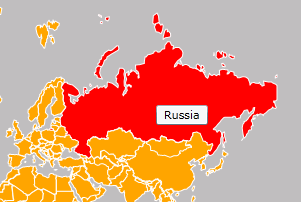
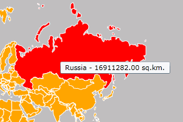
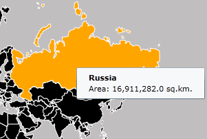

# Shape Reader

The __RadMap__ allows you to read data from several data formats and wrap it in __MapShape__ objects. The currently supported formats are:

* [KML Data]()

* [Shapefile Data]()

This topic will explain the following:

* [Reading Files](#reading-files)

* [Specifying a Tooltip](#specifying-a-tooltip)

* [Clearing the Layer](#clearing-the-layer)

* [Styling the Shapes](#styling-the-shapes)

## Reading Files

The __RadMap__ control supports the visualization of __ESRI Shapefiles__ and KML Data. It reads the data via the __MapShapeReader__ class implemented in the __Information Layer__.

#### __XAML__
{{region radmap-features-information-layer-shape-reder_0}}
	<telerik:RadMap x:Name="radMap">
	    <telerik:InformationLayer x:Name="informationLayer">
	        <telerik:InformationLayer.Reader>
	            <telerik:MapShapeReader />
	        </telerik:InformationLayer.Reader>
	    </telerik:InformationLayer>
	</telerik:RadMap>
{{endregion}}

#### __C#__
{{region radmap-features-information-layer-shape-reder_1}}
	this.informationLayer.Reader = new MapShapeReader();
{{endregion}}

#### __VB.NET__
{{region radmap-features-information-layer-shape-reder_2}}
	Me.informationLayer.Reader = New MapShapeReader()
{{endregion}}

To specify the type of the data the reader should read use the __SourceType__ property of the __MapShapeReader__ class. It can have the following values:

* __Auto__ - automatically determines the type of the data.

* __KML__ - specifies that the file to be read, contains KML Data.

* __Shapefile__ - specifies that the file to be read contains Shapefile data.

To learn how to specify the files for each of the types read the respective topics:

* [KML Data Import]()

* [Shapefiles Support]()

## Specifying a Tooltip

The __MapShapeReader__ object can use the data in the .dbf file and display it in a tooltip for the respective shape. In order to allow you to configure the tooltip's appearance and content, The __MapShapeReader__ class exposes the following properties:        

* [ToolTipFormat](#tooltipformat) - allows you to specify the format string for the tooltip. This is the simplest way to configure the tooltip, when having a one-line tooltip scenario.

* [ToolTipStyle](#tooltipstyle) - allows you to apply a Style that targets the ToolTip control.

* [ToolTipTemplate](#tooltiptemplate) - allows you to define a DataTemplate for the tooltip. This one is used when more complex, multiline and styled tooltip scenarios.

## ToolTipFormat

Using the __ToolTipFormat__ property is the simplest way to create a single-line tooltip. The property is of type string and allow you to display both the value of a single property of the extended data and combination of the values of different extended data properties.        

>tip To access the value of an extended data property use its name.

Here is an examples for different __ToolTipFormat__ values.        

## Single property value 

#### __XAML__
{{region radmap-features-information-layer-shape-reder_3}}
	<telerik:RadMap x:Name="radMap">
	    <telerik:InformationLayer x:Name="informationLayer">
	        <telerik:InformationLayer.Reader>
	            <telerik:MapShapeReader DataSource="/Silverlight.Help.RadMapSamples;component/Data/world.dbf"
	                                    Source="/Silverlight.Help.RadMapSamples;component/Data/world.shp"
	                                    ToolTipFormat="CNTRY_NAME" />
	        </telerik:InformationLayer.Reader>
	    </telerik:InformationLayer>
	</telerik:RadMap>
{{endregion}}

#### __C#__
{{region radmap-features-information-layer-shape-reder_4}}
	this.informationLayer.Reader.ToolTipFormat = "CNTRY_NAME";
{{endregion}}

#### __VB.NET__
{{region radmap-features-information-layer-shape-reder_5}}
	Me.informationLayer.Reader.ToolTipFormat = "CNTRY_NAME";
{{endregion}}

Here is a snapshot of the result:

## Formatted property value

>Note that in this case the format string begins with "__{}__". This escapes the following __{PropertyName}__ expressions. In code behind you mustn't add it to the actual format string.

#### __XAML__
{{region radmap-features-information-layer-shape-reder_6}}
	<telerik:RadMap x:Name="radMap">
	    <telerik:InformationLayer x:Name="informationLayer">
	        <telerik:InformationLayer.Reader>
	            <telerik:MapShapeReader DataSource="/Silverlight.Help.RadMapSamples;component/Data/world.dbf"
	                                    Source="/Silverlight.Help.RadMapSamples;component/Data/world.shp"
	                                    ToolTipFormat="{}{SQKM|F2} sq.km." />
	        </telerik:InformationLayer.Reader>
	    </telerik:InformationLayer>
	</telerik:RadMap>
{{endregion}}
    
#### __C#__
{{region radmap-features-information-layer-shape-reder_7}}
	this.informationLayer.Reader.ToolTipFormat = "{SQKM|F2} sq.km.";
{{endregion}}
    
#### __VB.NET__
{{region radmap-features-information-layer-shape-reder_8}}
	Me.informationLayer.Reader.ToolTipFormat = "{SQKM|F2} sq.km.";
{{endregion}}
    
Here is a snapshot of the result:

## Multiple formatted property values

>Note that in this case the format string begins with "__{}__". This escapes the following __{PropertyName}__ expressions. In code behind you mustn't add it to the actual format string.

#### __XAML__
{{region radmap-features-information-layer-shape-reder_9}}
	<telerik:RadMap x:Name="radMap">
	    <telerik:InformationLayer x:Name="informationLayer">
	        <telerik:InformationLayer.Reader>
	            <telerik:MapShapeReader DataSource="/Silverlight.Help.RadMapSamples;component/Data/world.dbf"
	                                    Source="/Silverlight.Help.RadMapSamples;component/Data/world.shp"
	                                    ToolTipFormat="{}{CNTRY_NAME} - {SQKM|F2} sq.km." />
	        </telerik:InformationLayer.Reader>
	    </telerik:InformationLayer>
	</telerik:RadMap>
{{endregion}}

#### __C#__
{{region radmap-features-information-layer-shape-reder_10}}
	this.informationLayer.Reader.ToolTipFormat = "{CNTRY_NAME} - {SQKM|F2} sq.km.";
{{endregion}}

#### __VB.NET__
{{region radmap-features-information-layer-shape-reder_11}}
	Me.informationLayer.Reader.ToolTipFormat = "{CNTRY_NAME} - {SQKM|F2} sq.km."
{{endregion}}

Here is a snapshot of the result:

## ToolTipStyle

The __ToolTipStyle__ property allows you to specify a Style of the tooltip that gets displayed. The Style should target the ToolTip control. Here is an example.

>tip To learn how to modify the color of the shapes like on the snapshot below, you have to read the [Styling the Shapes](#styling-the-shapes) section.

#### __XAML__
{{region radmap-features-information-layer-shape-reder_12}}
	<telerik:RadMap x:Name="radMap">
	    <telerik:InformationLayer x:Name="informationLayer">
	        <telerik:InformationLayer.Reader>
	            <telerik:MapShapeReader DataSource="/Silverlight.Help.RadMapSamples;component/Data/world.dbf"
	                                    Source="/Silverlight.Help.RadMapSamples;component/Data/world.shp"
	                                    ToolTipFormat="{}{CNTRY_NAME} - {SQKM|F2} sq.km.">
	                <telerik:MapShapeReader.ToolTipStyle>
	                    
	                </telerik:MapShapeReader.ToolTipStyle>
	            </telerik:MapShapeReader>
	        </telerik:InformationLayer.Reader>
	    </telerik:InformationLayer>
	</telerik:RadMap>
{{endregion}}

Here is a snapshot of the result:

## ToolTipTemplate

The __ToolTipTemplate__ property allows you to define a __DataTemplate__ for the tooltip. This way you are able to create more complex layouts like multiline content or content containing different visual elements like __Borders__, __Images__ etc.

In this case the __DataTemplate__ takes as __DataContext__ the entire Extended Data Set. To get a specific value you have to bind to it and use a converter to access the desired attribute. The __RadMap__ provides such converter out of the box. It is represented by the __ExtendedDataConverter__. To use it just bind to the extended data set and pass the desired attribute name as parameter. Here is an example.

>The __ToolTipTemplate__ property will take precedence over the __ToolTipFormat__ one.

#### __XAML__
{{region radmap-features-information-layer-shape-reder_13}}
	<UserControl.Resources>
	    <telerik:ExtendedDataConverter x:Key="ExtendedDataConverter" />
	</UserControl.Resources>
	<telerik:RadMap x:Name="radMap">
	    <telerik:InformationLayer x:Name="informationLayer">
	        <telerik:InformationLayer.Reader>
	            <telerik:MapShapeReader DataSource="/Silverlight.Help.RadMapSamples;component/Data/world.dbf"
	                                    Source="/Silverlight.Help.RadMapSamples;component/Data/world.shp">
	                <telerik:MapShapeReader.ToolTipTemplate>
	                    <DataTemplate>
	                        <StackPanel Margin="10,5">
	                            <TextBlock FontWeight="Bold"
	                                        Text="{Binding Converter={StaticResource ExtendedDataConverter}, ConverterParameter='CNTRY_NAME'}" />
	                            <TextBlock Text="{Binding Converter={StaticResource ExtendedDataConverter}, ConverterParameter='SQKM', StringFormat='Area: {0:#,#.0} sq.km.'}" />
	                        </StackPanel>
	                    </DataTemplate>
	                </telerik:MapShapeReader.ToolTipTemplate>
	            </telerik:MapShapeReader>
	        </telerik:InformationLayer.Reader>
	    </telerik:InformationLayer>
	</telerik:RadMap>
{{endregion}}

Here is a snapshot of the result:

## Clearing the Layer

When adding the read shapes to the layer, the __MapShapeReader__ is able to clear it first. This means that all previously added shapes will get removed and the new ones will be added. This behavior is controled by the __ClearLayer__ property of the __MapShapeLayer__. It's default value is __True__. This means that the described behavior will be active by default. To disable it set the property to __False__.

## Styling the Shapes

To modify the appearance of the shapes in terms of __Fill__, __Stroke__ etc. you can either use the [HighlightFill and Shape Fill](#using-the-mapshapefill-object-on-the-layer-level) properties of the __InformationLayer__ or use the [Colorizer]() property of the __InformationLayer__.

## See Also
 * [Shapefiles Support]()
 * [KML Data Import]()
 * [Colorizer]()
 * [Map Legend]()