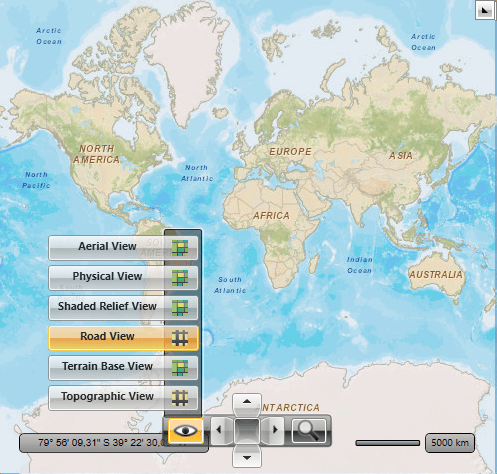

# ArcGIS Online Map Provider

The [ArcGIS online services](http://www.esri.com/software/arcgis/arcgisonline/maps/maps-and-map-layers) can be used via the __ArcGisMapProvider__ class.

>tip To use the [ArcGIS vector tile services](https://developers.arcgis.com/rest/services-reference/enterprise/vector-tile-service.htm) refer to the [Migrating to Vector Tile Map Provider](#migrating-to-vector-tile-map-provider) section of this article.

Currently the ArcGIS map provider support six modes which specify the type of appearance of the map can and be set using the __Mode__ property:        

1. Aerial
2. Physical
3. Shaded Relief
4. Street
5. Terrain
6. Topographic

The following example of the __ArcGisMapProvider__ definition uses the __Physical__ mode:

#### __XAML__
{{region xaml-radmap-features-providers-arcgis-0}}
	<telerik:RadMap x:Name="radMap" ZoomLevel="1">
		<telerik:RadMap.Provider>
			<telerik:ArcGisMapProvider Mode="Physical" />
		</telerik:RadMap.Provider>
	</telerik:RadMap>
{{endregion}}

#### __C#__
{{region cs-radmap-features-providers-arcgis-1}}
	ArcGisMapProvider provider = new ArcGisMapProvider();
	provider.Mode = ArcGisMapMode.Physical;
	this.radMap.Provider = provider;
{{endregion}}

#### __VB.NET__	
{{region vb-radmap-features-providers-arcgis-2}}
	Dim provider As New ArcGisMapProvider ()
	provider.Mode = ArcGisMapMode.Physical
	Me.radMap.Provider = provider
{{endregion}}

>important As of **April 16, 2019**, ArcGIS Online services only accept connections using [TLS 1.2](https://docs.microsoft.com/en-us/mem/configmgr/core/plan-design/security/enable-tls-1-2). Thus, you need to explicitly set the **ServicePointManager.SecurityProtocol** property if you're using a .NET Framework version prior to **4.7**.

#### __C#__
{{region cs-radmap-features-providers-arcgis-3}}
	public App()
	{
		// ArcGis rest services require TLS 1.2 protocol.
		ServicePointManager.SecurityProtocol = (SecurityProtocolType)3072;
	}
{{endregion}}

#### __VB.NET__	
{{region vb-radmap-features-providers-arcgis-4}}
	Partial Public Class App
		Inherits Application

		Public Sub New()
			' ArcGis rest services require TLS 1.2 protocol.
			ServicePointManager.SecurityProtocol = CType(3072, SecurityProtocolType)
		End Sub
	End Class
{{endregion}}

Here is a snapshot of the map that appears when using the `Physical` mode:

For comparison, the following snapshot demonstrates the appearance of the map for the __Street__ mode:

The __ArcGisMapProvider__ also allows the user to change the map mode using the **Map View** button of the toolbar.


## Migrating to Vector Tile Map Provider

To migrate to a vector-based tile provider that uses the [ArcGIS vector tile services](https://developers.arcgis.com/rest/services-reference/enterprise/vector-tile-service.htm) you can create a custom vector tile providers. The [Custom Vector Tile Provider]() article demonstrates how to do this.

Additional to this, as of 2023, part of the ArcGIS raster-based services are obsolete and no longer supported. The following list shows the end-points of the map layers that are obsolete and if they have alternatives in the vector-based services.

| Map Layer | Old Address | New Address |
| --------- | ----------- | ----------- |
| Physical  | https://www.arcgis.com/home/item.html?id=c4ec722a1cd34cf0a23904aadf8923a0 | no longer supported |
| ShadedRelief | https://www.arcgis.com/home/item.html?id=9c5370d0b54f4de1b48a3792d7377ff2 |  no longer supported |
| Streets (world streets) | https://www.arcgis.com/home/item.html?id=3b93337983e9436f8db950e38a8629af |  https://www.arcgis.com/home/item.html?id=de26a3cf4cc9451298ea173c4b324736 |
| Terrain (world terrain) | https://www.arcgis.com/home/item.html?id=c61ad8ab017d49e1a82f580ee1298931 |  no longer supported |
| Topographic (world topographic) | https://www.arcgis.com/home/item.html?id=30e5fe3149c34df1ba922e6f5bbf808f |  https://www.arcgis.com/home/item.html?id=7dc6cea0b1764a1f9af2e679f642f0f5 |


## See Also
 * [BingRestMapProvider]()
